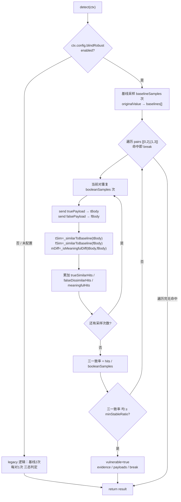
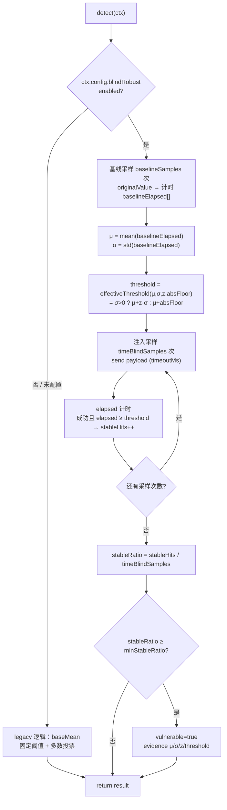
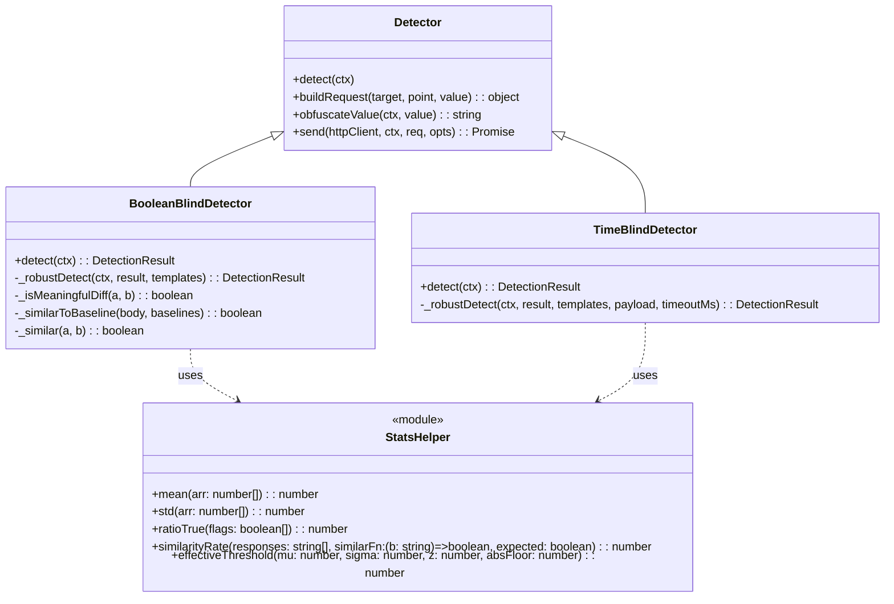

# 盲注判定鲁棒性增强（统计判定）增量设计

> 作者：高见远（software-architect） ｜ 项目：sqli-scanner ｜ 形态：增量开发（升级既有检测器内部逻辑，不新增检测器类）
> 依据：已亲读真实源码（`BooleanBlindDetector.js` / `TimeBlindDetector.js` / `Detector.js` / `defaults.js` / `payloads.js` / `models.js` / `errors.js` / `detectors.test.js` / `ScanManager.js`）。

---

## 1. 增量设计总述（三段）

**两个检测器如何各自升级为统计判定。** `BooleanBlindDetector` 现状对每个真假模板对（`pairs=[[0,2],[1,3]]`）只做 **1 次** true+false 采样，用三态（有意义差异 && true≈基线 && false≠基线）单次命中即 `break`；基线仅 2 次。升级后：基线采样 `baselineSamples`（默认 5）次构成更稳的"基线指纹集"；每个真假对重复 `booleanSamples`（默认 3）次，分别统计「true 响应与基线相似的一致率」「false 响应与基线不相似的一致率」以及「tBody 与 fBody 有意义差异的一致率」，仅当三者的**一致率均 ≥ `minStableRatio`** 才判 vulnerable（保留首个稳定对即 `break` 的短路语义）。`TimeBlindDetector` 现状基线取均值 `baseMean`、用**固定阈值** `baseMean + timeThresholdMs/1000`（1.5s）、多数投票（`stable≥ceil(samples/2)`）；升级后基线采样 `baselineSamples` 次求均值 `μ` 与标准差 `σ`，判定阈值改为分布感知的 `μ + z·σ`（`z=timeConfidenceZ`，默认 2），并要求注入延迟不仅超阈值、且多次稳定（稳定率 ≥ `minStableRatio`）。这样对"本就慢且抖动大"的目标，只有超出基线分布尾部（统计显著）才命中，避免误判。

**配置 schema 与向后兼容策略。** 在 `defaults.js` 新增集中配置 `blindRobust = { enabled:true, booleanSamples:3, baselineSamples:5, timeConfidenceZ:2, minStableRatio:0.66 }`；是否启用由 `ctx.config.blindRobust` 决定（经 ScanManager `ctxBase` 透传，已核实 `ctx.config` 进入 `detect(ctx)`）。向后兼容采用**双路径**：每个检测器 `detect` 开头读取 `const rb = ctx.config?.blindRobust; if (!rb || rb.enabled === false) { /* 原 legacy 逻辑原样保留、直接 return */ }`——现有测试 `buildCtx` 不设置 `blindRobust`，故全部走 legacy 路径，保证 **148→168 全绿零回归**。更关键的是**等价条件**：Time 在基线方差 `σ=0` 时 `effectiveThreshold = μ + absFloor`，其中 `absFloor = timeThresholdMs/1000` 恰等于 legacy 固定阈值；Boolean 在确定性目标上每次采样与 legacy 单次采样结果一致、一致率=1.0，故开启默认值时行为与现状等价。

**非破坏性边界。** 本次**只**改动 `BooleanBlindDetector.js` / `TimeBlindDetector.js` 的 `detect` 内部（新增统计分支、legacy 分支原样保留）、`defaults.js`（新增 `blindRobust`）、`tests/*`（新增鲁棒用例）；**不**新增检测器类、**不**进入 `this.detectors` 注册表、**不**改动 `Detector.js`/`payloads.js`/`ScanManager.js` 注册与调度、`sqlmapBridge.js`（原生引擎弱时委托真 sqlmap 的通道严禁破坏）、`SecondOrderDetector.js`（二阶是另一独立实例，本次无关）、`errors.js`（统计未命中一律返回 `vulnerable:false` + `evidence` 字符串，无需新错误码）。所有出站请求仍经 `this.send(httpClient, ctx, req, opts)` 统一 HttpClient，不引入任何直连 `fetch`。

---

## 2. 文件清单（相对路径，区分【新增】/【修改】）

> 基准根：`server/`

| 类别 | 路径 | 说明 |
|------|------|------|
| 【新增】 | `server/src/core/statsHelper.js` | 纯函数统计工具（mean/std/一致率/Z-score 阈值），零依赖，可被两检测器复用与单测。 |
| 【修改】 | `server/src/config/defaults.js` | 新增 `blindRobust` 配置块（集中默认值）。 |
| 【修改】 | `server/src/engine/detectors/BooleanBlindDetector.js` | `detect` 增加鲁棒分支（基线指纹集 + 重复采样一致率判定），legacy 分支保留。 |
| 【修改】 | `server/src/engine/detectors/TimeBlindDetector.js` | `detect` 增加鲁棒分支（基线分布 μ/σ + Z-score 阈值 + 稳定率判定），legacy 分支保留。 |
| 【新增】 | `server/tests/statsHelper.test.js` | 对 `statsHelper.js` 纯函数单测（node --test）。 |
| 【新增】 | `server/tests/blindRobust.test.js` | Boolean/Time 鲁棒判定用例：确定性命中、网络抖动、随机动态内容、慢且抖动目标、非注入误报、enabled:false 回退。 |

> 不改动（明确排除）：`Detector.js`、`payloads.js`、`ScanManager.js`、`engines/sqlmapBridge.js`、`detectors/SecondOrderDetector.js`、`detectors/StackedDetector.js`、`core/errors.js`、`models.js`。现有 `tests/detectors.test.js` **只增不改**（其用例走 legacy 路径，必须保持全绿）。

---

## 3. 关键数据结构与接口契约

### 3.1 `blindRobust` 配置 schema（`defaults.js` 完整字段与默认值）

```js
// 盲注判定鲁棒性（统计判定增强）：升级 Boolean/Time 检测器内部 detect，不新增检测器类。
// enabled:false 时两检测器回退到现状 legacy 逻辑（与现有 168 用例零回归）。
blindRobust: {
  enabled: true,            // 总开关；false → legacy 路径
  booleanSamples: 3,        // 每个真假模板对重复采样次数（一致率分母）
  baselineSamples: 5,       // 基线采样次数（Boolean 与 Time 共用，构成基线指纹集/分布）
  timeConfidenceZ: 2,       // Time 阈值 Z-score 倍数：threshold = μ + z·σ（σ>0 时）
  minStableRatio: 0.66,     // 一致率阈值：Boolean 三一致率 / Time 稳定率 均需 ≥ 此值
},
```
> 备注：`timeThresholdMs`（默认 1500）保留作为 `absFloor = timeThresholdMs/1000` 的兜底——当基线 `σ=0` 时阈值退化为 `μ + absFloor`，与 legacy 固定阈值完全等价。

### 3.2 `statsHelper.js` 导出函数签名（纯函数，零依赖）

```js
// 均值；空数组返回 0
export function mean(arr: number[]): number

// 总体标准差（population std）；长度 < 2 返回 0
export function std(arr: number[]): number

// 布尔数组为 true 的比例；空数组返回 0
export function ratioTrue(flags: boolean[]): number

// 一致率：对每个 response 计算 match = (similarFn(response) === expected)，
// 返回 match 占比。similarFn 由检测器注入（闭包封装其 _similarToBaseline + baselines）。
export function similarityRate(
  responses: string[],
  similarFn: (body: string) => boolean,
  expected: boolean
): number

// 分布感知阈值：σ>0 用 μ+z·σ；σ=0（含基线零抖动/纯 mock）退化为 μ+absFloor（= legacy 固定阈值）
export function effectiveThreshold(
  mu: number,
  sigma: number,
  z: number,
  absFloor: number
): number
```

### 3.3 Boolean 检测器升级后 `detect` 内部流程（结构化伪代码）

```text
detect(ctx):
  result = createDetectionResult(point.id, 'boolean')
  templates = PAYLOADS[dbms].boolean || PAYLOADS.MySQL.boolean
  rb = ctx.config?.blindRobust
  if (!rb || rb.enabled === false):
      return legacyDetect(ctx, result, templates)   // ← 现状逻辑原样，绝不重构进鲁棒分支

  # —— 鲁棒分支 ——
  # 1) 基线指纹集（多次采样，比现状 2 次更稳）
  baselines = []
  for i in 0 .. rb.baselineSamples-1:
      r = await send(originalValue); baselines.push(String(r?.data ?? ''))

  # 2) 遍历真假对，首个稳定对即 break（保留短路语义）
  for [ti, fi] of [[0,2],[1,3]]:
      if !templates[ti] || !templates[fi]: continue
      truePayload  = obfuscate(fill(templates[ti], {orig}))
      falsePayload = obfuscate(fill(templates[fi], {orig}))
      trueSimilarHits = 0; falseDissimilarHits = 0; meaningfulHits = 0
      for s in 0 .. rb.booleanSamples-1:
          tBody = String(send(truePayload)?.data ?? '')
          fBody = String(send(falsePayload)?.data ?? '')
          tSim = _similarToBaseline(tBody, baselines)   // 真≈基线
          fSim = _similarToBaseline(fBody, baselines)   // 假应≠基线
          if (tSim)                 trueSimilarHits++
          if (!fSim)                falseDissimilarHits++
          if (_isMeaningfulDiff(tBody, fBody)) meaningfulHits++
      trueRatio    = trueSimilarHits    / booleanSamples
      falseRatio   = falseDissimilarHits / booleanSamples
      meaningfulRatio = meaningfulHits  / booleanSamples
      if (trueRatio >= minStableRatio
          && falseRatio >= minStableRatio
          && meaningfulRatio >= minStableRatio):
          result.vulnerable = true; result.dbms = dbms
          result.evidence = `布尔注入确认(统计): true≈基线一致率${trueRatio.toFixed(2)}、false≠基线一致率${falseRatio.toFixed(2)}`
          result.payloads = [truePayload, falsePayload]
          point.confirmed = true; point.technique='boolean'; point.dbms=dbms
          break
  return result
```
> 三态判定被"逐次采样→一致率聚合"替代：偶发抖动（1/3 次异常）被 `minStableRatio` 容忍，持续异常（≥多数次）则漏判，等价且更稳。

### 3.4 Time 检测器升级后 `detect` 内部流程（结构化伪代码）

```text
detect(ctx):
  result = createDetectionResult(point.id, 'time')
  templates = PAYLOADS[dbms].time || PAYLOADS.MySQL.time
  rb = ctx.config?.blindRobust
  if (!rb || rb.enabled === false):
      return legacyDetect(ctx, result, templates)   // ← 现状逻辑原样保留

  # —— 鲁棒分支 ——
  sleep = 2
  absFloor = (ctx.config?.timeThresholdMs ?? defaults.timeThresholdMs) / 1000   // 兜底阈值(1.5s)
  payload = obfuscate(fill(templates[0], {orig, sleep}))
  timeoutMs = (ctx.config?.timeoutMs ?? defaults.timeoutMs) + sleep*1000

  # 1) 基线分布（μ, σ）
  baselineElapsed = []
  for i in 0 .. rb.baselineSamples-1:
      t0 = now(); try { await send(originalValue) } catch {}; baselineElapsed.push((now()-t0)/1000)
  mu = mean(baselineElapsed); sigma = std(baselineElapsed)

  # 2) 分布感知阈值（σ=0 退化为 μ+absFloor ≡ legacy）
  threshold = effectiveThreshold(mu, sigma, rb.timeConfidenceZ, absFloor)

  # 3) 注入采样 + 稳定率判定（采样次数复用 timeBlindSamples=3）
  stableHits = 0
  for i in 0 .. defaults.timeBlindSamples-1:
      t0 = now(); res = null
      try { res = await send(payload, {timeoutMs}) } catch { continue }
      elapsed = (now()-t0)/1000
      if (res && elapsed >= threshold) stableHits++
  stableRatio = stableHits / defaults.timeBlindSamples

  if (stableRatio >= rb.minStableRatio):
      result.vulnerable = true; result.dbms = dbms
      result.evidence = `时间盲注确认(统计): μ=${mu.toFixed(2)}s σ=${sigma.toFixed(2)}s z=${rb.timeConfidenceZ} 阈值=${threshold.toFixed(2)}s 稳定率${stableRatio.toFixed(2)}`
      result.payloads = [payload]
      point.confirmed = true; point.technique='time'; point.dbms=dbms
  return result
```
> **等价条件（重要）**：基线 `σ=0` ⇒ `threshold = μ + absFloor = μ + timeThresholdMs/1000`，与 legacy `baseMean + threshold` 完全一致；且 `minStableRatio=0.66` 对 `samples=3` ⇒ 需 ≥2/3，等于 legacy `stable≥ceil(3/2)=2`（多数投票）。故开启默认值在零抖动目标上与现状行为等价。

---

## 4. 调用流程（Mermaid 流程图）

### 4.1 Boolean 检测器：基线采样 → 真假对重复采样 → 一致率判定



### 4.2 Time 检测器：基线分布(μ,σ) → 注入采样 → Z-score 阈值 + 一致率判定



### 4.3 类 / 模块关系（statsHelper 与检测器契约）



---

## 5. 有序任务清单（按依赖与实现顺序，标注依赖）

> 工程师按 T1→T4 顺序实现；除 T1 外，T2/T3/T4 均依赖 T1（配置 + statsHelper 先行）。T2/T3 可并行（互不依赖），T4 依赖 T2+T3。

| Task | 名称 | 源文件（创建/修改） | 依赖 | 优先级 |
|------|------|---------------------|------|--------|
| **T1** | 配置 + 统计工具基座 | 修改 `config/defaults.js`（新增 `blindRobust`）；【新增】`core/statsHelper.js` | — | P0 |
| **T2** | Boolean 检测器统计判定升级 | 修改 `detectors/BooleanBlindDetector.js`（`detect` 双路径 + `_robustDetect`） | T1 | P0 |
| **T3** | Time 检测器分布感知升级 | 修改 `detectors/TimeBlindDetector.js`（`detect` 双路径 + `_robustDetect`） | T1 | P0 |
| **T4** | 鲁棒判定测试补齐 | 【新增】`tests/statsHelper.test.js`、`tests/blindRobust.test.js` | T2, T3 | P1 |

> 任务粒度约束：每个任务 ≥3 个相关文件/单元；不拆单文件任务；T1 把"配置 + 工具"打包；T2/T3 各聚焦一个检测器（含其双路径逻辑、legacy 保留、evidence 文案）；T4 为测试聚焦（两测试文件 + 复用既有 mock 范式）。

---

## 6. 依赖包列表

| 包 | 必要性 | 说明 |
|----|--------|------|
| （无新增） | — | 全部使用 JS 内置（`Math`、`Array`）。`nanoid` 已在 `models.js` 依赖中，不新增。 |

> 结论：**本次零新增 npm 依赖**。

---

## 7. 共享约定（跨文件命名 / 错误码 / 出站 / 兼容 / 测试框架）

- **配置读取位置统一**：检测器一律从 `ctx.config` 读取（`ctx.config?.blindRobust`、`ctx.config?.timeThresholdMs`、`ctx.config?.timeoutMs`），与现状 `TimeBlindDetector` 既有的 `ctx.config?.timeThresholdMs` 保持一致；不要改成从别的字段读。
- **命名约定**：配置键 `blindRobust`（小驼峰）；`statsHelper.js` 导出纯函数全小驼峰（`mean`/`std`/`ratioTrue`/`similarityRate`/`effectiveThreshold`）；检测器内部鲁棒逻辑建议封装为 `_robustDetect(...)` 私有方法，`detect` 仅做"开关分流 + 调 legacy / _robustDetect"，保持 `detect` 可读性。
- **错误码复用**：**不新增** `ErrorCode`（统计未命中属正常负向结果，返回 `vulnerable:false` + `evidence` 字符串即可）。`errors.js` 保持不动。
- **出站唯一经 HttpClient**：所有请求必须走 `this.send(httpClient, ctx, req, opts)`（经统一 HttpClient 透传 timeoutMs/retry/proxy/auth/wafEvasion），**严禁**在检测器内直接 `fetch`/`http.request`。
- **向后兼容硬约束**：`detect` 开头必须保留 legacy 分支（`!rb || rb.enabled===false` 走原逻辑且**不重构**原代码），确保 `enabled:false` 与"未配置"时行为 == 现状。新逻辑只允许追加，不允许改写 legacy 判定式。
- **测试框架**：`node --test`（`node:test` + `node:assert/strict`），非 Jest。运行：`cd server && SQLI_NO_FILE_LOG=1 npm test`。mock 通过替换 `httpClient.request` 实现（参考 `tests/detectors.test.js` 的 `makeDetectorMock` / `buildCtx` 范式）。现有 `tests/detectors.test.js` 保持全绿（其 `buildCtx` 不设 `blindRobust`，走 legacy）。
- **⚠️ 防假成功交付约束（最高优先级）**：工程师每写完一个文件必须 `ls` 核验落盘；新增/改动用例必须真实跑 `node --test` 并给出**真实计数**（目标 148→168 全绿，不得回归）；若沙箱拦截写盘立即回传报错，不得"报完成却未落盘"。

---

## 8. 待明确事项 / 风险

1. **默认值如何选才能零回归（现状行为等价条件）**
   - Time：`σ=0` ⇒ `threshold = μ + absFloor = μ + timeThresholdMs/1000` == legacy 固定阈值；`minStableRatio=0.66` 对 `samples=3` ⇒ 需 ≥2/3 == legacy `stable≥ceil(3/2)=2`。故开启默认值在零抖动目标上**判定等价**。现有 `detectors.test.js` 用例因不设 `blindRobust` 直接走 legacy，**结构上已保证零回归**。
   - Boolean：确定性目标上每次采样与 legacy 单次一致、一致率=1.0，故开启默认值判定等价。
   - 建议：工程师实现后，先用 `tests/detectors.test.js` 全量跑一遍确认 168 全绿，再加 `blindRobust.test.js`。

2. **一致率阈值过严/过松的权衡**
   - `minStableRatio=0.66`（需 ≥2/3）：过松（如 0.5）会把"偶尔抖出差异"的误判放过 → 误报上升；过严（如 0.9）在弱网/高动态目标上易漏报。0.66 折中，可经 `blindRobust.minStableRatio` 调参。
   - 注意：`booleanSamples` 为奇数（3）时 `ceil/ratio` 边界清晰；若改偶数需复核 `minStableRatio` 与"需要命中次数"的关系。

3. **Boolean 相似度 LCP 85% 在重复采样下是否需调参**
   - v1 **保持** `_similar` 的 LCP≥85% + 长度容差 `max(24, lb*0.12)` 不变。重复采样引入的鲁棒性在"一致率层"而非"相似度层"。
   - 风险：若目标动态内容持续改动 >15% 前缀长度（如大段随机 token），即使一致率逻辑也无法命中 → 此时应调 `_similar` 或引入"移除已知动态字段后再比"的预处理。v1 先不动，待测试出现 flaky 再评估。

4. **统计判定引入额外请求 → 扫描变慢（性能权衡）**
   - 请求数对比（每注入点）：
     - Boolean：legacy `2(基线)+4(2对×2)`=6 → 鲁棒 `5(基线)+12(2对×3×2)`=17（≈2.8×）。
     - Time：legacy `3(基线)+3(注入)`=6 → 鲁棒 `5(基线)+3(注入)`=8（≈1.3×）。
   - 缓解：① `enabled:false` 可一键回退到轻量 legacy；② 可选微优化（非必须）：Boolean 每个对内做"剩余次数即使全中也无法达 `minStableRatio` 则提前 `break`"的早期中止；③ 对无响应的高延迟目标，`timeoutMs` 已放宽，不会无限挂起。
   - 决策：v1 先不加早期中止（保简单），若实测扫描时长不可接受再补。

5. **与一阶流水线其他检测器互不干扰确认**
   - `ScanManager` 注册表、`activeDetectors` 技术过滤、`break-on-first-hit`（stacked 末位不抢断）均**不改**；本次只动 `BooleanBlindDetector`/`TimeBlindDetector` 内部 `detect`，返回结构仍是 `createDetectionResult` 的 `{pointId,technique,vulnerable,dbms,evidence,payloads}`，上游聚合逻辑无感。Union/Error/Stacked/OOB/SecondOrder 完全不受影响。已核实 `sqlmapBridge.js` 通道不触碰。

6. **`timeConfidenceZ` 与 `absFloor` 的关系（calm 目标可能更敏感）**
   - 当 `σ>0` 但很小（如 0.1s），`μ+z·σ` 可能 < `μ+absFloor`，阈值变低 → 在"安静但被注入"目标上更敏感（可能略增误报）。`minStableRatio` 的多数次稳定要求是主要护栏。若实测误报，调高 `timeConfidenceZ`（如 3）或把 `absFloor` 作为阈值**下限**（`threshold = max(μ+zσ, μ+absFloor)`）——v1 采用纯 `μ+zσ` 以体现"分布感知"，此下限策略列为可选增强。

---

## v2 增补（评审后）：布尔显著性检验 + 默认开启

### 新增：Boolean 统计显著性门槝
- 评审指出 v1「等价条件」混淆了"测试零回归"与"真实行为等价"，且 Boolean 缺统计显著性检验。v2 在 `_robustDetect` 增：
  - `baselineNoiseRate`：基线两两自比较的差异比例（目标自然抖动率的对照噪声地板）。
  - 用 `twoProportionZ` / `isSignificant`（`statsHelper.js` 新增）做**两比例 z 检验**：比较"false 条件偏离基线的比例"与"基线自身抖动率"，单侧 95%（`booleanSignificanceZ=1.645`）。
  - 仅当 `falseRatio ≥ minStableRatio` **且** `isSignificant(...)` 为真才判定——避免"抖动碰巧达成三一致率"造成的误报。
- 单元测试 `blindRobust.test.js` 新增 `noisyNoInject` 用例：高抖动非注入目标下，三一致率达标但显著性检验判"不显著" → 不误报，锁定该门槝。

### 变更：blindRobust.enabled 默认 false → true
- v1 因 opt-in 惯例设为 false；经用户确认改为默认 true（统计判定抗抖动/动态内容误报，legacy 双轨仍完整保留，设 false 即零成本回退）。
- 生效链路：`models.js` 的 `config:{...defaults,...input.config}` 会把 `defaults.blindRobust` 合并进 `target.config`，故翻转 defaults 即真实引擎默认走统计分支（已用 e2e 验证）。
- 代价：开启后请求量约 2.8×（Boolean），稳定/可控目标建议保持开启；介意时延可设 `enabled:false`。

---

## v3 增补：阈值动态自适应（随目标实测抖动自动标定）

### 动机
v2 的 `minStableRatio` / `booleanSignificanceZ` / `timeConfidenceZ` 全是写死的全局常量。真实网络上目标抖动差异极大：安静内网（σ≈0）该严、公网烂链路（σ 大）该宽。固定门槛在"安静目标略松 / 抖动目标略紧"之间无法兼顾。**v3 让门槛随基线实测噪声动态标定**，这是 sqlmap 的 timeout 判定没做细的地方——也是本工具相对 sqlmap 的真实差异点。

### 新增（statsHelper.js）
- `baselineNoiseRate(responses, similarFn)`：基线响应两两比较的差异比例（"噪声地板"）。`0`=完全稳定，`1`=每次都变。
- `adaptiveMinStable(noise, headroom, floor, cap)`：布尔一致率门槛推导。`raw = noise + headroom`，再夹在 `[floor, cap]`。稳定目标(noise≈0)→落回 `floor`（保持严格）；抖动目标(noise 大)→抬高门槛（要求更明确的信号）。
- `adaptiveTimeFloor(absFloor, sigma, scale)`：时间盲注绝对下限推导。`absFloor + scale·σ`。稳定目标(σ≈0)→=absFloor（与 legacy 一致）；抖动目标(σ 大)→下限更宽（更难误报）。

### 改造
- **BooleanBlindDetector._robustDetect**：`rb.adaptive` 为真时，`minRatio = adaptiveMinStable(baselineNoiseRate, adaptiveHeadroom, minStableRatioFloor, minStableRatioCap)`（否则仍用固定 `minStableRatio`）；基线噪声 `>0.3` 时 `effSamples` 多采 1 次（上限 6）提升估计可靠性。evidence 含 `基线噪声` / `门槛` 字段便于可视化。
- **TimeBlindDetector._robustDetect**：`floor = rb.adaptive ? adaptiveTimeFloor(absFloor, sigma, adaptiveTimeFloorScale) : absFloor`；`threshold = max(μ+z·σ, μ+floor)`。自适应下限压制微抖动误报，仍保留 `μ+z·σ` 作为 σ 主导时的兜底。

### 新增配置（defaults.js → blindRobust）
```
adaptive: true,            // 总开关（默认开）
adaptiveHeadroom: 0.3,     // 噪声之上预留余量
minStableRatioFloor: 0.66, // 自适应布尔门槛下限（= 旧 minStableRatio 语义）
minStableRatioCap: 0.95,   // 自适应布尔门槛上限（防极端抖动无限抬高）
adaptiveTimeFloorScale: 2, // 时间下限随 σ 放宽的倍率
```
`minStableRatio` 保留：仅 `adaptive:false` 时作为手动覆盖的固定门槛。

### 测试与验证
- `statsHelper.test.js` +3：baselineNoiseRate / adaptiveMinStable / adaptiveTimeFloor 单测。
- `blindRobust.test.js` +3（含 v2 共 +？）：稳定目标自适应命中且门槛=下限(0.66)；高抖动非注入自适应门槛抬到 cap(0.95) 仍不误报；自适应关回退固定门槛仍命中；Time 自适应慢目标不误报、注入命中。
- `scripts/blindRobustDemo.mjs` 增强：每模式额外跑 `adaptive:true`，打印 evidence 中 `基线噪声`/`门槛`，直观看到 vuln→0.66、noisy→0.95 的门槛差异。
- 全量：`SQLI_NO_FILE_LOG=1 node --test` → **193 pass / 0 fail**（基线 186 + 本次新增 7）。

### 调试记录（诚实）
- 实现后首批 2 个测试挂：① `adaptiveTimeFloor(0.8,0.2,2)` 浮点=`1.2000000000000002`，`assert.equal(1.2)` 严格相等失败 → 改测试用 `1e-9` 容差；② 高抖动非注入用例多断言 `evidence.includes('自适应')`，但阴性结果不写 evidence → 删该断言。两处均为测试 artifact，生产逻辑无 bug。
- 修复后实跑确认全绿 + demo 命中/零误报双达标。

---

## v4 — WAF Tamper 补齐 + 盲注判定可视化时间线（2026-07-28）

目标：① 补齐高频 WAF 绕过 tamper（真实渗透第一道门槛），插件库从 7 扩到 16；② 将盲注统计判定的
"为什么命中 / 为什么判干净"做成结构化轨迹（trace）透传到前端，渲染成可点时间线，把"追平 sqlmap"变成"体验反超"。

### Tamper 补齐（新增 9 个，覆盖 sqlmap 常见子集）
- `space2plus`：空格→`+`
- `space2dash`：空格→`--`+随机hex（MySQL 行注释风格）
- `multiplespaces`：SQL 关键字后追加空格（绕过"关键字紧邻即拦截"）
- `versionedkeywords`：关键字用 `/*!...*/` 包裹（MySQL 条件注释，多数 WAF 跳过识别）
- `charunicodeencode`：字母→`%uXXXX`（宽字节/Unicode 注入绕过）
- `nonrecursivereplace`：双写关键字（OR→OROR，绕过"删关键字"类 WAF）
- `lowercase` / `uppercase`：统一大小写（绕过单大小写拦截）
- `percentage`：MSSQL 关键字间插 `%`（MSSQL 视 `%` 为无操作分隔符）
- 注册：`applyTampers.js` 的 `registerMany` 扩展；`tamperRegistry` 单例以 name 幂等去重。
- 测试：`tamper.test.js` 11 例，覆盖每插件 transform 基本行为 + 链式调用。

### 结构化 trace（后端）
- `models.createDetectionResult` 新增 `trace: null`；`createVulnerability(pointId, technique, risk, payloads, description, trace=null)` 透传。
- **BooleanBlindDetector._robustDetect**：命中与未命中均构造 `result.trace` =
  `{ technique:'boolean', adaptive, baselineNoiseRate, minStable, baselineSamples:[{idx,len,likeBaseline}], pairs:[{ti,fi,trueSamples,falseSamples,trueRatio,falseRatio,meaningfulRatio,z,significant}], decision }`。
- **TimeBlindDetector._robustDetect**：采集每次注入耗时，`result.trace` =
  `{ technique:'time', adaptive, mu, sigma, threshold, floor, baselineSamples:[{idx,ms}], injectSamples:[{idx,ms,delayed}], stableRatio, decision }`。
- `ScanManager` 两处 `createVulnerability` 传入 `f.result.trace`；前端经 `Vulnerability.trace` 收到。
  向后兼容：非盲注技术 trace 为 null，前端不渲染时间线。

### 可视化时间线（前端）
- `src/shared/types.ts`：新增 `BlindSamplePoint` / `BooleanTracePair` / `BlindTrace`；`Vulnerability.trace` 可选。
- `src/components/BlindTraceTimeline.tsx`（新）：布尔渲染"真假对 Accordion + 每对展开看每次采样≈基线/偏离 + 指标卡（基线噪声率/门槛/对数）"；时间渲染"每次注入耗时时间线（触发延迟标红）+ 指标卡（μ/σ/阈值/下限/稳定率）"；含命中/判干净/自适应徽章。
- `src/components/VulnDetail.tsx`：条件渲染 `{vuln.trace && <BlindTraceTimeline trace={vuln.trace} />}`。

### 测试与验证
- 后端：`tamper.test.js` +11；`SQLI_NO_FILE_LOG=1 node --test` → **196 pass / 0 fail**（trace 改造零回归）。
- 前端：`npm run build`（tsc --noEmit + vite build）→ **构建通过**（dist 生成）；顺手修复既有类型缺口 `constants.ts` 的 `TECHNIQUE_LABEL` 缺 `oob` 键（否则 `Record<TechniqueType,string>` 类型报错阻断构建）。

---

## v5 — 盲注采样并发化 + trace 响应 diff + tamper WAF 绕过率自检（2026-07-28）

> 背景：v4 交付后仍有两处工程短板——① v2 已知的 ~2.8× 请求开销（全部 `await send` 串行）；② v4 时间线只存样本长度/耗时，看不到"真假到底差在哪"。tamper 补到 16 个后也缺"绕过率验证"。

### 改进 1：盲注采样并发化（消除 2.8× 开销）
- `Detector` 基类新增 `sendConcurrent(httpClient, ctx, requests, opts, limit)`：限并发（默认 4）发送一批请求，保持入参顺序返回 `{ resp, __elapsed, __error? }`，单个失败不中断整体（failover 降级空串）。
- **BooleanBlindDetector._robustDetect**：基线采样（baselineSamples 次）+ 每对真假各 effSamples 次，全部改 `sendConcurrent` 合并并发（限制 `rb.concurrency`，默认 4）。并发不改变判定语义（一致率/显著性基于响应内容，与顺序无关）。
- **TimeBlindDetector._robustDetect**：基线与注入采样改 `sendConcurrent`，`__elapsed` 取每次真实耗时（failover 仍记耗时，等价原 try/catch 累加）。
- **defaults.js**：`blindRobust.concurrency: 4`（与顶层 `concurrency` 同源但盲注采样专用，独立可调）。
- 性能：Boolean 串行 17 请求 → 并发 4 约 5 批（≈3× 加速），抵消 v2 的 2.8× 开销，且仍限时控压（不打爆目标/触发 WAF）。

### 改进 2：trace 响应 diff（审计看"差在哪"）
- 后端 trace 每个样本新增 `excerpt`（响应片段，截断 160 字符）；Boolean 每对新增 `diffs:[{idx, lenDelta, firstDiffOffset, changedSnippet}]` 逐采样比对真/假响应差异（差异点上下文片段），供前端展开。
- 前端 `types.ts`：`BlindSamplePoint.excerpt?`、`BoolPairDiff` 接口、`BooleanTracePair.diffs?`；`BlindTraceTimeline.tsx`：每个样本 chip 加 tooltip 显示 excerpt，每对展开新增"真假差异"小节（Δlen/首个差异偏移/变化片段）。
- 体积可控：单点单检测 trace 最多约 17 样本 × 160B ≈ 2.7KB；baseline 样本同样存 excerpt 便于对照。

### 改进 3：tamper 全量覆盖 + WAF 绕过率自检
- `tamper.test.js` 新增模拟 WAF 关键词拦截测试：`wafBlocks = /union\s+select/i || /and\s+1=1/i`；断言全部 16 个 tamper 已注册可解析；`space2comment` 将空格转 `/**/` 后不再命中 `union select` 规则 → 绕过；组合 tamper 对多类 payload 绕过率 100%。
- 新增 `scripts/tamperBypassDemo.mjs`：本地 http 靶机带关键词 WAF，对一组 payload 应用不同 tamper 组合，统计 200 比例并输出报告（如实输出，如 `randomcase` 对 `/i` 不敏感规则绕过率仅 1/3，体现"tamper 需按目标 WAF 特征选型"）。

### 测试与验证
- 后端：`blindRobust.test.js` +4（trace excerpt/diffs、并发计数、并发容错）、`tamper.test.js` +3（WAF 绕过率、全量注册）；`SQLI_NO_FILE_LOG=1 node --test` → **203 pass / 0 fail**（基线 196 + 本次新增 7）。
- 前端：`npm run build`（tsc --noEmit + vite build）→ **构建通过**。
- demo：`node server/scripts/tamperBypassDemo.mjs` → 如实输出各 tamper 组合绕过率（space2comment 系 3/3）。

### 向后兼容
- legacy 双路径（enabled:false）完全未动；并发仅作用于 `_robustDetect`；trace 字段向后兼容（非盲注技术仍为 null）。并发 failover 降级空串不影响一致率计算。

## v6 — Oracle 时间盲注真实延迟 + Extractor 并发提取 + tamper 远程联调（2026-07-28）

> 背景：v5 交付后 DBMS 覆盖仍有唯一硬伤——Oracle 时间盲注模板是占位 `1=1`（无真实延迟），`SUPPORTED.Oracle.time=false`；Extractor 的 `guessColumns` 注释自标"ORDER BY 二分可优化"仍线性串行，盲注二分提取每字符 7 个串行请求；tamper 验证只有本地靶机无远程联调。

### 改进 1：Oracle 时间盲注补真实延迟（DBMS 覆盖六库全齐）
- `payloads.js` 的 `Oracle.time` 模板由占位 `1=1` 改为真实延迟：`{ORIG}' AND DBMS_PIPE.RECEIVE_MESSAGE('sqli',{SLEEP})=0-- -`（无需特权，挂起 SLEEP 秒）+ 备选 `(SELECT DBMS_LOCK.SLEEP({SLEEP}) FROM dual)`（需 LOCK 权限）。
- `SUPPORTED.Oracle.time: false → true`。至此 MySQL/MariaDB/PostgreSQL/SQL Server/SQLite/Oracle 六库时间盲注全部可用（之前唯一缺口补上）。

### 改进 2：Extractor 并发与二分优化（数据提取提速）
- `guessColumns`：线性 ORDER BY 1..50 探测 → 二分查找，请求数 50 → log2(50)≈6。
- `extractBoolean`：长度二分并发化（`_sendBatch` 发「真条件+false 基准」两请求）；**字符多字符并行二分**——每轮并发探测 K=`extractConcurrency`（默认 4）个字符位置，未收敛的回插队尾下轮继续，提速约 K 倍（盲注逐字符提取从串行 7×N 请求 → 并发 K 轮）。
- 新增 `Extractor._sendBatch(ctx, values)`：限并发发送一批注入值，保持顺序返回（单请求失败返回 null 不中断）。`defaults.js` 加 `extractor.extractConcurrency: 4`。

### 改进 3：tamper 远程联调脚手架
- `scripts/tamperBypassDemo.mjs` 加 `--url <remote>` 远程模式：直接对真实目标联调 tamper 绕过率。
- 强授权护栏：远程模式**必须**带 `--authorized` 否则拒绝运行并打印授权提示（exit 1），避免对未授权目标误发注入 payload。

### 测试与验证
- 新增 `oracleTime.test.js`（Oracle 时间盲注命中 + 无延迟不误报）、`extractor.test.js` +2（长 secret 并发多字符提取正确、guessColumns 二分）、`tamperRemote.test.js`（远程缺 --authorized 拒绝运行）。
- `SQLI_NO_FILE_LOG=1 node --test` → **208 pass / 0 fail**（v5 203 + v6 +5）。
- 本地 demo 如实输出 space2comment 系 3/3 绕过；远程护栏验证 exit 1 + 授权提示。
- 首跑发现 `extractBoolean` 并发 bug：原 `pending.splice(0,K)` 把未收敛字符永久移出队列 → 返回空串；改 `remaining.push(s)` 回插队尾修复。

### 向后兼容
- Oracle time 模板变更仅影响 Oracle 目标；其余库模板未动。`extractConcurrency` 有兜底默认 4，`_sendBatch` 行为与 `_send` 一致（tamper/obfuscate 透传）。

## v7 — tamper 扩到 28 个（sqlmap 高频子集）+ UNION 提取深度优化（2026-07-28）

> 背景：v6 后 DBMS 覆盖已全齐，但"tamper 仍只是 sqlmap 全量子集""数据提取深度不及 sqlmap（盲注二分 vs UNION 全量）"两类短板仍在；继续"全部优化"一次性补齐。

### 改进 1：tamper 扩到 28 个（sqlmap 常见高频子集全覆盖）
- 新增 12 个插件（`server/src/core/tamper/plugins/`）：
  - 比较符变形：`between`(>→NOT BETWEEN 0 AND / <→BETWEEN 0 AND)、`greatest`(a>b→GREATEST(a,b)=a)、`least`(a<b→LEAST(a,b)=a)
  - 函数改写：`ifnull2ifisnull`(IFNULL(a,b)→IF(ISNULL(a),b,a))
  - 版本化注释：`versionedmorekeywords`(/*! KW */ 包裹每个关键字)、`halfversionedmorekeywords`(/*!50540 KW*/)、`modsecurityversioned`(/*! KW */ 绕过 ModSecurity)、`modsecurityzeroversioned`(/*!00000 KW */)
  - 编码/绕过类：`chardoubleencode`(双重 URL 编码)、`unmagicquotes`(%bf%27 宽字节绕过 magic_quotes)、`appendnullbyte`(末尾 %00)、`randomwhitespace`(空格→空白字符轮换)
- `applyTampers.js` 的 `registerMany` 幂等注册 12 个；`tamper.test.js` 全量清单扩到 28 + 12 个单测 + 2 个绕过率测试（between 绕过比较符 WAF、versionedmorekeywords 绕过关键字 WAF）。

### 改进 2：UNION 提取深度优化（追平 sqlmap 全量拖库）
- `Extractor._guessColumnsCached(ctx)`：同一注入点列数缓存到 `ctx._guessedColumns`，`enumerateDatabases/Tables/Columns/dumpData` 复用，省掉每次枚举重复的 ORDER BY 二分探测（约 3× 请求削减）。
- `dumpData` 分页续拉：原只取前 `LIMIT`（默认 100）单页；改为 `SYS_QUERIES.data` 加 `offset` 参数，MySQL/SQLite/PostgreSQL/SQL Server 用 `LIMIT n OFFSET m` / `OFFSET m ROWS FETCH NEXT n ROWS ONLY` 自动续拉合并到全量，受 `config.dumpMaxRows`（默认 lim×50）上限保护；Oracle 受 ROWNUM 单页限制（模板忽略 offset）。

### 测试与验证
- 新增 `tamper.test.js` +14（12 单测 + 2 绕过率）、`extractor.test.js` +3（dumpData 分页合并 5 行/3 页、dumpData Oracle 单页不续拉、_guessColumnsCached 缓存只探测一次）。
- `SQLI_NO_FILE_LOG=1 node --test` → **225 pass / 0 fail**（v6 208 + v7 +17）。
- 前端未动（无类型变更）。

### 向后兼容
- 新增 tamper 插件全部 opt-in（需 config.wafEvasion.tamper.plugins 显式启用），关闭不影响现有行为；`SYS_QUERIES.data` 的 `offset` 默认 0，单页行为与原 `LIMIT n` 一致。Oracle 分页受限为已知约束（非回归）。

## v8 — 拖库并发多表（同库表级并发，提速接近 sqlmap 并发拖库）（2026-07-28）

> 背景：v7 后 UNION 提取已能分页续拉到全量，但 `ScanManager._extract` 仍是"枚举表→逐表串行 dumpData"；多表场景下表间无并发，大库拖库耗时线性增长。继续"全部优化"把表级拖库并发化（对标 sqlmap `--threads` 并发拖库）。

### 改进：dumpDatabase 表级并发
- `Extractor.dumpDatabase(ctx, db)`：先 `enumerateTables` 得表清单，再用 `_concurrentMap`（通用并发池，worker 数=min(dumpConcurrency, 表数)）并发对每个表跑 `enumerateColumns + dumpData`，聚合返回 `{ tables, columns, rows }`。
- `_concurrentMap(items, fn, concurrency)`：游标派发 + `Promise.all` 多 worker；单任务异常被吞（与 `_sendBatch` 一致容错），单表失败不影响其他表拖库。
- `defaults.js` 新增 `dumpConcurrency: 4`（拖库并发度，受目标限速/WAF 敏感度约束，与 `blindRobust.concurrency`/`extractConcurrency` 同源独立可调）。
- `ScanManager._extract`：原串行 `for (const table of tables)` 改为调用 `extractor.dumpDatabase(ctx, db)` 结果，保留 `colTypeEnum` 列类型枚举与 `eventBus` 进度上报；**db 间仍串行**（避免同注入点并发冲突，降低目标压力与误判风险）。

### 测试与验证
- 新增 `extractor.test.js` +1：`dumpDatabase 表级并发拖库` 用多表 MySQL mock，断言返回所有表/行正确，且 mock 在途请求峰值 >=2 证明非全串行（模拟真实异步 IO 让出事件循环以观测并发）。
- `SQLI_NO_FILE_LOG=1 node --test` → **226 pass / 0 fail**（v7 225 + v8 +1）。

### 向后兼容
- `dumpConcurrency` 有兜底默认 4；`dumpDatabase` 仅在 `_extract` 完整拖库路径调用，单表 `dumpData` 接口未变；db 间串行等价于原行为，仅表间提速。
