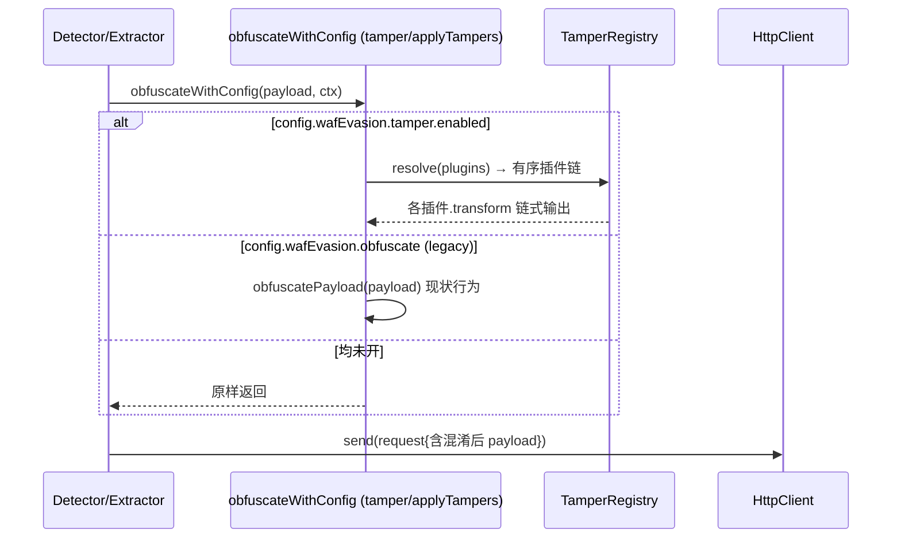
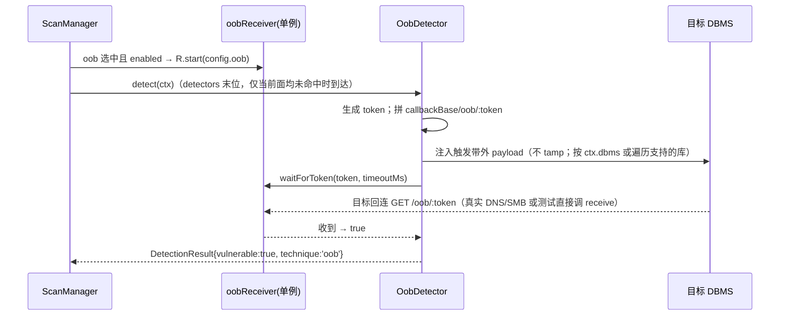

# sqli-scanner 增量能力设计：可插拔 tamper / OOB 带外 / 指纹扩展+表单爬取

> 作者：架构师 高见远（Gao）
> 形态：在**现有注入检测引擎**上做增量（非重写）
> 依据：已逐行核对 `Detector.js / injection.js / httpClient.js / ScanManager.js / payloads.js / defaults.js / TargetParser.js / DBFingerprinter.js / Extractor.js / ReportGenerator.js / sqlmapBridge.js / scanRoutes.js` 与 `tests/*` 测试约定
> 语言：中文（含代码注释/日志/报告），ESM，全部出站请求走 `HttpClient`

---

## 1. 增量设计总述

本次在现有引擎上叠加三项能力，统一遵循"扩展而非重写、向后兼容、不破坏 `sqlmapBridge` 通道"的原则。**tamper 框架**把现状唯一的内联混淆 `obfuscatePayload` 升级为链式可插拔体系：`server/src/core/tamper/` 提供 `TamperRegistry`（内置+用户插件注册表）与 `applyTampers`（链式执行），钩子点 `Detector.obfuscateValue / injection.obfuscateIfNeeded / Extractor._send` 改为统一调用 `obfuscateWithConfig(value, ctx)`（未启用 tamper 时行为等价于现状）；配置落在 `config.wafEvasion.tamper={enabled,plugins}`。**OOB 带外**新增独立 HTTP 接收端 `server/src/core/oobReceiver.js`（自带端口，可测）与策略模式检测器 `OobDetector`（技术名 `oob`），当 time/boolean 盲注不可靠时注入触发 DBMS 带外回调的 payload（MySQL `LOAD_FILE`/UNC、`xp_dirtree`、`UTL_HTTP` 等），再轮询接收端是否收到带 token 的回调；在 `ScanManager` 注册并同步 `TECHNIQUE_TYPES/techniques/SUPPORTED`（按库标记是否支持 OOB），**默认 opt-in**（不勾选不触发出站带外）。**指纹+表单**两路并行：指纹侧强化 MariaDB 与 MySQL 区分、补充版本特征与少量 payload 变体（只做可测的）；`TargetParser.discover` 改为 `async` 并新增 HTML 表单爬取——用 `HttpClient` 取目标页与表单 action 指向的页，解析 `<form>` 提取 input（含 hidden/CSRF token 字段）作为 body 位置注入点，多 action 记为独立点，原参数发现逻辑完全保留。

---

## 2. 文件清单（相对路径，区分【新增】/【修改】）

### 【新增】
- `server/src/core/tamper/TamperRegistry.js` — 插件注册表（内置+用户）
- `server/src/core/tamper/applyTampers.js` — `applyTampers` + `obfuscateWithConfig` 统一钩子
- `server/src/core/tamper/plugins/space2comment.js` — 空格→`/**/`
- `server/src/core/tamper/plugins/randomcase.js` — 关键字随机大小写
- `server/src/core/tamper/plugins/charencode.js` — 字符 URL/十六进制编码
- `server/src/core/tamper/plugins/equaltolike.js` — `=`→`LIKE`
- `server/src/core/tamper/plugins/keywordSplit.js` — 关键字内插注释分割（`/*!*/`）
- `server/src/core/tamper/plugins/comments.js` — 随机注释注入
- `server/src/core/tamper/plugins/base64encode.js` — 整串 BASE64（需配套解码触发，留接口）
- `server/src/core/tamper/index.js` — 桶文件：注册内置插件、导出 `tamperRegistry`
- `server/src/core/oobReceiver.js` — OOB 接收端（独立 HTTP 服务，单例 `oobReceiver`）
- `server/src/engine/detectors/OobDetector.js` — OOB 带外检测器（策略模式，技术名 `oob`）
- `server/tests/tamper.test.js` — Registry/applyTampers/插件单测
- `server/tests/oobReceiver.test.js` — 接收端 start/receive/waitForToken 单测
- `server/tests/oobDetector.test.js` — OobDetector 检测逻辑单测（mock receiver）
- `server/tests/fingerprint.test.js` — MariaDB 区分 / 版本特征单测
- `server/tests/targetParser.forms.test.js` — 表单爬取单测（mock httpClient）

### 【修改】
- `server/src/engine/payloads.js` — 新增 `oob` 技术（`OOB_PAYLOADS`）、`SUPPORTED` 增 `oob` 标记、`TECHNIQUE_TYPES` 含 `'oob'`、MariaDB 区分、`DB_VERSION`/`FINGERPRINT` 版本特征、少量 payload 变体；`obfuscatePayload` 保持为 legacy 单函数
- `server/src/config/defaults.js` — 新增 `wafEvasion.tamper`、`oob`、`crawlForms`
- `server/src/engine/Detector.js` — `obfuscateValue` 改调 `obfuscateWithConfig`；`buildRequest` 支持 `actionUrl/formMethod/formValues`
- `server/src/engine/injection.js` — `obfuscateIfNeeded` 改调 `obfuscateWithConfig`；`buildInjectionRequest` 支持表单点
- `server/src/engine/Extractor.js` — `_send` 改调 `obfuscateWithConfig`；`_build` 支持表单点
- `server/src/engine/TargetParser.js` — 构造函数接 `httpClient`；`discover` 改 `async`，新增表单爬取
- `server/src/engine/models.js` — `createInjectionPoint` 增加 `formMethod/actionUrl/formValues/csrfTokenName`
- `server/src/engine/ScanManager.js` — 注册 `OobDetector`（末位）；`_run` 中 `await parser.discover`；按需 `oobReceiver.start(config.oob)`
- `server/src/services/ReportGenerator.js` — `riskOf` 将 `oob` 纳入 Medium 评级
- `server/tests/targetParser.test.js` — 扩展断言（不破坏原有用例）

> 注：`sqlmapBridge.js`、`scanRoutes.js`（已透传未知 config 键）、`index.js`（OOB 接收端为独立端口，不需 Express 挂载）、`DBFingerprinter.js`（仅复用 `obfuscateIfNeeded`，自动获得 tamper）均**无需结构性改动**；`scanRoutes.sanitizeStart` 经 `...cfg` 已透传 `oob/tamper/crawlForms`，仅 `techniques` 需 `TECHNIQUE_TYPES` 含 `oob` 才能被校验通过。

---

## 3. 关键数据结构与接口契约

### 3.1 TamperPlugin 形状（每个插件导出此对象）
```js
// server/src/core/tamper/plugins/space2comment.js
export const space2comment = {
  name: 'space2comment',                 // 唯一名，对应 config.wafEvasion.tamper.plugins 中的字符串
  description: '将空格替换为注释 /**/，绕过空格过滤',
  /**
   * @param {string} payload 待混淆的注入串
   * @param {object} ctx { httpClient, target, point, dbms, config }
   * @returns {string} 转换后串
   */
  transform(payload, ctx) {
    return payload.replace(/ /g, '/**/');
  },
};
```

### 3.2 TamperRegistry / applyTampers API
```js
// TamperRegistry
class TamperRegistry {
  register(plugin)                          // 注册单个插件（缺 name 抛 INVALID_PARAM）
  registerMany(plugins[])                   // 批量注册（启动期注册内置+用户插件）
  get(name)                                 // 按名取插件
  list()                                    // 全部插件元信息 {name, description}[]
  resolve(names[])                          // 按名解析成有序插件数组（未知名跳过并告警）
}
export const tamperRegistry = new TamperRegistry();  // 单例

// applyTampers：链式执行，前一个输出作为下一个输入
applyTampers(payload, ctx, pluginNames) => string

// obfuscateWithConfig：统一钩子（Detector/injection/Extractor 均改调此）
// 1) tamper.enabled → applyTampers；2) 否则 wafEvasion.obfuscate → obfuscatePayload（legacy）；3) 否则原样
obfuscateWithConfig(value, ctx) => string
```

### 3.3 OobReceiver API（独立 HTTP 服务，单例 `oobReceiver`）
```js
class OobReceiver {
  /**
   * 启动监听（幂等：已在同一端口监听则 no-op）
   * @param {{callbackBase:string, httpPort:number, timeoutMs:number}} oobConfig
   */
  async start(oobConfig)                    // 创建 node:http 服务，路由 GET /oob/:token
  receive(token)                           // 内部：记录 token→ts 并唤醒等待者（测试可直接调用模拟带外回调）
  /**
   * 轮询等待某 token 被接收
   * @param {string} token
   * @param {number} timeoutMs 超时（取 config.oob.timeoutMs）
   * @returns {Promise<boolean>} 收到 true / 超时 false
   */
  waitForToken(token, timeoutMs) => Promise<boolean>
  isStarted() => boolean
  stop()                                   // 关闭服务（扫描结束可选调用）
}
export const oobReceiver = new OobReceiver();
```

### 3.4 OobDetector 结果形状
复用现有 `DetectionResult`（`createDetectionResult`），不新增结构：
```js
{
  pointId, technique: 'oob',
  vulnerable: true,
  dbms,                                    // 实际触发带外回调的库（MySQL/PostgreSQL/SQL Server/Oracle 之一）
  evidence: 'OOB 带外确认：token=xxx 被目标 DBMS 回连至 callbackBase 接收端',
  payloads: [ '<触发带外请求的原始 payload>' ],
}
```
> 命中时同步置 `point.confirmed=true; point.technique='oob'; point.dbms=dbms`（与现有检测器一致）。OOB 仅确认注入，**不进入拖库/二分提取分支**（ScanManager 的 `_extract` 只对 union/error（拖库）与 boolean/time（proof）生效，oob 落空属预期）。

### 3.5 扩展后的配置 schema（defaults.js）
```js
wafEvasion: {
  randomUA: false,
  jitterMs: 0,
  obfuscate: false,                        // legacy 单混淆，保留
  tamper: { enabled: false, plugins: [] }, // 【新增】链式可插拔
},
techniques: ['union', 'error', 'boolean', 'time'],  // 默认不含 oob/stacked（均 opt-in）
oob: {                                      // 【新增】OOB 带外
  enabled: false,                           // 默认关闭，避免意外出站
  callbackBase: '127.0.0.1:8899',           // 接收端可达地址（真实环境换成自有域名）
  httpPort: 8899,                           // 接收端监听端口（独立端口，非引擎 4567）
  timeoutMs: 5000,                          // 轮询等待上限
},
crawlForms: false,                          // 【新增】表单爬取总开关（默认关，避免误触发副作用）
```

### 3.6 TargetParser 表单点形状（InjectionPoint 扩展）
```js
// models.createInjectionPoint(location, param, originalValue, extra={})
{
  id, location: 'body', param: 'username', originalValue: '',
  confirmed: false, technique: null, dbms: null,
  // —— 以下为表单点新增字段（非表单点均为 null/{}，向后兼容）——
  formMethod: 'POST',                       // 表单提交方法
  actionUrl: 'http://example.com/login',    // 表单 action 解析后的绝对提交地址
  formValues: { username: '', password: '', _token: 'abc123' }, // 表单全部字段原始值（含 CSRF token）
  csrfTokenName: '_token',                  // 捕获到的反 CSRF 字段名（null 表示无）
}
```
> `buildRequest / buildInjectionRequest / Extractor._build` 在构造请求时优先使用 `point.actionUrl||target.baseUrl`、`point.formMethod||target.method`；body 位置表单点将 `formValues` 全量并入 `data`，再把 `point.param` 覆盖为注入值（保证请求形态合法、CSRF token 随之带上）。

---

## 4. 调用流程（Mermaid）

> 详细见 `docs/three_features_sequence_diagram.mermaid` 与 `docs/three_features_class_diagram.mermaid`。

### 4.1 tamper 挂入发送路径（统一钩子）


### 4.2 OOB 检测器接入 ScanManager + 接收端


### 4.3 TargetParser 抓取 / 解析表单

```mermaid
sequenceDiagram
  participant SM as ScanManager
  participant TP as TargetParser(httpClient)
  participant H as HttpClient
  participant TG as 目标页/action 页
  SM->>TP: await parser.discover(target)  // 改 async
  TP->>TP: 原有 4 类参数发现（url/body/cookie/header）不变
  alt config.crawlForms
    TP->>H: 取 baseUrl 页面
    H->>TG: GET baseUrl
    TG-->>TP: HTML
    TP->>TP: 解析 <form>，提取 input（含 hidden/CSRF）
    TP->>H: 取 action 指向页（如有）
    TP->>TP: 生成 body 位置表单点（独立 action=独立点）
  end
  TP-->>SM: InjectionPoint[]（含表单点）
```


---

## 5. 有序任务清单（按依赖和实现顺序，标注依赖）

| 序 | 任务 | 依赖 | 涉及文件（新增/修改） | 优先级 |
|----|------|------|----------------------|--------|
| T1 | **tamper 注册表与内置插件**：实现 `TamperRegistry`、7 个内置插件、`applyTampers`、`obfuscateWithConfig`、桶文件注册 | 无 | `core/tamper/*`【新】 | P0 |
| T2 | **钩子集成**：`Detector.obfuscateValue`/`injection.obfuscateIfNeeded`/`Extractor._send` 改调 `obfuscateWithConfig`；`defaults.wafEvasion.tamper` | T1 | `Detector.js`/`injection.js`/`Extractor.js`/`defaults.js`【修】 | P0 |
| T3 | **OOB 接收端**：`OobReceiver` 独立 HTTP 服务（start/receive/waitForToken/stop） | 无 | `core/oobReceiver.js`【新】 | P0 |
| T4 | **OOB 检测器 + ScanManager 注册 + payloads 同步**：`OobDetector`、`TECHNIQUE_TYPES`+`SUPPORTED.oob`、`PAYLOADS.oob`/`OOB_PAYLOADS`、ScanManager 注册末位并按需 `oobReceiver.start`、`riskOf` 纳 oob 为 Medium | T3 | `detectors/OobDetector.js`【新】、`payloads.js`/`ScanManager.js`/`ReportGenerator.js`/`defaults.js`/`TECHNIQUE_TYPES`【修】 | P0 |
| T5 | **指纹库扩展**：MariaDB 与 MySQL 区分（`DB_VERSION`/`FINGERPRINT` 精化，新增 `MariaDB` 库条目复用 MySQL payload）、补版本特征与少量 payload 变体 | 无 | `payloads.js`/`models.js`(DBMS_LIST)【修】 | P1 |
| T6 | **TargetParser 表单爬取**：构造接 `httpClient`、`discover` 改 async、HTML 表单解析+CSRF 捕获、`models.createInjectionPoint` 扩字段、`buildRequest` 等支持表单点、`ScanManager` 改 `await discover`、`defaults.crawlForms` | 无（与 T1-T4 正交，但改 `buildRequest` 需注意不与 T2 冲突，建议 T2 之后） | `TargetParser.js`/`models.js`/`Detector.js`/`injection.js`/`Extractor.js`/`ScanManager.js`/`defaults.js`【修】 | P1 |
| T7 | **测试补齐**：tamper / oobReceiver / oobDetector / fingerprint / targetParser.forms 单测；原 targetParser.test 扩展断言 | T1-T6 | `tests/*`【新/修】 | P0/P1 |

> 依赖说明：T2 依赖 T1（钩子调用注册表）；T4 依赖 T3（检测器轮询接收端）；T6 改动点函数与 T2 同文件（`Detector.buildRequest`/`injection.buildInjectionRequest`/`Extractor._build`），建议 T2 完成后再做 T6 以避免同一文件反复改动；T5 独立；T7 收尾。实现顺序推荐：T1 → T2 → T3 → T4 → T5 → T6 → T7。

---

## 6. 依赖包列表

**预计无新增运行时依赖。**
- OOB 接收端使用 Node 内置 `node:http`，无需引入 `express` 子实例（独立端口，避免与主应用耦合）。
- token 生成复用已有 `nanoid`（已在 `package.json` 依赖）。
- tamper 插件均为纯字符串变换，零依赖。
- 若未来要支持"真实 DNS OOB"需自有域名+权威 NS，那是**基础设施**而非代码依赖，本设计以本地 HTTP 接收端为可测实现，DNS 仅留接口，不引入新包。

---

## 7. 共享约定

- **错误码复用 `core/errors.js`**：优先复用现有 `ErrorCode`（如 OOB 配置非法用 `INVALID_PARAM`、启动失败用 `HTTP_ERROR`/`UNKNOWN`）。如需新增，在 `ErrorCode` 追加一组 `OOB_*`（`6001 OOB_RECEIVER_START_FAILED`、`6002 OOB_DISABLED`）与 `TAMPER_*`（`6003 TAMPER_INVALID_NAME`），不改动既有码值。
- **命名约定**：tamper 插件导出 `camelCase` 常量并以 `name` 字段作为唯一标识；单例 `tamperRegistry` / `oobReceiver` 与现有 `httpClient` 风格一致；检测器技术名 `'oob'` 与 `TECHNIQUE_TYPES` 严格对应前端 `types.ts` 的 `TechniqueType`（前端同步需补 `'oob'`）。
- **出站唯一入口**：所有网络请求（含表单爬取取页、OOB 注入）一律经 `HttpClient`，禁止裸 `fetch/axios`（与现状一致）。
- **向后兼容**：`tamper.enabled=false` 且 `wafEvasion.obfuscate=false` 时，`obfuscateWithConfig` 返回原样，行为等价于现状；表单点字段在非表单场景为 `null/{}`，`buildRequest` 回退到 `target.baseUrl/method`，原 4 类参数发现零改动。
- **测试框架**：项目实际用 `node --test`（`package.json` 的 `test` 脚本），非 Jest。新增测试沿用 `node:test` + `node:assert/strict`，mock `httpClient.request` 与 `oobReceiver.receive` 模拟带外回调；要求"补测试"即指补 `node:test` 用例。
- **非破坏性边界声明**：引擎仅绑 `127.0.0.1`、CORS 白名单、`SCAN_API_TOKEN` 纵深防御均保留；OOB 与表单爬取默认关闭（opt-in），避免对未授权目标产生意外出站/状态变更。

---

## 8. 待明确事项 / 风险

1. **OOB DNS 基础设施边界（诚实）**：真实 OOB 依赖自有域名+权威 NS（DNS）或 SMB 共享（UNC），本机不可测。本设计以**本地 HTTP 接收端**为可测实现，payload 中的 `callbackBase` 在真实环境需换成你的域名；测试通过直接调用 `oobReceiver.receive(token)` 或 mock 模拟回连，**不验证真实 DBMS 出网**。Oracle `UTL_HTTP`/MSSQL `xp_dirtree` 还需目标库相应权限，真实命中率受环境影响——属预期。
2. **表单爬取副作用风险**：爬取会向目标发起 `GET` 取页（只读，风险低）；但扫描阶段会把注入 payload 提交到表单 `action`（可能触发登录/写操作等副作用）。建议 `crawlForms` 默认关闭，且仅对 `method=GET` 表单或用户显式开启的 `POST` 表单启用；CSRF token 在发现时捕获为静态值，重放可能过期导致请求被拒（不影响"发现注入点"判定，仅提示）。
3. **MariaDB 区分的边界**：MariaDB 与 MySQL 协议互通，`PAYLOADS.MariaDB` 直接复用 MySQL 模板（`MariaDB: PAYLOADS.MySQL` 引用或浅拷贝），仅在指纹层用版本串 `MariaDB` 关键字区分并独立上报；提取/枚举复用 MySQL 的 `WRAP`/`SYS_QUERIES`（Extractor 与 DBFingerprinter 需对 `dbms==='MariaDB'` 走 MySQL 分支——可在两处 `dbms || 'MySQL'` 默认或显式 `if(dbms==='MariaDB') dbms='MySQL'` 兜底，避免重复维护）。
4. **`obfuscate` 与 `tamper` 并存语义**：二者独立开关。`tamper.enabled` 优先；关闭时回退到 legacy `obfuscatePayload`。是否需要在 tamper 链尾自动追加 legacy 混淆，待定（默认不追加，保持行为清晰；如需等价旧行为，用户可把 `legacyComment` 作为插件名加入 `plugins`）。
5. **OOB 在多检测器 break 逻辑中的位置**：`OobDetector` 置于 `detectors` 末位，仅当前面（union/error/boolean/time/stacked）均未命中（未 break）时才尝试——即作为盲注/无回显场景的兜底确认，符合定位。若希望即使已确认也额外用 OOB 印证，需调整 `ScanManager` 的 break 策略，待产品确认。
6. **Tauri 桌面形态**：独立 OOB 接收端口在桌面端由 sidecar 引擎同进程拉起，无需额外打包；`callbackBase` 在桌面端建议用 `127.0.0.1:<httpPort>`。
7. **`sanitizeStart` 透传**：`oob/tamper/crawlForms` 已随 `...cfg` 透传，但 `techniques` 需 `TECHNIQUE_TYPES` 含 `oob` 才能被校验通过（已在 T4 处理）；若产品希望 OOB 默认随空 techniques 开启，需改 `_selectedTechs` 的兜底逻辑（当前空 techniques 返回全量含 oob 仅当数组为空/缺省，默认 4 项不含 oob，安全）。

---

## 附：实现要点提示（给工程师，非代码）

- T1：`tamper/index.js` 在导入时 `registerMany([space2comment, randomcase, ...])`，并可选 `registerMany(userPlugins)`（用户插件从 `config.wafEvasion.tamper.plugins` 解析为对象时注入）。
- T2：三处 `obfuscateValue/obfuscateIfNeeded/_send` 的 `return obf?obfuscatePayload(v):v` 改为 `return obfuscateWithConfig(v, ctx)`；`obfuscateWithConfig` 从 `core/tamper/applyTampers.js` 导入。
- T3：`oobReceiver.start` 用 `http.createServer`，路由 `req.url` 匹配 `/oob/:token` 后 `receive(token)` 并 `res.end('ok')`；`waitForToken` 用 `Map<token, {resolve}>` 唤醒。
- T4：`OobDetector.detect` 先 `oobReceiver.waitForToken` 之前确保 `oobReceiver.isStarted()`（由 ScanManager 启动）；payload 经 `OOB_PAYLOADS[dbms]` 以 `{CALLBACK}` 占位填充 `callbackBase/oob/:token`，**不做 tamper**（避免破坏回调地址）。
- T5：在 `payloads.js` 增加 `const MariaDB = PAYLOADS.MySQL` 引用；`FINGERPRINT.MariaDB`、`DB_VERSION.MariaDB.sig=/MariaDB/i`；`MySQL` 的 `DB_VERSION` 增加负向约束（识别到 MariaDB 时不应判 MySQL，靠顺序/优先匹配 MariaDB 实现）。
- T6：`TargetParser` 构造签名为 `constructor(httpClient)`；`discover` 内原逻辑保持，新增 `if (config.crawlForms) await this._crawlForms(target, points)`；CSRF 字段名正则 `/^(csrf|_token|__RequestVerificationToken|authenticity_token)$/i`。
- T7：tamper 测试覆盖 `applyTampers` 链式顺序与 `obfuscateWithConfig` 三态；oobReceiver 测试覆盖 start 幂等、receive→waitForToken 返回 true、超时返回 false；oobDetector 用注入 `oobReceiver.receive(token)` 模拟回连验证 `vulnerable=true`。
