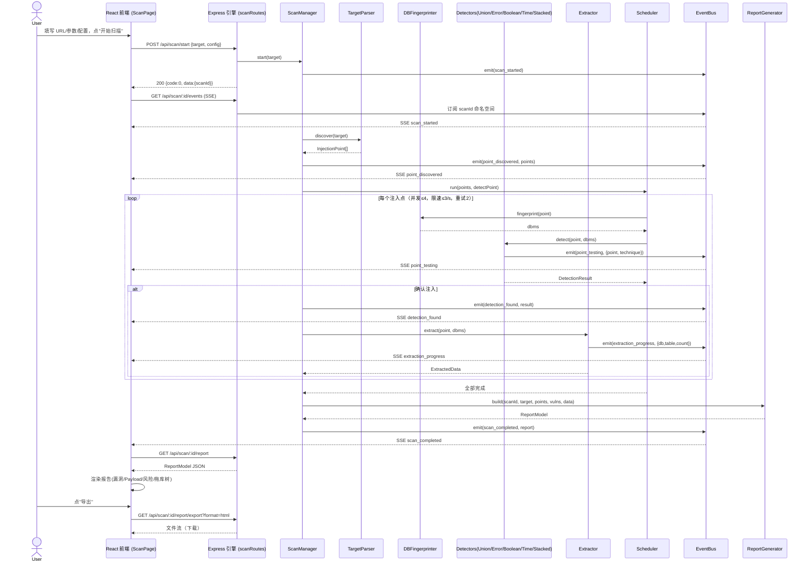

# SQL 注入检测工具 — 系统架构设计 + 任务分解（完整版）

> 作者：架构师 高见远（Gao）
> 形态：Web 全栈（React + Node/Express 引擎）+ Tauri 桌面壳（一份代码双形态）
> 语言：全部中文（含代码注释、日志、报告文案）
> 工程根目录：`sqli-scanner/`（相对 `C:\ProgramData\WorkBuddy\users\3a7d1c20\WorkBuddy\2026-07-27-04-04-56\`）

---

## 0. 总览与关键决策

| 维度 | 决策 |
|------|------|
| 双形态复用 | 同一套 React 前端 + 同一套 Node 检测引擎；Tauri 仅作为"本地壳"，以 **sidecar 方式拉起引擎进程**并负责窗口/打包。前端代码零改动。 |
| 进程模型 | Web 版：前端经同源 `/api` → Express（部署期由网关转发）；Tauri 版：前端经 `http://127.0.0.1:4567/api` → 本地 sidecar 引擎。前端通过 `VITE_API_BASE` 一个变量切换，**业务逻辑完全一致**。 |
| 引擎端口 | 默认 `4567`（可在 `server/src/config/defaults.js` 与 `src-tauri/tauri.conf.json` 同步修改）。 |
| 默认参数 | 并发 4、超时 10s、重试 2、时间盲注阈值 1.5s、限速 ≤3 req/s（HTTP 令牌桶）。 |
| 实时进度 | 服务端事件 **SSE**（`GET /api/scan/:id/events`），单向流、自动重连，比 WebSocket 更轻、足够。 |
| 检测器设计 | **策略模式** `Detector` 接口 + 5 个具体检测器（union/error/boolean/time/stacked），新增技术只加一个类并在注册表登记。 |
| 拖库 | 默认开启，但前端**二次确认**后才真正 dump 数据；API 层已做入参校验。 |
| 历史记录 | 首版内存 Map + 可选本地 JSON 落盘（不加密）。 |
| Payload | 用户**只可查看不可编辑**（自动化为主、学习向展示）。 |
| 代理/认证 | **已实现**：`HttpClient` 支持 `proxy`（HTTP/SOCKS5）与 `auth`（Basic/Cookie/自定义头）；引擎默认绑定 `127.0.0.1`、CORS 仅放行可信前端源、可选 `SCAN_API_TOKEN` 纵深防御。 |

---

## 1. 实现方案 + 框架选型

### 1.1 总体架构（分层）

```
┌─────────────────────────────────────────────────────────────┐
│  表现层  React + MUI + Tailwind （ScanPage / ReportPage …）    │
├─────────────────────────────────────────────────────────────┤
│  契约层  src/shared/types.ts + apiClient.ts （前后端共享 schema）│
├───────────────────────┬─────────────────────────────────────┤
│  Web 运行时            │  Tauri 运行时（桌面壳）              │
│  Nginx/同源网关 → /api │  sidecar: node 引擎 @127.0.0.1:4567 │
├───────────────────────┴─────────────────────────────────────┤
│  接口层  Express 路由（scanRoutes / healthRoutes）            │
├─────────────────────────────────────────────────────────────┤
│  编排层  ScanManager（发现→指纹→检测→提取→报告）             │
├─────────────────────────────────────────────────────────────┤
│  调度层  Scheduler（并发池 + 令牌桶限速 + 重试）              │
├─────────────────────────────────────────────────────────────┤
│  引擎层  TargetParser / Detector×5 / DBFingerprinter /        │
│          Extractor / ColumnTypeEnumerator                    │
├─────────────────────────────────────────────────────────────┤
│  基础层  HttpClient / EventBus / payloads / errors / logger   │
└─────────────────────────────────────────────────────────────┘
```

### 1.2 进程模型（Web 版 vs Tauri 版）

**Web 版**
- 开发期：Vite dev server 的 `server.proxy` 把 `/api` 转发到 `http://localhost:4567`。
- 生产期：Express 与静态资源同域（或由反向代理把 `/api` 转发到引擎端口）。
- 前端 `apiClient` 的 base 为相对路径 `/api`，无需感知后端地址。

**Tauri 版**
- `src-tauri/tauri.conf.json` 中配置 `bundle.externalBin` 指向打包好的 Node 引擎可执行文件（sidecar），并在 `tauri.conf.json` 声明其监听端口。
- Tauri 启动时先拉起 sidecar（Node 引擎监听 `127.0.0.1:4567`），再加载前端。
- 构建 Tauri 时通过 `.env.tauri` 注入 `VITE_API_BASE=http://127.0.0.1:4567`，其余前端代码与 Web 版完全相同。
- 前端用 `@tauri-apps/api` 仅在"启动/停止引擎""导出文件落盘"两处与系统交互，封装在 `src/shared/tauriBridge.ts`，Web 版该模块为 no-op。

**为何这样选**：引擎是唯一真实逻辑载体，前端只负责"发请求 + 渲染"。把引擎跑成常驻 HTTP 服务（sidecar）后，Web 与桌面复用同一份代码，避免维护两套通信协议（IPC vs HTTP）。策略模式 + HTTP API 让引擎可被任意前端/CLI 复用。

### 1.3 前端模块划分
- `pages/`：ScanPage（目标录入+配置+进度）、ReportPage（漏洞/拖库/风险）、HistoryPage（历史）。
- `components/`：TargetForm、ScanConfigPanel、ProgressView、VulnList、VulnDetail、PayloadViewer、ReportExport、DbTree。
- `hooks/`：`useScan`（开始/停止/轮询）、`useEvents`（SSE 订阅）。
- `store/`：`scanStore`（zustand 管理当前扫描状态与报告）。
- `shared/`：`types`（TS 类型）、`apiClient`（HTTP 封装）、`constants`、`tauriBridge`。

### 1.4 后端检测引擎模块划分
- `core/`：HttpClient（超时/重试/限速）、EventBus（进度事件）、errors（错误码）、logger。
- `engine/`：models、payloads、TargetParser、Detector 接口 + detectors/、DBFingerprinter、Extractor、ColumnTypeEnumerator、ScanManager。
- `services/`：Scheduler（并发/限速）、ReportGenerator（JSON/HTML）。
- `api/`：scanRoutes、healthRoutes。
- `config/`：defaults（默认参数）。

### 1.5 框架/库选型及理由
- **Express**：轻量、生态成熟，路由/SSE 开箱即用，足够承载扫描 API。
- **axios**：统一前后端 HTTP 调用，支持 timeout/拦截器，便于做重试与限速封装。
- **MUI + Tailwind**：MUI 提供企业级组件（表格/对话框/步进器），Tailwind 负责布局与主题微调，二者可共存（Tailwind 仅用于 className 布局，MUI 负责组件）。
- **zustand**：极简状态管理，适合扫描会话这种单一数据源场景，比 Redux 轻。
- **react-router-dom**：多页面（扫描/报告/历史）路由。
- **Tauri v2**：比 Electron 体积小、资源占用低，sidecar 模型完美契合"本地引擎"。
- **SSE（原生）**：进度推送单向、自动重连，无需引入 socket.io。

### 1.6 架构模式
- 引擎内部：**策略模式**（Detector）+ **门面模式**（ScanManager 对外暴露简单 API，隐藏内部复杂度）+ **观察者模式**（EventBus 推送进度）。
- 前后端：**REST + SSE** 契约式通信。
- 前端：**组件化 + 单向数据流（zustand）**。

---

## 2. 文件列表及相对路径

所有路径相对 `sqli-scanner/`。

```
sqli-scanner/
├── package.json                      # 根：workspace 脚本（dev/web/tauri/build）
├── vite.config.ts                    # Vite 配置（含 /api 代理）
├── tailwind.config.js                # Tailwind 配置（content 指向 src）
├── postcss.config.js                 # Tailwind/PostCSS
├── tsconfig.json                     # 前端 TS 配置
├── tsconfig.node.json                # Vite 节点 TS 配置
├── index.html                        # 前端入口 HTML
├── .gitignore
├── .env.development                  # VITE_API_BASE=/api
├── .env.tauri                        # VITE_API_BASE=http://127.0.0.1:4567
├── README.md
│
├── src/                              # React 前端
│   ├── main.tsx                      # 入口：挂载 App + Router
│   ├── App.tsx                       # 布局 + 路由出口
│   ├── index.css                     # Tailwind 指令 + 全局样式
│   ├── router.tsx                    # 路由表（/scan /report/:id /history）
│   ├── shared/
│   │   ├── types.ts                  # TS 类型（镜像后端 schema）
│   │   ├── apiClient.ts              # axios 封装 + 统一响应 {code,data,message}
│   │   ├── constants.ts              # 风险等级/技术枚举/默认配置展示
│   │   └── tauriBridge.ts            # Tauri 专用桥接（Web 版 no-op）
│   ├── hooks/
│   │   ├── useScan.ts                # 开始/停止/获取报告
│   │   └── useEvents.ts              # SSE 订阅进度事件
│   ├── store/
│   │   └── scanStore.ts              # zustand：当前扫描+报告+历史
│   ├── pages/
│   │   ├── ScanPage.tsx              # 目标/参数/配置录入 + 实时进度
│   │   ├── ReportPage.tsx            # 漏洞详情/Payload/风险/拖库树
│   │   └── HistoryPage.tsx           # 历史扫描列表
│   └── components/
│       ├── TargetForm.tsx            # URL/Method/Body/Cookie/Header 录入
│       ├── ScanConfigPanel.tsx       # 超时/并发/重试/拖库开关
│       ├── ProgressView.tsx          # 进度条 + 事件流
│       ├── VulnList.tsx              # 漏洞列表
│       ├── VulnDetail.tsx            # 单漏洞详情 + Payload
│       ├── PayloadViewer.tsx         # 只读 Payload 展示
│       ├── ReportExport.tsx          # 导出 JSON/HTML
│       └── DbTree.tsx               # 库/表/列/数据 树形展示
│
├── server/                           # Node/Express 检测引擎
│   ├── package.json
│   ├── index.js                      # 入口：启动 Express + 路由挂载
│   └── src/
│       ├── config/
│       │   └── defaults.js           # 并发/超时/重试/阈值/限速/端口
│       ├── core/
│       │   ├── httpClient.js         # axios 封装：超时/重试/令牌桶限速
│       │   ├── eventBus.js           # 每扫描一个 EventEmitter 命名空间
│       │   ├── errors.js             # 错误码枚举 + AppError
│       │   └── logger.js             # winston 日志
│       ├── engine/
│       │   ├── models.js             # Target/InjectionPoint/DetectionResult/Report
│       │   ├── payloads.js           # 按库×技术的 Payload 模板
│       │   ├── TargetParser.js       # 从 Target 发现注入点
│       │   ├── Detector.js           # 检测器接口/基类
│       │   ├── detectors/
│       │   │   ├── UnionDetector.js
│       │   │   ├── ErrorDetector.js
│       │   │   ├── BooleanBlindDetector.js
│       │   │   ├── TimeBlindDetector.js
│       │   │   └── StackedDetector.js
│       │   ├── DBFingerprinter.js    # 5 种库指纹识别（响应头 + UNION 版本回显）
│       │   ├── Extractor.js          # 库/表/列/数据 提取（拖库）
│       │   ├── ColumnTypeEnumerator.js # 列数据类型枚举（P1）
│       │   └── ScanManager.js        # 编排：发现→指纹→检测→提取→报告
│       ├── services/
│       │   ├── Scheduler.js          # 并发池 + 重试（限速统一在 HttpClient）
│       │   └── ReportGenerator.js    # 报告 JSON/HTML 生成 + 风险定级
│       └── api/
│           ├── scanRoutes.js         # /api/scan/*
│           └── healthRoutes.js       # /api/health
│
└── src-tauri/                        # Tauri 桌面壳
    ├── tauri.conf.json               # 窗口/sidecar/能力/capabilities
    ├── Cargo.toml
    ├── build.rs
    ├── icons/                        # 应用图标
    └── src/
        └── main.rs                   # 启动 sidecar（Node 引擎）+ 窗口
```

---

## 3. 数据结构和接口

### 3.1 核心引擎类图（Mermaid classDiagram）
> 同 `docs/class-diagram.mermaid`

```mermaid
classDiagram
    class ScanConfig {
        +number concurrency
        +number timeoutMs
        +number retry
        +number timeThresholdMs
        +number ratePerSec
        +boolean enableExtract
        +string proxy
        +object auth
    }
    class Target {
        +string id
        +string baseUrl
        +string method
        +object bodyParams
        +object cookieParams
        +object headerParams
        +ScanConfig config
    }
    class InjectionPoint {
        +string id
        +enum location
        +string param
        +string originalValue
        +boolean confirmed
        +string technique
        +string dbms
    }
    class DetectionResult {
        +string pointId
        +enum technique
        +boolean vulnerable
        +string dbms
        +string evidence
        +string[] payloads
    }
    class Vulnerability {
        +string id
        +string pointId
        +enum technique
        +string dbms
        +enum riskLevel
        +string[] payloads
        +string description
    }
    class ExtractedData {
        +string[] databases
        +map~string,string[]~ tables
        +map~string,string[]~ columns
        +map~string,object[]~ rows
    }
    class ReportModel {
        +string scanId
        +Target target
        +Date startedAt
        +Date finishedAt
        +string dbms
        +InjectionPoint[] points
        +Vulnerability[] vulns
        +ExtractedData data
        +enum riskLevel
        +object summary
    }
    class Detector {
        <<interface>>
        +enum technique
        +detect(ctx) Promise~DetectionResult~
    }
    class UnionDetector
    class ErrorDetector
    class BooleanBlindDetector
    class TimeBlindDetector
    class StackedDetector
    class DBFingerprinter {
        +fingerprint(ctx) Promise~string~
    }
    class Extractor {
        +enumerateDatabases(ctx)
        +enumerateTables(ctx, db)
        +enumerateColumns(ctx, db, table)
        +dumpData(ctx, db, table, cols, limit)
    }
    class ColumnTypeEnumerator {
        +enumerate(ctx, db, table, cols) Promise~object~
    }
    class ScanManager {
        +start(target) Promise~string~
        +stop(scanId) void
        +getReport(scanId) ReportModel
        +exportReport(scanId, format) string
        -TargetParser parser
        -Detector[] detectors
        -DBFingerprinter fp
        -Extractor extractor
        -EventBus bus
    }
    class Scheduler {
        +run(items, worker) Promise
        -number concurrency
        -number ratePerSec
    }
    class EventBus {
        +create(scanId) Emitter
        +emit(scanId, type, payload) void
        +toSSE(scanId, res) void
    }
    class HttpClient {
        +request(opts) Promise~Response~
        -number timeoutMs
        -number retry
        -TokenBucket bucket
    }
    class ReportGenerator {
        +build(scanId, target, points, vulns, data) ReportModel
        +toJSON(report) string
        +toHTML(report) string
        +riskOf(vulns) enum
    }
    class TargetParser {
        +discover(target) InjectionPoint[]
    }

    Detector <|.. UnionDetector
    Detector <|.. ErrorDetector
    Detector <|.. BooleanBlindDetector
    Detector <|.. TimeBlindDetector
    Detector <|.. StackedDetector
    ScanManager *-- TargetParser
    ScanManager *-- Detector
    ScanManager *-- DBFingerprinter
    ScanManager *-- Extractor
    ScanManager *-- EventBus
    ScanManager ..> Scheduler : 调度检测
    ScanManager ..> ReportGenerator : 生成报告
    Extractor ..> ColumnTypeEnumerator : 枚举列类型
    Detector ..> HttpClient : 发请求
    DBFingerprinter ..> HttpClient : 发请求
    Extractor ..> HttpClient : 发请求
    ReportModel *-- ExtractedData
    ReportModel *-- Vulnerability
    Target "1" *-- "0..*" InjectionPoint : 发现
```



### 3.2 关键类说明（属性/方法速查）

- **Target**：扫描目标。`method ∈ {GET,POST}`，`bodyParams/cookieParams/headerParams` 为键值对象；`config` 缺省取 `defaults.js`。
- **InjectionPoint**：`location ∈ {url, body, cookie, header}`，`confirmed` 是否确认可注入，`technique/dbms` 命中后回填。
- **Detector（接口）**：`technique ∈ {union, error, boolean, time, stacked}`；`detect(ctx)` 入参含 `HttpClient`、`InjectionPoint`、`dbms`、指纹上下文，返回 `DetectionResult`。
- **DBFingerprinter**：`fingerprint(ctx)` 先按响应头特征快速识别（如 `X-Powered-By`/`Set-Cookie`），未命中则 UNION 注入各库版本函数（置于已定位的回显列），按版本特征字符串判定 `dbms`。
- **Extractor**：基于已确认的可回显注入点（优先 UNION）做 `SELECT ... FROM information_schema/sysobjects/sqlite_master` 等系统表枚举；盲注场景退化为布尔/时间二分提取（受 `timeout` 与限速约束）。
- **ColumnTypeEnumerator**：在列枚举后追加 `typeof`/`DATA_TYPE` 探测，标注每列类型（int/varchar/text/datetime…）。
- **ScanManager**：门面，对外仅暴露 `start/stop/getReport/exportReport`；内部串起 parser→fingerprint→detectors→extractor→ReportGenerator，并通过 EventBus 推送进度。
- **Scheduler**：`run(items, worker)` 用固定大小并发池执行 `worker(item)`，内置失败重试；速率限制统一由 `HttpClient` 的令牌桶负责（Scheduler 不再重复限速，避免双重限速把实际速率压到设定值以下）。

### 3.3 前端 ↔ 后端 REST API 端点清单

> 统一响应包：`{ "code": 0, "data": <任意>, "message": "ok" }`（`code≠0` 见错误码表）。
> 所有时间字段为 ISO 8601 UTC 字符串。

#### POST `/api/scan/start`
请求体：
```json
{
  "url": "http://example.com/item.php",
  "method": "GET",
  "bodyParams": { "id": "1" },
  "cookieParams": { "PHPSESSID": "abc" },
  "headerParams": { "X-Forwarded-For": "1" },
  "config": {
    "concurrency": 4, "timeoutMs": 10000, "retry": 2,
    "timeThresholdMs": 1500, "ratePerSec": 3,
    "enableExtract": true, "proxy": null, "auth": null
  }
}
```
响应：`{ "code": 0, "data": { "scanId": "scan_xxx" }, "message": "ok" }`

#### GET `/api/scan/:id`
响应 `data`：`ReportModel` 的实时快照（扫描中 `finishedAt=null`，`vulns/data` 逐步填充）。

#### GET `/api/scan/:id/events`（SSE）
事件流，每行 `data: { "type": "...", "scanId": "...", "ts": "...", "payload": {...} }`。
事件类型：`scan_started` / `point_discovered` / `point_testing` / `detection_found` / `extraction_progress` / `scan_completed` / `scan_stopped` / `scan_error`。
示例 `detection_found` payload：`{ "pointId":"p1", "technique":"union", "dbms":"MySQL", "evidence":"...", "payloads":["...","..."] }`。

#### POST `/api/scan/:id/stop`
响应：`{ "code": 0, "data": { "stopped": true }, "message": "ok" }`

#### GET `/api/scan/:id/report`
响应 `data`：完整 `ReportModel`（扫描完成后最全）。

#### GET `/api/scan/:id/report/export?format=json|html`
响应：`application/json` 或 `text/html` 文件流（报告导出）。

#### GET `/api/health`
响应：`{ "code": 0, "data": { "status": "up", "version": "1.0.0" }, "message": "ok" }`

#### GET `/api/payloads?dbms=MySQL&technique=union`（只读展示）
响应 `data`：该库该技术的 Payload 模板列表（用户查看用，不可编辑）。

---

## 4. 程序调用流程（Mermaid sequenceDiagram）
> 同 `docs/sequence-diagram.mermaid`



---

## 5. 任务列表（给工程师的直接执行清单）

> 遵循"最多 5 个任务、每任务 ≥3 文件、T01 为项目基础设施"的硬约束。任务内文件级列出，按依赖顺序实现即可落地。

### T01 — 项目基础设施（脚手架 + 配置 + 依赖 + 入口）
- **目录/文件**：`package.json`、`vite.config.ts`、`tailwind.config.js`、`postcss.config.js`、`tsconfig.json`、`tsconfig.node.json`、`index.html`、`.gitignore`、`.env.development`、`.env.tauri`、`src/main.tsx`、`src/App.tsx`、`src/index.css`、`server/package.json`、`server/index.js`（占位启动）、`src-tauri/tauri.conf.json`、`src-tauri/Cargo.toml`、`src-tauri/src/main.rs`、`README.md`
- **做什么**：搭建 Web + 引擎 + Tauri 三合一 monorepo 骨架。配置 Vite（`/api` 代理到 `:4567`）、Tailwind、TS；配置 Tauri 窗口与 sidecar 端口 `4567`；`server/index.js` 先写一个能 `listen(4567)` 的空 Express；`src/main.tsx`+`App.tsx` 渲染空壳；声明全部依赖（见 §6）。
- **依赖**：无。
- **优先级**：P0

### T02 — 共享契约与引擎基础层（类型/Payload/HTTP/事件/错误/配置）
- **目录/文件**：`src/shared/types.ts`、`src/shared/apiClient.ts`、`src/shared/constants.ts`、`server/src/config/defaults.js`、`server/src/core/httpClient.js`、`server/src/core/eventBus.js`、`server/src/core/errors.js`、`server/src/core/logger.js`、`server/src/engine/payloads.js`、`server/src/engine/models.js`
- **做什么**：
  - `types.ts`：镜像后端 schema 的 TS 类型（Target/InjectionPoint/DetectionResult/Vulnerability/Report/ScanConfig/事件枚举）。
  - `apiClient.ts`：axios 封装，base=`import.meta.env.VITE_API_BASE ?? '/api'`，统一解包 `{code,data,message}`，非 0 抛错。
  - `defaults.js`：导出默认参数（并发4/超时10s/重试2/阈值1.5s/限速3/端口4567/拖库true）。
  - `httpClient.js`：axios 实例 + 超时 + 重试拦截器 + 令牌桶限速（≤ratePerSec）。
  - `eventBus.js`：`create(scanId)` 返回按 scanId 隔离的 EventEmitter；`toSSE(scanId, res)` 把事件转为 SSE 流。
  - `errors.js`：错误码枚举 + `AppError(code,message)`。
  - `logger.js`：winston 控制台+文件日志。
  - `payloads.js`：按 `dbms × technique` 组织的 Payload 模板（MySQL/PostgreSQL/SQLite/SQL Server/Oracle × union/error/boolean/time），含指纹 Payload。
  - `models.js`：Target/InjectionPoint/DetectionResult/Vulnerability/Report/ExtractedData 的工厂与校验函数。
- **依赖**：T01。
- **优先级**：P0

### T03 — 检测引擎核心（策略检测器 + 指纹 + 提取 + 列类型 + 编排）
- **目录/文件**：`server/src/engine/TargetParser.js`、`server/src/engine/Detector.js`、`server/src/engine/detectors/UnionDetector.js`、`server/src/engine/detectors/ErrorDetector.js`、`server/src/engine/detectors/BooleanBlindDetector.js`、`server/src/engine/detectors/TimeBlindDetector.js`、`server/src/engine/DBFingerprinter.js`、`server/src/engine/Extractor.js`、`server/src/engine/ColumnTypeEnumerator.js`、`server/src/engine/ScanManager.js`
- **做什么**：
  - `TargetParser.discover(target)`：从 url/body/cookie/header 生成 `InjectionPoint[]`。
  - `Detector`：基类定义 `technique` 与 `detect(ctx)` 契约；5 个子类各实现一种技术（union 看回显列数/数据；error 看数据库报错特征；boolean 看真假条件响应差异；time 看 `SLEEP/pg_sleep/waitfor` 延迟是否 ≥ 基线+阈值；stacked 以 `;` 追加独立延迟语句证明可堆叠多条语句）。
  - `DBFingerprinter.fingerprint(ctx)`：按各库特征 Payload 判定 dbms。
  - `Extractor`：基于确认的可回显点做库/表/列/数据枚举（UNION 优先，盲注二分兜底），受 config 约束。
  - `ColumnTypeEnumerator`：列类型枚举（P1）。
  - `ScanManager`：门面，串起"发现→指纹→四检测器→提取→构造报告"，全程经 EventBus 推送进度；持有检测器注册表，新增技术只需登记。
- **依赖**：T01、T02（使用 models/payloads/httpClient/eventBus）。
- **优先级**：P0

### T04 — 引擎 API 与调度/报告服务（路由 + 调度器 + 报告 + 引擎启动）
- **目录/文件**：`server/src/services/Scheduler.js`、`server/src/services/ReportGenerator.js`、`server/src/api/scanRoutes.js`、`server/src/api/healthRoutes.js`、`server/index.js`（补全）
- **做什么**：
  - `Scheduler.run(items, worker)`：并发池（concurrency）+ 令牌桶限速 + 失败重试。
  - `ReportGenerator`：`build()` 汇总成 `ReportModel` 并 `riskOf()` 定级（Critical/High/Medium/Low）；`toJSON()/toHTML()` 导出。
  - `scanRoutes.js`：实现 §3.3 全部端点（start/get/events-SSE/stop/report/export/payloads）。
  - `healthRoutes.js`：`/api/health`。
  - `server/index.js`：补全——`express.json()`、挂载路由、CORS、`listen(defaults.port)`。
- **依赖**：T01、T02、T03（用到 ScanManager/Scheduler/ReportGenerator）。
- **优先级**：P0

### T05 — 前端 UI 与 Tauri 集成（路由 + 页面 + 组件 + Hook + 进度 + 导出）
- **目录/文件**：`src/router.tsx`、`src/hooks/useScan.ts`、`src/hooks/useEvents.ts`、`src/store/scanStore.ts`、`src/shared/tauriBridge.ts`、`src/pages/ScanPage.tsx`、`src/pages/ReportPage.tsx`、`src/pages/HistoryPage.tsx`、`src/components/TargetForm.tsx`、`src/components/ScanConfigPanel.tsx`、`src/components/ProgressView.tsx`、`src/components/VulnList.tsx`、`src/components/VulnDetail.tsx`、`src/components/PayloadViewer.tsx`、`src/components/ReportExport.tsx`、`src/components/DbTree.tsx`
- **做什么**：
  - `router.tsx`：路由 `/scan`、`/report/:id`、`/history`。
  - `useScan.ts`：调 `start/get/stop/export`；`useEvents.ts`：订阅 SSE 写 `scanStore`。
  - `scanStore.ts`：zustand 存当前扫描状态、报告、历史事件。
  - `ScanPage`：TargetForm + ScanConfigPanel 录入，ProgressView 实时进度，拖库前二次确认对话框。
  - `ReportPage`：VulnList + VulnDetail（含 PayloadViewer 只读）+ DbTree（拖库树）+ ReportExport（JSON/HTML）。
  - `HistoryPage`：内存历史列表（可选落盘本地 JSON）。
  - `tauriBridge.ts`：封装 `@tauri-apps/api` 的引擎启停/文件保存；Web 版为 no-op，保证业务组件零分支。
- **依赖**：T01、T02（types/apiClient/constants）、T04（消费真实端点）。
- **优先级**：P0

---

## 6. 依赖包列表

### Node（引擎 / `server` 与根）
```
- express@^4.19.2            # Web 框架、路由、SSE 支持
- cors@^2.8.5                # 跨域（Web 版前后端分离调试用）
- axios@^1.7.2               # HTTP 客户端（引擎发测试请求 + 失败重试封装）
- winston@^3.13.0            # 日志
- nanoid@^5.0.7              # 生成 scanId / pointId
- dotenv@^16.4.5             # 读取 .env（端口等）
```
### 前端（`src`）
```
- react@^18.3.1              # UI 框架
- react-dom@^18.3.1
- @mui/material@^5.15.20    # 企业级组件（表格/对话框/步进器）
- @mui/icons-material@^5.15.20
- @emotion/react@^11.11.4   # MUI 样式引擎
- @emotion/styled@^11.11.5
- tailwindcss@^3.4.4        # 布局/主题
- postcss@^8.4.39
- autoprefixer@^10.4.19
- react-router-dom@^6.24.0  # 前端路由
- zustand@^4.5.2            # 轻量状态管理
- axios@^1.7.2              # 调引擎 API（与引擎共用）
- @tauri-apps/api@^2.0.0    # 桌面壳桥接（Web 版不调用）
```
### 构建/工具
```
- vite@^5.3.1               # 前端构建/ dev server
- @vitejs/plugin-react@^4.3.1
- typescript@^5.4.5
- @tauri-apps/cli@^2.0.0    # Tauri 打包/sidecar 构建
```
### Rust（Tauri，`src-tauri`）
```
- tauri@^2.0.0              # 桌面壳框架
- tauri-plugin-shell@^2.0.0# sidecar 拉起 Node 引擎
- serde@^1                 # 配置序列化
```

---

## 7. 共享知识（跨文件约定）

- **统一响应包**：所有 REST 响应 `{ code, data, message }`，`code=0` 成功；SSE 事件 `{ type, scanId, ts, payload }`。
- **错误码约定**（`core/errors.js`）：
  - `0` OK；`1001` 无效目标；`1002` 不支持的方法；`2001` 扫描不存在/已结束；`2002` 引擎忙；`3001` HTTP 超时；`3002` HTTP 错误；`4001` 检测失败；`5001` 提取失败；`9001` 未知错误。
- **HTTP 客户端封装**：所有出站请求走 `core/httpClient.js`（统一超时 `timeoutMs`、指数退避重试 `retry`、令牌桶 `ratePerSec`，代理/认证字段预留）。检测器/指纹/提取器**不得**自行 `fetch`/`axios.create`。
- **Payload 存放**：集中存于 `engine/payloads.js`，结构 `PAYLOADS[dbms][technique] = string[]`；指纹相关另含 `FINGERPRINT`（响应头特征）与 `DB_VERSION`（UNION 版本函数 + 版本特征正则）。新增库/技术只改此文件 + 对应检测器。
- **事件总线机制**：`eventBus.create(scanId)` 返回隔离的 EventEmitter；`ScanManager` 全程 `emit`；`scanRoutes` 用 `toSSE` 转流。前端 `useEvents` 仅消费，不反向控制（停止走独立 `POST /stop`）。
- **进度事件类型**：`scan_started / point_discovered / point_testing / detection_found / extraction_progress / scan_completed / scan_stopped / scan_error`（见 §3.3）。
- **风险定级规则**（`ReportGenerator.riskOf`）：可完成数据提取（union 回显或盲注二分拖库成功）→ **Critical**；确认可回显注入（union/error）→ **High**；仅盲注确认但提取受限 → **Medium**；单点疑似证据不足 → **Low**。
- **API base 切换**：前端 `VITE_API_BASE`——Web 构建为 `/api`，Tauri 构建为 `http://127.0.0.1:4567`；业务组件不感知差异。`tauriBridge.ts` 仅在引擎启停/文件保存处使用 `@tauri-apps/api`。
- **中文约定**：所有用户可见文案、日志、报告、Payload 注释均为中文；错误 `message` 也用中文便于展示。
- **时间格式**：所有时间字段 ISO 8601 UTC 字符串。

---

## 8. 待明确事项及默认处理

| # | 不确定点 | 默认处理 |
|---|----------|----------|
| 1 | 代理/认证 | **已实现**：`httpClient` 支持 `proxy`（HTTP/SOCKS5）与 `auth`（Basic/Cookie/自定义头）；引擎默认绑定 `127.0.0.1`、CORS 仅放行可信前端源、可选 `SCAN_API_TOKEN` 纵深防御。 |
| 2 | 时间盲注判定可靠性 | 以"延迟 ≥ `timeThresholdMs`(1.5s) 且多次(默认3次)稳定"为判定，避免网络抖动误报。 |
| 3 | 拖库数据量上限 | 单次 dump 单表默认上限 100 行（可在 config 扩展），避免超大表卡死；UI 二次确认。 |
| 4 | 历史记录持久化 | 首版内存 Map；`HistoryPage` 提供"导出到本地 JSON"可选落盘，不做加密。 |
| 5 | 暗色主题 | 首版仅浅色（MUI 默认）；预留 `theme` 切换位，P2 再加。 |
| 6 | WAF 规避 | **已实现**：`httpClient` 支持随机 UA（`randomUA`）、请求间随机延时（`jitterMs`）、Payload 大小写/注释混淆（`obfuscate`），由 `ScanConfig.wafEvasion` 控制。 |
| 7 | 并发与限速的具体实现 | 令牌桶 `ratePerSec=3`，并发池 `concurrency=4`，两者正交（并发控"同时进行的请求数"，限速控"每秒发出数"）。 |
| 8 | 多目标批量扫描 | 首版单目标；`start` 入参结构已支持未来扩展为数组。 |
| 9 | 报告 HTML 样式 | 内联 CSS 单文件，无外部依赖，便于离线打开与导出。 |
| 10 | Tauri sidecar 的 Node 二进制 | 由 CI/本地 `npm run build:engine` 将 `server/` 用 pkg 或 esbuild 打成单文件，放入 `src-tauri/externalBin`；本设计不锁定打包工具，留 `scripts` 位。 |

---

> 本设计可直接落地：工程师按 T01→T05 顺序、在每个任务内按文件清单实现即可；引擎以策略模式保证可扩展，前后端以 §3.3 契约对齐，双形态以 `VITE_API_BASE` + Tauri sidecar 复用同一份代码。
