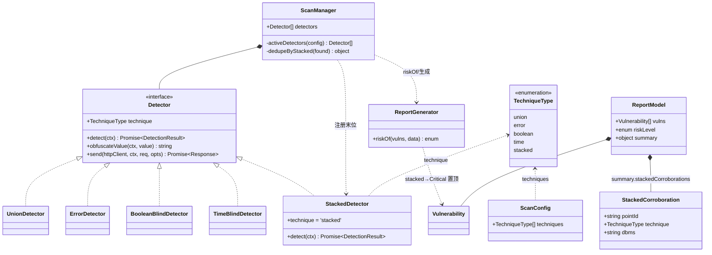
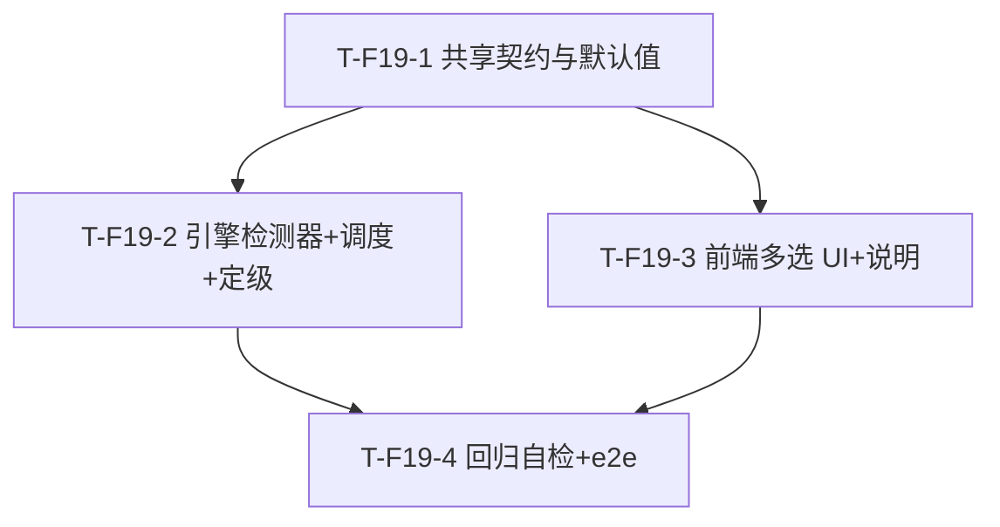

# SQL 注入检测工具「sqli-scanner」— F-19 增量设计 + 任务分解（堆叠注入 Stacked Queries）

> 作者：架构师 高见远（Gao）
> 版本：F-19 增量（基于 v1.0.0 完整版 `docs/system_design.md` + P2 增强 `docs/system_design_p2.md`）
> 形态：Web 全栈（React + Node/Express 引擎）+ Tauri 桌面壳（一份代码双形态）
> 语言：简体中文
> 工程根目录：`sqli-scanner/`（相对 `C:\ProgramData\WorkBuddy\users\3a7d1c20\WorkBuddy\2026-07-27-04-04-56\`）
> 配套 PRD：`docs/prd_f19_stacked.md`

> ⚠️ 文件约定：本增量设计写入 `docs/system_design_f19.md`，并另存 `docs/class-diagram-f19.mermaid` / `docs/sequence-diagram-f19.mermaid`，**不覆盖** v1.0.0 与 P2 的设计文档与图。架构师判定：破坏性覆盖旧设计文档风险高于按 F19 后缀新增，故采用增量文件，便于后续合并。

---

## 0. 增量总览与核心决策（先读）

| # | 决策 | 结论 |
|---|------|------|
| D1 | 是否引入技术选择机制 | **一并引入**（本期最大改动，但必须做）。新增 `ScanConfig.techniques` + `ScanConfigPanel` 多选 + `ScanManager` 按集合过滤。理由：现状无机制，"让用户勾选堆叠"的前提就是先把选择机制建起来，否则堆叠检测器只能跟随全量无条件跑，违背 PRD G2。 |
| D2 | 堆叠默认是否勾选 | **默认不勾选（opt-in）**。默认 `techniques=['union','error','boolean','time']`（4 类全选、堆叠不选）。向后兼容：老配置无 `techniques` 字段 → 等价于 4 类全选、堆叠不跑。 |
| D3 | 堆叠主判据 | **时间延迟为主判据**：以 `;` 追加独立延迟语句（`SLEEP` / `WAITFOR DELAY` / `pg_sleep`），连续 N/2 次响应延迟 ≥ `timeThresholdMs` 即判可用。副作用（建/删临时表）作为 **P1 可选副判据、默认关闭**（具破坏性，不在 P0）。 |
| D4 | 风险等级 | **stacked 定为 Critical**（高于 union/error=High、boolean/time=Medium）。`ReportGenerator.riskOf` 增加 `stacked→Critical` 分支并**置顶**（在任何其他判定之前）。 |
| D5 | Oracle 处理 | **不投放堆叠 payload**。指纹为 Oracle 时 `StackedDetector` 直接返回未命中并写 evidence「Oracle 不支持堆叠查询」；UI/报告标注"不适用"。 |
| D6 | 延迟参数 | 复用 `timeThresholdMs` 作判定阈值、`SLEEP` 固定 **2s**（与 `TimeBlindDetector` 完全一致），**不新增任何配置项**。 |
| D7 | SQL Server `time`/`stacked` 重叠 | **报告层去重 + 互相印证**：同一注入点若 `stacked` 命中，则丢弃同点 `time/boolean/error/union` 记录、仅保留 1 条 `stacked`（Critical），被丢弃者移入 `report.summary.stackedCorroborations` 作为"印证"证据，`byTechnique` 仅计 `stacked`。调度上 `stacked` 注册于检测器数组**末位**，且当 `stacked` 被选中时循环不抢断，确保 stacked 能独立确认。 |
| D8 | 后端统一枚举 | 新增后端常量 `TECHNIQUE_TYPES = ['union','error','boolean','time','stacked']`（置于 `payloads.js` 导出），与前端 `TechniqueType` 联合类型**严格对应**；各 `Detector` 仍以 `super('xxx')` 自报，但过滤与校验以 `TECHNIQUE_TYPES` 为准。 |
| D9 | 新依赖 | **无**。复用现有 `HttpClient` / `Detector` 基类 / `obfuscateValue`，不引入新 npm 包（与 PRD §8 范围排除一致）。 |

**本期范围边界**：仅做"检测/确认堆叠可用 + UI 暴露选项 + 报告呈现"，**不做自动利用层**（写文件/命令执行/拖库）。不重写既有 4 类检测逻辑，仅新增第 5 类 + 必要的枚举/过滤/定级衔接。

---

## 1. 实现方案 + 框架选型

### 1.1 技术难点与框架结论

| 难点 | 选型 / 处理 |
|------|-------------|
| 现状无"技术选择机制"（无 `techniques` 字段、无多选 UI、4 检测器无条件全跑） | **结论：无新框架，复用现有 Node/Express + React/MUI/Tailwind + 策略模式**。`ScanConfig` 增 `techniques: TechniqueType[]`；`ScanConfigPanel` 增多选组；`ScanManager` 按 `config.techniques` 过滤 `this.detectors`。这是本期**最关键改动**。 |
| 第 5 类检测器的实现方式 | 沿用既有**策略模式**：新增 `StackedDetector extends Detector`，构造 `super('stacked')`，复用 `detect(ctx)` / `obfuscateValue` / `send`，判定逻辑平移 `TimeBlindDetector`（区别仅在 payload 模板以 `;` 追加独立延迟语句）。 |
| 技术枚举分散（前端联合类型、后端仅 `super('xxx')`） | 后端新增 `TECHNIQUE_TYPES` 集中枚举；前端扩展 `TechniqueType`、`TECHNIQUE_LABEL`；两端值严格对齐。 |
| SQL Server `time` 已是 `; WAITFOR`（堆叠式）→ stacked 与 time 双重印证/重复报告 | 报告层去重（D7）：同点 stacked 命中即合并为 1 条 Critical，其余移入 `stackedCorroborations`。 |
| Oracle 驱动不支持堆叠 | `StackedDetector` 在 `dbms==='Oracle'` 时直接返回未命中 + evidence 标注；UI/报告提示"不适用"。 |
| 时间延迟判定的稳定性 | 复用 `timeThresholdMs`（默认 1.5s）+ `timeBlindSamples`（默认 3，需 ≥ 2 次稳定）与 `Sleep(2s)`；阈值过低误报、过高漏报，沿用既有默认即可。 |
| WAF 规避对 `;` 的影响 | 复用 `Detector.obfuscateValue`；既有 `obfuscatePayload` 仅随机化字母、空白插 `/**/`、保留引号/数字/函数名，`;` 与 `SLEEP/WAITFOR/pg_sleep` 不受影响（经 P2 单测验证）。 |

**框架/库结论**：**无新增**。完全复用 v1.0.0 + P2 的 Node/Express + axios + React/MUI/Tailwind/zustand + 策略模式 + SSE 技术栈。`StackedDetector` 与既有检测器同构，新增枚举/常量/字段，不引入新运行时依赖。

### 1.2 改动架构位置（相对既有分层）

```
表现层  ScanConfigPanel.tsx（新增"检测技术"多选组）
   │  config.techniques
   ▼
契约层  src/shared/types.ts（TechniqueType+'stacked' / ScanConfig.techniques）
        src/shared/constants.ts（TECHNIQUES+'stacked' / TECHNIQUE_LABEL['stacked'] / DEFAULT_CONFIG.techniques）
   │  POST /api/scan/start {config{techniques}}
   ▼
接口层  scanRoutes.js（无需改动，config 整体透传）
   ▼
编排层  ScanManager.js（按 config.techniques 过滤 detectors + 去重/印证聚合）
   ▼
引擎层  detectors/StackedDetector.js（新增，super('stacked')）
        payloads.js（新增 PAYLOADS[dbms].stacked，Oracle=[]）
        models.js（ScanConfig 合并 techniques，无需改结构）
   ▼
服务层  ReportGenerator.js（riskOf 增加 stacked→Critical 置顶 + byTechnique 统计）
```

---

## 2. 文件列表及相对路径（标注【新增】/【修改】）

> 路径相对 `sqli-scanner/`。本增量共触及 **10 个文件**（不含测试）。

### 后端（引擎：检测器 + 调度过滤 + 风险定级 + Payload + 默认值）

| 文件 | 变更 | 关键改动 |
|------|------|----------|
| `server/src/engine/detectors/StackedDetector.js` | 【新增】 | 继承 `Detector`，`super('stacked')`；`detect(ctx)`：Oracle 直接返回未命中；取 `PAYLOADS[dbms].stacked`，空则未命中；以 `;` 追加独立延迟语句，复用 `timeThresholdMs`/`timeBlindSamples`，`obfuscateValue` 包裹；命中 evidence 写清"`;` 后第二条语句被执行"。 |
| `server/src/engine/payloads.js` | 【修改】 | ① 导出 `TECHNIQUE_TYPES = ['union','error','boolean','time','stacked']`（后端统一枚举）；② 为 5 个 dbms 增 `stacked` 模板（MySQL/PostgreSQL/SQLite 用 `;` 追加 `SLEEP/pg_sleep/重运算`；SQL Server 用 `; WAITFOR DELAY`；**Oracle = `[]` 占位、标注不支持**）。 |
| `server/src/engine/ScanManager.js` | 【修改】 | ① 注册表末位加 `new StackedDetector()`；② 新增 `activeDetectors(config)`：按 `config.techniques` 过滤，空/未定义 → 全部 5 个；③ 检测循环调整（见 §4）；④ 循环后 `dedupeByStacked(found)`：同点 stacked 命中→丢弃同点经典记录、移入 `report.summary.stackedCorroborations`，仅留 1 条 stacked(Critical)；⑤ 写 `report.summary.stackedEnabled`（是否选中堆叠）。 |
| `server/src/services/ReportGenerator.js` | 【修改】 | `riskOf(vulns, data)` 增加 `if (vulns.some(v => v.technique === 'stacked')) return 'Critical';` 并**置顶**于 union/error 判定之前；`build` 的 `byTechnique` 统计已自动含 `stacked`；`toHTML` 的 `.critical` 红色样式已支持。 |
| `server/src/config/defaults.js` | 【修改】 | 新增 `techniques: ['union','error','boolean','time']`（默认 4 类全选、**不含 stacked**，维持向后兼容）。 |

### 前端（枚举 + 默认配置 + 多选 UI + 报告呈现）

| 文件 | 变更 | 关键改动 |
|------|------|----------|
| `src/shared/types.ts` | 【修改】 | `TechniqueType` 联合类型加 `'stacked'`；`ScanConfig` 加 `techniques: TechniqueType[]`；`DetectionResult`/`Vulnerability`/`InjectionPoint.technique` 类型自动跟随扩展。 |
| `src/shared/constants.ts` | 【修改】 | `TECHNIQUES` 加 `'stacked'`；`TECHNIQUE_LABEL['stacked'] = '堆叠注入'`；`DEFAULT_CONFIG` 加 `techniques: ['union','error','boolean','time']`。 |
| `src/components/ScanConfigPanel.tsx` | 【修改】 | 新增"检测技术"分区（`Divider` 分组）：一组 `Checkbox`（选项来自 `TECHNIQUES`+`TECHNIQUE_LABEL`，受控于 `config.techniques`），默认 4 项选中、stacked 未选中；`onChange` 透传 `techniques` 数组；空选→传 `[]`（后端按全选）；堆叠项附次要说明"堆叠注入可确认目标是否允许执行多条语句，风险高，按需开启"。 |
| `src/components/VulnDetail.tsx` | 【修改】 | 当 `vuln.technique === 'stacked'` 时，描述区追加专项说明"堆叠注入可进一步用于写文件/命令执行（非本期自动利用）"（P1-2）。基础显示经 `TECHNIQUE_LABEL`/`RISK_LABEL` 已自动显示"堆叠注入"/"严重"。 |
| `src/pages/ScanPage.tsx` | 【修改（小改/核查）】 | `config` 初始值 `{...DEFAULT_CONFIG}` 已含 `techniques`；补一行防御 `config.techniques ?? DEFAULT_CONFIG.techniques` 并随 `startScan` 透传（已透传，仅加容错注释）。`ScanConfigPanel` 已接收 `config.techniques`。 |

> 说明：`VulnList.tsx` / `ReportExport.tsx` 经 `TECHNIQUE_LABEL[v.technique]` 自动显示"堆叠注入"，经 `RISK_LABEL[v.riskLevel]` 自动显示"严重"红色 —— **无需改动**即可满足 P0-6 基础呈现；专项说明与去重印证为增量增强。

---

## 3. 数据结构和接口（类图 / 类型签名）

> 完整类图见 `docs/class-diagram-f19.mermaid`。下面给出类型签名与关键结构（Mermaid classDiagram）。

### 3.1 统一技术枚举（本增量新增的"后端集中枚举"）

```ts
// 前端 src/shared/types.ts —— 扩展联合类型
export type TechniqueType = 'union' | 'error' | 'boolean' | 'time' | 'stacked';

// 后端 server/src/engine/payloads.js —— 新增导出（与前端严格对应）
export const TECHNIQUE_TYPES = ['union', 'error', 'boolean', 'time', 'stacked']; // 顺序即检测器注册序
```

### 3.2 ScanConfig.techniques 字段（前端 types.ts / 后端 defaults.js）

```ts
// src/shared/types.ts
export interface ScanConfig {
  // …既有字段…
  wafEvasion: WafEvasionConfig;
  techniques: TechniqueType[]; // 【新增】选中的检测技术；空数组 [] 表示"全选"（含 stacked）；未定义→后端按 defaults 全选 4 类
}
```

```js
// server/src/config/defaults.js
export const defaults = {
  // …既有…
  techniques: ['union', 'error', 'boolean', 'time'], // 【新增】默认 4 类全选、堆叠不勾选（opt-in）
};
```

### 3.3 StackedDetector（新增，策略模式，平移 TimeBlindDetector）

```ts
// server/src/engine/detectors/StackedDetector.js
class StackedDetector extends Detector {
  technique = 'stacked';            // super('stacked')
  async detect(ctx: {
    httpClient, target, point, dbms, config
  }): Promise<DetectionResult>
  // 算法（与 TimeBlindDetector 同构，仅 payload 模板以 ";" 追加独立延迟语句）：
  //  1) dbms 为空 → 未命中（需先指纹）
  //  2) dbms === 'Oracle' → 直接未命中，evidence="Oracle 不支持堆叠查询，跳过"
  //  3) templates = PAYLOADS[dbms]?.stacked；空数组 → 未命中
  //  4) sleep=2；threshold = (config.timeThresholdMs ?? defaults.timeThresholdMs)/1000；samples = defaults.timeBlindSamples
  //  5) payload = obfuscateValue(ctx, fillPayload(templates[0], {orig, sleep}))
  //  6) timeoutMs = (config.timeoutMs ?? defaults.timeoutMs) + sleep*1000
  //  7) 采样 samples 次，count 稳定（elapsed >= threshold）次数
  //  8) 若 stable >= ceil(samples/2)：vulnerable=true；evidence="堆叠注入确认：…连续 stable/samples 次响应延迟≥threshold s，证明第二条语句被成功执行"；payloads=[payload]；回填 point.confirmed/technique/dbms
}
```

### 3.4 StackedDetector 接口（Mermaid classDiagram 节选）



### 3.5 报告层去重/印证结构（新增 summary 子结构）

```ts
// report.summary（在既有 summary 基础上扩展，不破坏原有 totalPoints/totalVulns/byTechnique/byRisk）
report.summary = {
  totalPoints: number,
  totalVulns: number,
  byTechnique: Record<string, number>,   // 含 stacked 计数（去重后仅计 stacked）
  byRisk: Record<string, number>,
  stackedEnabled: boolean,                // 本次是否选中堆叠技术
  stackedCorroborations: StackedCorroboration[]  // 被堆叠合并的"互相印证"记录
};
```

---

## 4. 程序调用流程（时序图）

> 完整时序见 `docs/sequence-diagram-f19.mermaid`。要点：UI 多选 → `ScanConfig.techniques` → `POST /api/scan/start` → `ScanManager` 按集合过滤检测器 → 仅跑选中 → 报告聚合（含 stacked 与 time 重叠去重）→ 前端经 `TECHNIQUE_LABEL` 显示。

### 4.1 调度过滤与循环关键逻辑（文字规格，供工程师落地）

```
// ScanManager.activeDetectors(config)
const sel = config.techniques;
const selectedTechs = (sel && sel.length) ? sel : TECHNIQUE_TYPES; // 空/未定义 → 全部 5 个（含 stacked）
return this.detectors.filter(d => selectedTechs.includes(d.technique));
// 注册序：union → error → boolean → time → stacked（stacked 末位）

// 检测循环（每注入点）
const found = [];
for (const detector of activeDetectors(config)) {
  if (cancelled) break;
  emit(point_testing, {pointId, technique: detector.technique});
  const result = await detector.detect(ctx);
  if (result.vulnerable) {
    found.push({ technique: detector.technique, result });
    if (detector.technique !== 'stacked') {
      // 经典技术维持 break-on-first-hit（向后兼容）
      // 仅当 stacked 也被选中时，不在此抢断，确保 stacked 末位仍有机会独立确认
      if (!selectedTechs.includes('stacked')) break;
    }
    // stacked 命中不 break（其本身已在末位）
  }
}

// 聚合 + 去重（dedupeByStacked）
const byPoint = group(found, f => f.result.pointId);
const vulns = [];
const corroborations = [];
for (const [pid, items] of byPoint) {
  const stacked = items.find(i => i.technique === 'stacked');
  if (stacked) {
    // 权威：仅保留 1 条 stacked（Critical），其余同点经典记录移入印证
    vulns.push(makeVuln(stacked, 'Critical'));
    for (const i of items) if (i !== stacked)
      corroborations.push({ pointId: pid, technique: i.technique, dbms: i.result.dbms });
  } else {
    // 仅经典技术：每条转独立 vuln（与既有 break 后单条行为一致）
    for (const i of items) vulns.push(makeVuln(i, riskOf([i])));
  }
}
report.vulns = vulns;
report.summary.stackedCorroborations = corroborations;
report.summary.stackedEnabled = selectedTechs.includes('stacked');
report.riskLevel = hasData ? 'Critical' : riskOf(vulns); // riskOf 内 stacked→Critical 置顶
```

> 向后兼容护栏：当 `stacked` **未选中**（默认态/老配置）→ 经典 4 类循环保持 `break-on-first-hit`，行为与 v1.0.0 **完全一致**（stacked 不跑、不升 Critical）；当 `stacked` **选中**（opt-in）→ 经典 4 类不再抢断、stacked 末位独立确认，命中即 Critical，同点经典记录合并为印证，不重复计为独立漏洞。

### 4.2 时序图（Mermaid sequenceDiagram 节选）

```mermaid
sequenceDiagram
    actor User
    participant UI as ScanConfigPanel/ScanPage
    participant API as scanRoutes
    participant SM as ScanManager
    participant FP as DBFingerprinter
    participant D as ActiveDetectors(按 techniques 过滤)
    participant SD as StackedDetector
    participant RG as ReportGenerator
    participant BUS as EventBus

    User->>UI: "检测技术"多选组勾选（默认 union/error/boolean/time 选，stacked 不选）
    UI->>UI: config.techniques = [已选]（空选→[]）
    User->>UI: 点"开始扫描"
    UI->>API: POST /api/scan/start {target, config{techniques}}
    API->>SM: start(target) —— createTarget 合并 defaults.techniques
    SM->>BUS: emit(scan_started)
    loop 每个注入点
        SM->>FP: fingerprint(ctx) → dbms
        SM->>SM: activeDetectors = detectors.filter(d=>techniques.includes(d.technique))
        Note over SM: techniques 空/未定义 → 全部 5 个
        SM->>D: 依次 detect（注册序 union→error→boolean→time→stacked）
        alt 经典技术命中 且 stacked 未选
            D-->>SM: 命中 → break（维持原行为）
        else 经典技术命中 且 stacked 已选
            D-->>SM: 命中 → 不 break（继续跑 stacked）
        end
        SM->>SD: detect(ctx)（末位；dbms=Oracle 直接返回未命中）
        SD->>SD: 注入 "; SLEEP/WAITFOR/pg_sleep" 延迟语句，采样稳定判定
        SD-->>SM: DetectionResult(vulnerable, technique='stacked')
    end
    SM->>SM: dedupeByStacked：同点 stacked 命中→同点经典记录移入 summary.stackedCorroborations，仅留 1 条 stacked(Critical)
    SM->>RG: riskOf(vulns) —— 含 stacked→Critical（置顶）
    RG-->>SM: report.riskLevel
    SM->>BUS: emit(scan_completed, report)
    BUS-->>UI: SSE → VulnList/VulnDetail 经 TECHNIQUE_LABEL 显示"堆叠注入" + 风险 Chip Critical(红)
    User->>UI: 导出报告
    UI->>API: GET /report/export?format=html
    API-->>UI: HTML（stacked 行 .critical 红色，技术列"堆叠注入"）
```

---

## 5. 任务列表（有序、含依赖，工程师直接执行清单）

> 约束：增量特性在既有仓库上开发，**无新建脚手架/依赖**，故"基础设施任务"等价于本特性所依赖的**共享契约/枚举/默认值**（T-F19-1），其余按"引擎检测器+调度 / 前端 UI / 回归自检"分组，共 **4 个任务**，每任务 ≥3 文件，且 ≤5 上限。任务间依赖尽量收敛于 T-F19-1。

### T-F19-1 共享契约与配置默认值（技术枚举 + ScanConfig.techniques + 后端枚举/默认值）
- **目录/文件**：
  - `src/shared/types.ts`【修改】— `TechniqueType` 加 `'stacked'`；`ScanConfig` 加 `techniques: TechniqueType[]`。
  - `src/shared/constants.ts`【修改】— `TECHNIQUES` 加 `'stacked'`；`TECHNIQUE_LABEL['stacked']='堆叠注入'`；`DEFAULT_CONFIG.techniques = ['union','error','boolean','time']`。
  - `server/src/config/defaults.js`【修改】— 加 `techniques: ['union','error','boolean','time']`（默认 4 类全选、不含 stacked）。
  - `server/src/engine/payloads.js`【修改】— 导出 `TECHNIQUE_TYPES = ['union','error','boolean','time','stacked']`；为 5 个 dbms 增 `stacked` payload 模板（MySQL/PostgreSQL/SQLite 用 `;` 追加 `SLEEP/pg_sleep/重运算`；SQL Server `; WAITFOR DELAY`；**Oracle = `[]` 占位**）。
- **做什么**：建立前后端一致的技术枚举与默认 4 选（stacked 不选）；为后续检测器/调度/UI 提供枚举与 payload 基础。
- **依赖**：无（本特性基础）。
- **优先级**：P0
- **验收点**：① `techniques` 字段前后端类型对齐；② `TECHNIQUE_LABEL['stacked']==='堆叠注入'`；③ `PAYLOADS[dbms].stacked` 五库均存在（Oracle 为空数组且无 `; SLEEP` 误投）；④ `defaults.techniques` 不含 stacked。

### T-F19-2 引擎：堆叠检测器 + 技术选择调度 + 风险定级
- **目录/文件**：
  - `server/src/engine/detectors/StackedDetector.js`【新增】— 实现 `super('stacked')` + `detect(ctx)`（Oracle 直接未命中；以 `;` 追加延迟语句；复用 `timeThresholdMs`/`timeBlindSamples`/`obfuscateValue`；命中 evidence 写明"`;` 后第二条语句被执行"）。
  - `server/src/engine/ScanManager.js`【修改】— 注册表末位加 `StackedDetector`；新增 `activeDetectors(config)` 按 `techniques` 过滤（空/未定义→全 5）；循环逻辑按 §4.1（stacked 未选保持 break，已选不抢断）；新增 `dedupeByStacked` 同点合并 + `summary.stackedEnabled`/`stackedCorroborations`。
  - `server/src/services/ReportGenerator.js`【修改】— `riskOf` 增加 `stacked→Critical` 分支并置顶；`byTechnique` 统计自动含 stacked。
- **做什么**：落地第 5 类检测能力 + 技术选择调度机制（本期最关键）+ 报告风险定级与去重/印证聚合。
- **依赖**：T-F19-1（`TECHNIQUE_TYPES`、.payloads `stacked`、defaults.techniques）。
- **优先级**：P0
- **验收点**：① 仅勾选 stacked → 仅 `StackedDetector` 跑；② 老配置/无 techniques → 4 类全跑、stacked 不跑（行为同 v1.0.0）；③ 空选 `[]` → 全部（含 stacked）跑；④ stacked 命中 → `riskOf` 返回 `Critical`；⑤ SQL Server 上 time+stacked 同点 → 仅 1 条 stacked(Critical)，time 进入 `stackedCorroborations`；⑥ Oracle 不投放堆叠、无报错。

### T-F19-3 前端：检测技术多选 UI + 报告专项说明
- **目录/文件**：
  - `src/components/ScanConfigPanel.tsx`【修改】— 新增"检测技术"分区（`Divider` 分组）：`Checkbox` 多选（选项来自 `TECHNIQUES`+`TECHNIQUE_LABEL`，受控于 `config.techniques`），默认 4 项选中、stacked 未选中；`onChange` 透传 `techniques` 数组；空选→`[]`；堆叠项附次要说明文字。
  - `src/components/VulnDetail.tsx`【修改】— 当 `vuln.technique==='stacked'` 时追加专项说明"堆叠注入可进一步用于写文件/命令执行（非本期自动利用）"（P1-2）。
  - `src/pages/ScanPage.tsx`【修改（小改/核查）】— `config` 初始 `{...DEFAULT_CONFIG}`（已含 techniques）；加容错 `config.techniques ?? DEFAULT_CONFIG.techniques`；`startScan` 透传 `config`（已透传）。
- **做什么**：在 UI 暴露技术选择（含堆叠 opt-in），并在漏洞详情补充堆叠风险提示。
- **依赖**：T-F19-1（`TECHNIQUES`/`TECHNIQUE_LABEL`/`DEFAULT_CONFIG.techniques`）。
- **优先级**：P0
- **验收点**：① 默认态 4 项勾选、stacked 未勾选；② 勾选 stacked → `config.techniques` 含 `'stacked'`；③ 全不选 → 传 `[]`；④ 堆叠漏洞详情显示专项说明；⑤ 列表/详情经 `TECHNIQUE_LABEL`/`RISK_LABEL` 显示"堆叠注入"/"严重"(红)（VulnList 无需改）。

### T-F19-4 回归自检与端到端验证（默认全选行为不变 + 去重 + 风险定级）
- **目录/文件**：
  - `server/tests/scanManager.f19.test.js`【新增】— 验证：① 无 `techniques` 字段（老配置）→ 4 检测器全跑、stacked 不跑（spy `detect`）；② `techniques=['union']` → 仅 union 跑；③ `techniques=[]` → 全部（含 stacked）跑；④ stacked 命中 → `riskOf` 返回 `Critical`；⑤ SQL Server 上 time+stacked 同点去重（time 移入 `stackedCorroborations`，仅 1 条 stacked）；⑥ Oracle 不投放 stacked（`detect` 直接未命中）。
  - `server/tests/reportGenerator.f19.test.js`【新增】— `riskOf`：stacked→Critical 置顶（高于 union/error）；`byTechnique` 含 stacked 计数；不含 stacked 时定级与 v1.0.0 完全一致。
  - `src/tests/scanConfig.f19.test.tsx`【新增】— `ScanConfigPanel` 多选：默认 4 选中、stacked 未选中；勾选 stacked 写入 `config.techniques`；空选→`[]`。
  - `src/tests/qa_f19_stacked.test.tsx`【新增】— 端到端 UI：勾选堆叠 → 报告列表显示"堆叠注入"、风险 Chip 为"严重"(Critical 红)。
- **做什么**：以测试固化"向后兼容 + 去重 + 风险定级"三大回归护栏（对应 PRD §7.2 高风险项）。
- **依赖**：T-F19-1、T-F19-2、T-F19-3。
- **优先级**：P0
- **验收点**：① 全套测试通过与 v1.0.0 等价回归（4 类默认行为不变）；② 去重单测通过；③ 风险置顶单测通过；④ UI 多选与报告呈现 e2e 通过。

---

## 6. 依赖包列表

```
无新增依赖。
```
- 后端：复用 `axios`（HttpClient）、`nanoid`、`winston`；`StackedDetector` 沿用 `Detector` 基类与 `obfuscatePayload`，**不引入新包**。
- 前端：复用 React/MUI/Tailwind/zustand；枚举/常量/字段扩展**不引入新包**。
- 与 PRD §8「不新增网络依赖包」一致。

---

## 7. 共享知识（跨文件约定）

- **技术枚举命名（两端严格对应）**：
  - 前端类型 `TechniqueType = 'union' | 'error' | 'boolean' | 'time' | 'stacked'`（小写，与 `PAYLOADS[dbms]` 键、`Detector.super('xxx')` 字符串一致）。
  - 后端常量 `TECHNIQUE_TYPES = ['union','error','boolean','time','stacked']`（置于 `payloads.js` 导出），顺序即检测器注册序（stacked 末位）。
  - 展示用 `TECHNIQUE_LABEL`：`stacked: '堆叠注入'`。新增技术必须同步改三处（前端类型 + 后端 `TECHNIQUE_TYPES` + 前端 `TECHNIQUE_LABEL`/`TECHNIQUES`）。
- **Payload 放置规范**：堆叠 payload 统一存于 `PAYLOADS[dbms].stacked`（结构 `string[]`，占位符 `{ORIG}`/`{SLEEP}`）。**Oracle 以 `[]` 占位、标注不支持、绝不投放**；其余 4 库投放以 `;` 追加独立延迟语句的模板。新增 DBMS 的 stacked 模板务必与 `DBFingerprinter` 指纹结果对应。
- **风险等级映射（riskOf 优先级，置顶顺序）**：`stacked → Critical`（最高）＞ `union/error → High` ＞ `boolean/time → Medium` ＞ 疑似 `Low`；可提取数据 `hasData → Critical`。`stacked` 分支必须位于 `riskOf` 所有既有判定**之前**。
- **混淆通道统一**：堆叠 payload 必须经 `Detector.obfuscateValue(ctx, value)` 包裹（WAF 规避开启时生效），**不得**绕过 `send`/`httpClient` 自发包。`obfuscatePayload` 保留 `;` 与 `SLEEP/WAITFOR/pg_sleep`（仅字母大小写随机化 + 空白插 `/**/`）。
- **技术选择机制（向后兼容护栏）**：`ScanConfig.techniques` 为空数组 `[]` 或 `undefined` → 视为"全选"（含 stacked）；非空前端多选数组 → 仅跑所选。`ScanManager.activeDetectors` 为唯一过滤入口。`stacked` 未选中时，经典 4 类循环维持 `break-on-first-hit`，行为与 v1.0.0 **完全一致**。
- **去重/印证约定**：同注入点若 `stacked` 命中，丢弃同点其他经典漏洞记录、仅保留 1 条 `stacked`(Critical)，被丢弃者写入 `report.summary.stackedCorroborations = [{pointId, technique, dbms}]` 作为"互相印证"证据；`byTechnique` 仅计 `stacked`，避免重复计为独立漏洞。前端可在 VulnDetail 展示该印证提示（P2-2 增强）。
- **统一响应包 / SSE / 时间格式**：沿用 v1.0.0 约定（`{code,data,message}`、SSE `{type,scanId,ts,payload}`、ISO 8601 UTC）。本增量不改动 API 契约（`/api/scan/start` 的 `config` 仅多一个 `techniques` 字段，向后兼容）。
- **中文约定**：日志/报告/evidence/Payload 注释全中文；堆叠命中 evidence 必须含"`;` 后第二条语句被执行"字样，便于报告解读。

---

## 8. 待明确事项（PRD §9 七个待确认问题的架构拍板）

| # | 问题 | 架构拍板结论（D 编号） |
|---|------|------------------------|
| ① | 技术选择机制是否本期一并引入？ | **是**（D1）。现状无 `techniques` 字段、无多选 UI、4 检测器无条件全跑；要"让用户勾选堆叠"必须先把选择机制建起来。本期新增 `ScanConfig.techniques` + `ScanConfigPanel` 多选 + `ScanManager.activeDetectors` 过滤。`stacked` 默认不勾选（opt-in）以保兼容。 |
| ② | 堆叠检测主判据？ | **时间延迟为主判据**（D3）。以 `;` 追加独立延迟语句（`SLEEP`/`WAITFOR DELAY`/`pg_sleep`），连续 N/2 次延迟 ≥ `timeThresholdMs` 即判可用。**副作用副判据（建/删临时表、写文件）作为 P1 可选、默认关闭**（具破坏性，不在 P0）。 |
| ③ | 风险等级如何定？ | **stacked 定为 Critical**（D4），高于 union/error=High、boolean/time=Medium。`ReportGenerator.riskOf` 增加 `stacked→Critical` 分支并**置顶**。 |
| ④ | 堆叠是否进入默认扫描集？ | **默认不勾选（opt-in）**（D2）。原因：堆叠可能具破坏性副作用、MySQL 默认 `multiStatements` 关闭、会改变报告风险定级（升 Critical）；作为增强项按需开启更稳妥。默认 `techniques=['union','error','boolean','time']`。 |
| ⑤ | Oracle 不支持堆叠，是否投放？ | **不投放，标注"技术不适用"**（D5）。`StackedDetector` 在 `dbms==='Oracle'` 时直接返回未命中并写 evidence「Oracle 不支持堆叠查询」；`PAYLOADS.Oracle.stacked=[]`；UI/报告标注"不适用"（P2-1 增强）。 |
| ⑥ | 堆叠延迟秒数与判定阈值是否复用既有参数？ | **复用 `timeThresholdMs` 作判定阈值、`SLEEP` 固定 2s**（D6），与 `TimeBlindDetector` 完全一致，**不新增任何配置项**，降低复杂度与回归面。 |
| ⑦ | SQL Server `time`（`; WAITFOR`，堆叠式）与 stacked 重叠，如何处理？ | **报告层去重 + 互相印证**（D7）。同注入点若 `stacked` 命中 → 仅保留 1 条 `stacked`(Critical)，同点 `time/boolean/error/union` 记录移入 `report.summary.stackedCorroborations`（印证证据），`byTechnique` 仅计 `stacked`，避免重复计为独立漏洞。调度上 `stacked` 注册末位、且 `stacked` 选中时循环不抢断，确保 stacked 能独立确认（不被 time 提前 break 遮蔽）。 |
| 附 | 后端无集中 TechniqueType 枚举 | **新增 `TECHNIQUE_TYPES`（payloads.js 导出）**（D8），与前端 `TechniqueType` 严格对应；各 `Detector` 仍 `super('xxx')` 自报，但过滤/校验以 `TECHNIQUE_TYPES` 为准。 |

---

## 9. 任务依赖图（Mermaid graph）



> 说明：T-F19-2、T-F19-3 并行依赖 T-F19-1；T-F19-4 依赖前三者。共 4 个任务，均 ≥3 文件，符合"≤5 任务"硬约束。无新增依赖包。

---

## 附录：关键风险与回归护栏总结

1. **高（回归）— 技术选择过滤**：`techniques` 空/未定义必须视为全选、且 `stacked` 未选中时经典 4 类循环维持 `break-on-first-hit`，否则老配置/新用户会"漏跑"既有技术。护栏：T-F19-4 回归测试 ①②③ + §7 护栏约定。
2. **中（定级）— stacked→Critical 置顶**：会改变 `report.riskLevel`。护栏：`riskOf` 分支置顶 + T-F19-4 单测 ④⑤ 验证仅真命中 stacked 才升 Critical、且不扰乱既有组合。
3. **中（检测稳定性）— 时间延迟判定**：复用 `timeThresholdMs`(1.5s) + `SLEEP 2s` + `timeBlindSamples`(3，需 ≥2 次稳定)；阈值过低误报、过高漏报。沿用既有默认并文档注明。
4. **中（WAF/编码）— `;` 不被破坏**：经 `obfuscateValue` 统一通道，`obfuscatePayload` 保留 `;` 与延迟函数名（P2 单测已覆盖）。
5. **低（DBMS 差异）— Oracle 不投放、MySQL 需 `multiStatements`**：`StackedDetector` 对 Oracle 直接未命中；MySQL 靶机需开启 `multiStatements`（P2-3 e2e 增强）。
6. **低（重复报告）— SQL Server time/stacked 重叠**：报告层去重/印证（D7）已解决，不重复计为独立漏洞。
7. **低（双形态）— Web/Tauri 共用前端**：无新业务逻辑分支，技术选择前端零差异（Tauri 经 `VITE_API_BASE` 复用同一份）。

> 本增量设计可直接落地：工程师按 T-F19-1 → T-F19-2/T-F19-3（可并行）→ T-F19-4 顺序、在每个任务内按文件清单实现即可；检测器沿用策略模式、调度复用过滤集、报告复用定级与去重，双形态以既有 `VITE_API_BASE` 复用同一份前端代码。
