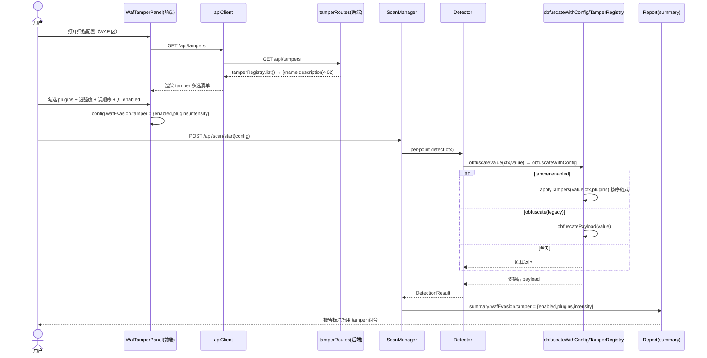
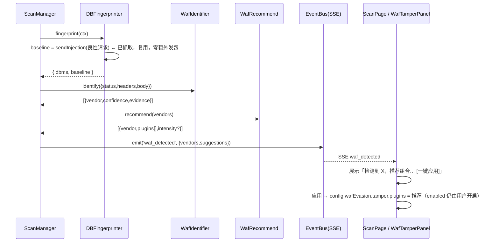
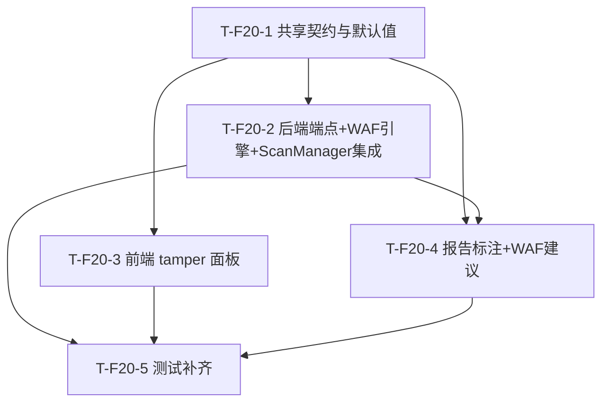

# SQL 注入检测工具「sqli-scanner」— F-20 增量设计 + 任务分解（WAF 绕过优化 / tamper 流水线暴露 + 指纹推荐）

> 作者：架构师 高见远（Bob / Gao）
> 版本：F-20 增量（基于 v1.0.0 + P2 + F-19 + 既有 tamper 后端体系）
> 语言：简体中文
> 配套 PRD：`docs/prd_f20_waf.md`；既有设计：`docs/system_design.md`、`docs/system_design_p2.md`、`docs/system_design_f19.md`
> 文件约定：本增量设计写入 `docs/system_design_f20.md`，并另存 `docs/class-diagram-f20.mermaid` / `docs/sequence-diagram-f20.mermaid`，**不覆盖**旧设计文档与图。

---

## 0. 增量总览与核心决策（先读）

**F-20 的核心事实（已逐项核对代码，见 §1.1 与 §8）：后端 tamper 可插拔流水线（`TamperRegistry` + 链式 `applyTampers` + 统一钩子 `obfuscateWithConfig` + 62 个插件）在 v1.x 阶段已完整实现并接入 `Detector/injection/Extractor/Exploiter`，`defaults.js` 已预留 `wafEvasion.tamper`，单测 `tamper.test.js` 已存在。**

> **边界结论（最重要）：本期【不重写】后端 tamper 引擎。** 真正待做 = ① 前端把现有 tamper 暴露为「多选 + 强度 + 顺序 + 总开关」面板；② 新增 `GET /api/tampers` 把 `tamperRegistry.list()` 作为单一事实源；③ 新增轻量 WAF 指纹识别（复用指纹阶段已抓响应，零额外发包）+ 命中后推荐 tamper 组合（仅推荐、不自动套用）；④ `WafEvasionConfig` / `DEFAULT_CONFIG` / 后端 `defaults.js` 对齐 `tamper` 字段（含 `intensity`）；⑤ `ScanManager` 报告补齐 `tamper` 标注 + `wafDetected` 汇总；⑥ 前后端测试补齐。

本设计共 **5 个任务**（T-F20-1 ~ T-F20-5），均 ≥3 文件，符合「≤5 任务」硬约束；后端（T-F20-2）与前端面板（T-F20-3）可并行，前端报告/建议（T-F20-4）依赖后端事件结构，测试（T-F20-5）收尾。

---

## 1. 实现方案 + 框架选型

### 1.1 技术难点与框架结论

| 难点 | 结论 | 框架/选型 |
|------|------|-----------|
| tamper 变换流水线 | **已存在，不重写**。统一入口 `Detector.obfuscateValue → obfuscateWithConfig → applyTampers(plugins)` 已就绪，`plugins` 数组顺序即链式顺序 | 复用 Node/Express + 现有 `core/tamper`，无新引擎代码 |
| 前端 tamper 清单数据源 | 新增 `GET /api/tampers` 包装 `tamperRegistry.list()`（单一事实源），避免前端硬编码 62 项漂移 | 复用 Express.Router + 既有 `ApiResponse` 契约 |
| WAF 指纹识别（零额外发包） | 复用 `DBFingerprinter.fingerprint` 已抓取的 `baseline` 响应（status/headers/body），由新增 `WafIdentifier.identify(baseline)` 纯函数判定 | 新增 `core/waf/*`，纯函数 + 内置规则库，无第三方依赖 |
| 推荐组合（仅推荐不套用） | `WafRecommend.recommend(vendors)` 返回 `{vendor, plugins[], intensity?}[]`；前端以「建议」呈现，应用只写 `plugins`，`enabled` 仍须用户显式开启 | 后端经验映射表 + 前端 `WafTamperPanel` 建议区 |
| 顺序 UI | 「点击添加进有序列表 + 上移/下移/删除」原生控件（`IconButton` + 数组重排），**不引入拖拽库** | React + MUI，零新增依赖 |
| 强度语义 | `low/medium/high` 三档预设包（前端 `TAMPER_INTENSITY_PRESETS`），非数值滑块；`intensity` 仅前端语义，后端透传至报告用于审计 | 前端常量 + 后端 report 记录 |
| 报告标注 | 扩展 `ScanManager._run` 的 `summary.wafEvasion`，增 `tamper` 子对象；另增 `summary.wafDetected` 汇总识别到的 WAF | 复用 `report.summary`（`object` 类型，向前兼容） |

**框架选型结论：无新框架、无新 npm 依赖。** 前端 React + MUI + Tailwind（既有），后端 Node + Express（既有）。tamper 引擎、注册表、62 插件、统一钩子全部复用，本期仅做「暴露 + 对齐 + 识别推荐 + 标注 + 测试」。

### 1.2 改动架构位置（相对既有分层）

| 层 | 文件 | 性质 | 说明 |
|----|------|------|------|
| 前端类型/常量 | `src/shared/types.ts`、`src/shared/constants.ts` | 修改 | 加 `TamperConfig`/`TamperInfo`/`WafSuggestion`/`WafCandidate` 类型；`WafEvasionConfig.tamper`；`DEFAULT_CONFIG` 补 tamper；`TAMPER_INTENSITY_PRESETS`；`EventType` 加 `waf_detected` |
| 后端默认 | `server/src/config/defaults.js` | 修改 | `wafEvasion.tamper` 补 `intensity:'medium'`（与前端一致） |
| 后端路由 | `server/src/api/tamperRoutes.js`（新增）、`server/index.js`（修改挂载） | 新增+修改 | `GET /api/tampers` 包装 `tamperRegistry.list()` |
| 后端 WAF 引擎 | `server/src/core/waf/WafIdentifier.js`、`wafRules.js`、`wafRecommend.js` | 新增 | 指纹规则库 + 识别 + 推荐映射（纯函数/单例） |
| 后端集成 | `server/src/engine/DBFingerprinter.js`、`ScanManager.js`、`server/src/api/scanRoutes.js` | 修改 | `fingerprint` 返回 `{dbms,baseline}`；`_run` 调 WafIdentifier + 发 `waf_detected` + 报告标注；`sanitizeStart` 归一化 tamper |
| 前端面板 | `src/components/WafTamperPanel.tsx`（新增）、`src/components/ScanConfigPanel.tsx`（修改）、`src/shared/apiClient.ts`（修改） | 新增+修改 | tamper 多选/强度/顺序/总开关 + 清单拉取 + 建议区 |
| 前端报告/建议 | `src/hooks/useEvents.ts`、`src/store/scanStore.ts`、`src/pages/ScanPage.tsx`、`src/pages/ReportPage.tsx` | 修改 | SSE `waf_detected` → store；ScanPage 建议条；ReportPage WAF 标注 |
| 测试 | `server/tests/*`、`src/tests/*` | 新增 | 回归 + e2e |

---

## 2. 文件列表及相对路径（标注【新增】/【修改】）

### 前端
- `src/shared/types.ts`【修改】— 新增 `TamperConfig`、`TamperInfo`、`WafCandidate`、`WafSuggestion`；`WafEvasionConfig` 加 `tamper: TamperConfig`；`EventType` 加 `'waf_detected'`。
- `src/shared/constants.ts`【修改】— `DEFAULT_CONFIG.wafEvasion` 加 `tamper: { enabled:false, plugins:[], intensity:'medium' }`；新增 `TAMPER_INTENSITY_PRESETS`、`TAMPER_INTENSITY_LABEL`。
- `src/shared/apiClient.ts`【修改】— 新增 `tampers: () => apiClient.get<TamperInfo[]>('/tampers')`。
- `src/components/WafTamperPanel.tsx`【新增】— tamper 多选组（拉取 `/api/tampers`）+ 强度三档 + 有序列表（上移/下移/删除）+ 总开关 + 可选 `suggestion` 建议区与「一键应用」。
- `src/components/ScanConfigPanel.tsx`【修改】— WAF 区升级：保留 `随机UA`/`请求延时(jitterMs)` 两个 legacy 开关；`Payload 混淆(obfuscate)` 保留并标注「已被 tamper 取代」；嵌入 `<WafTamperPanel .../>`（受控于 `config.wafEvasion.tamper`）。
- `src/hooks/useEvents.ts`【修改】— `waf_detected` 事件 → `setWafSuggestion(payload)`。
- `src/store/scanStore.ts`【修改】— 新增 `wafSuggestion` 状态 + `setWafSuggestion`/`clearWafSuggestion`。
- `src/pages/ScanPage.tsx`【修改】— 从 store 读取 `wafSuggestion`，渲染建议条；把 `suggestion` 透传给 `WafTamperPanel`（若配置面板同页）；「应用」写 `config.wafEvasion.tamper.plugins`（不自动开 enabled）。
- `src/pages/ReportPage.tsx`【修改】— 摘要区渲染 `summary.wafEvasion.tamper`（启用态显示组合、关闭态不显示）；可选展示 `summary.wafDetected`。

### 后端
- `server/src/api/tamperRoutes.js`【新增】— `GET /tampers` 返回 `tamperRegistry.list()`（经 `ApiResponse` 包装）。
- `server/index.js`【修改】— `import { tamperRoutes }` 并 `app.use('/api', tamperRoutes)`、`app.use('/', tamperRoutes)`（与既有路由同挂双前缀，兼容 Web/Tauri）。
- `server/src/config/defaults.js`【修改】— `wafEvasion.tamper` 补 `intensity: 'medium'`。
- `server/src/core/waf/wafRules.js`【新增】— `WAF_RULES: { vendor: { name, confidence, matchers:[{type:'header'|'status'|'body', key?, test:Regex}] } }`，初始覆盖 Cloudflare/ModSecurity/AWS WAF/阿里云 WAF/百度云加速/安全狗/腾讯云 WAF。
- `server/src/core/waf/WafIdentifier.js`【新增】— `class WafIdentifier { identify(response): WafCandidate[] }` 纯函数，按 `WAF_RULES` 匹配 `response{status,headers,body}`，返回置信度降序的候选 vendor。
- `server/src/core/waf/wafRecommend.js`【新增】— `recommend(vendors: string[]): WafSuggestion[]`，按 `WAF_RECOMMEND_MAP`（vendor→plugins[]）映射，未命中 vendor 忽略。
- `server/src/engine/DBFingerprinter.js`【修改】— `fingerprint` 返回值由 `string|null` 改为 `{ dbms: string|null, baseline: {status,headers,body} }`（baseline 为已抓取的良性响应，零额外发包）。
- `server/src/engine/ScanManager.js`【修改】— ① 构造器注入 `wafIdentifier`/`wafRecommend`；② `_run` 每点 `fingerprint` 后取 `baseline` 调 `wafIdentifier.identify`，聚合去重；③ 循环后 `emit('waf_detected', {vendors, suggestions})` + 写 `report.summary.wafDetected`；④ 扩展 `summary.wafEvasion` 增 `tamper:{enabled,plugins,intensity}`。
- `server/src/api/scanRoutes.js`【修改】— `sanitizeStart` 对 `cfg.wafEvasion.tamper` 做形状归一化（`enabled:bool`、`plugins:string[]`、`intensity∈{low,medium,high}`，未知名不报错，仅确保为字符串数组）。

### 测试
- `server/tests/tamper.f20.test.js`【新增】— 回归：① 无 tamper 字段（老配置）→ `obfuscateWithConfig` 原样返回；② 未知插件名 `resolve` 跳过并 warn；③ `tamper.enabled=true` 时按 `plugins` 顺序链式变换；④ `GET /api/tampers` 返回 62 项且与 `tamperRegistry.list()` 一致；⑤ `ScanManager` 报告 `summary.wafEvasion.tamper` 正确。
- `server/tests/waf.f20.test.js`【新增】— ① `WafIdentifier.identify` 对带 `cf-ray`/`Server: cloudflare` 的响应识别 Cloudflare；② 对 ModSecurity 默认拦截页识别 ModSecurity；③ `recommend(['Cloudflare'])` 返回非空 plugins；④ `identify` 对无特征响应返回 `[]`（零误报）。
- `src/tests/scanConfig.f20.test.tsx`【新增】— `WafTamperPanel`：默认 `enabled=false`/`plugins=[]`；勾选写入 `config.wafEvasion.tamper.plugins`；上移/下移改变数组顺序；强度预设填充 plugins；「一键应用」建议只写 plugins 不改 enabled。
- `src/tests/qa_waf_suggestion.test.tsx`【新增】— e2e：模拟 `waf_detected` 事件 → ScanPage 显示建议条 → 点击应用 → `config.wafEvasion.tamper.plugins` 被填充、`enabled` 仍 false；报告页在 tamper 启用时显示组合。

---

## 3. 数据结构和接口（类图 / 类型签名）

### 3.1 前端类型（`src/shared/types.ts`）

```ts
/** tamper 变换配置（对齐后端 wafEvasion.tamper） */
export interface TamperConfig {
  enabled: boolean;                 // 总开关，默认 false
  plugins: string[];                // 有序插件名数组（顺序=链式顺序），默认 []
  intensity: 'low' | 'medium' | 'high'; // 强度预设档，默认 'medium'（仅前端语义）
}

/** tamper 清单项（GET /api/tampers 返回） */
export interface TamperInfo {
  name: string;        // 插件名，须与 TamperRegistry 注册名严格一致
  description: string; // 中文/英文说明
}

/** WAF 指纹识别候选（后端 → 前端事件载荷片段） */
export interface WafCandidate {
  vendor: string;      // 如 'Cloudflare' / 'ModSecurity'
  confidence: number;  // 0~1
  evidence: string;    // 命中依据（如 'header: cf-ray'）
}

/** WAF 推荐组合（仅建议，不自动套用） */
export interface WafSuggestion {
  vendor: string;
  plugins: string[];   // 推荐 tamper 插件名（有序）
  intensity?: 'low' | 'medium' | 'high';
}

/** WAF 规避配置（扩展 tamper 字段） */
export interface WafEvasionConfig {
  randomUA: boolean;
  jitterMs: number;
  obfuscate: boolean;       // legacy，标注「已被 tamper 取代」
  tamper: TamperConfig;     // ← 新增
}

// EventType 增加：
// | 'waf_detected'  // payload: { vendors: WafCandidate[]; suggestions: WafSuggestion[] }
```

### 3.2 前端常量（`src/shared/constants.ts`）

```ts
// DEFAULT_CONFIG.wafEvasion 增加：
wafEvasion: {
  randomUA: false,
  jitterMs: 0,
  obfuscate: false,
  tamper: { enabled: false, plugins: [], intensity: 'medium' }, // ← 新增
},

// 强度三档预设包（与后端注册名严格一致；medium 为默认，覆盖常见绕过）
export const TAMPER_INTENSITY_PRESETS: Record<'low' | 'medium' | 'high', string[]> = {
  low: ['space2comment', 'randomcase'],
  medium: ['space2comment', 'randomcase', 'charencode'],
  high: ['space2comment', 'randomcase', 'charencode', 'modsecurityversioned', 'percentage', 'versionedkeywords'],
};
export const TAMPER_INTENSITY_LABEL: Record<'low' | 'medium' | 'high', string> = {
  low: '轻度',
  medium: '中度',
  high: '激进',
};
```

### 3.3 后端 `GET /api/tampers` 响应 schema

```
GET /api/tampers  →  ApiResponse<{ name: string; description: string }[]>
示例：
{ "code": 0, "message": "ok",
  "data": [
    { "name": "space2comment", "description": "将空格替换为内联注释 /**/，绕过空格过滤" },
    { "name": "randomcase",    "description": "关键字大小写随机" },
    ... // 共 62 项，与 tamperRegistry.list() 完全一致
  ]
}
```

### 3.4 后端 `WafIdentifier` / `WafRecommend` 接口（`core/waf/*`）

```js
// wafRules.js
export const WAF_RULES = {
  Cloudflare: { name: 'Cloudflare', matchers: [
    { type: 'header', key: 'cf-ray' },
    { type: 'header', key: 'server', test: /cloudflare/i },
  ]},
  ModSecurity: { name: 'ModSecurity', matchers: [
    { type: 'body', test: /modsecurity/i },
    { type: 'header', key: 'server', test: /mod_security|modsecurity/i },
    { type: 'status', test: /^406$|^501$/ },
  ]},
  AWS_WAF: { name: 'AWS WAF', matchers: [
    { type: 'header', key: 'x-amzn-requestid' },
    { type: 'body', test: /request blocked by aws waf|the request could not be satisfied/i },
  ]},
  Aliyun_WAF: { name: '阿里云 WAF', matchers: [
    { type: 'header', key: 'server', test: /aliyun/i },
    { type: 'body', test: /阿里云|aliyun.*waf/i },
  ]},
  Baidu_Yunjiasu: { name: '百度云加速', matchers: [
    { type: 'header', key: 'server', test: /bws|baidu/i },
    { type: 'header', key: 'via', test: /yunjiasu|baidu/i },
  ]},
  SafeDog: { name: '安全狗', matchers: [
    { type: 'header', key: 'server', test: /safedog/i },
    { type: 'header', key: 'x-powered-by-safedog' },
  ]},
  Tencent_WAF: { name: '腾讯云 WAF', matchers: [
    { type: 'header', key: 'server', test: /tencent|stgw/i },
    { type: 'header', key: 'x-ws-request-id' },
  ]},
};
// 每个 matcher 命中即记该 vendor；confidence 按命中 matcher 数/权重估算（初版：命中即 0.8+，多匹配升级）。

// WafIdentifier.js
export class WafIdentifier {
  constructor(rules = WAF_RULES) { this.rules = rules; }
  /** @param {{status:number,headers:object,body:string}} response
   *  @returns {WafCandidate[]} 按 confidence 降序 */
  identify(response) { /* 遍历 rules，逐 matcher 匹配，聚合去重，返回候选 */ }
}

// wafRecommend.js
export const WAF_RECOMMEND_MAP = {
  Cloudflare:    ['space2comment', 'randomcase', 'charencode'],
  ModSecurity:   ['modsecurityversioned', 'versionedkeywords', 'space2comment'],
  AWS_WAF:       ['charencode', 'randomcase', 'space2comment'],
  Aliyun_WAF:    ['space2comment', 'randomcase', 'charencode'],
  Baidu_Yunjiasu:['space2comment', 'randomcomments', 'randomcase'],
  SafeDog:       ['charencode', 'space2comment', 'equaltolike'],
  Tencent_WAF:   ['space2comment', 'randomcase', 'charencode'],
};
export function recommend(vendors) {
  return vendors.map(v => ({ vendor: v.name, plugins: WAF_RECOMMEND_MAP[v.vendor] || [] }))
                .filter(s => s.plugins.length > 0);
}
```

### 3.5 `report.summary.wafEvasion.tamper` 字段（新增）

```js
report.summary.wafEvasion = {
  randomUA: false,
  jitterMs: 0,
  obfuscate: false,
  tamper: { enabled: true, plugins: ['space2comment', 'randomcase'], intensity: 'medium' }, // ← 新增
};
report.summary.wafDetected = [               // ← 新增（P1，可选展示）
  { vendor: 'Cloudflare', confidence: 0.85, evidence: 'header: cf-ray' },
];
```

### 3.6 类图（Mermaid）

详见 `docs/class-diagram-f20.mermaid`（已另存）。

---

## 4. 程序调用流程（时序图）

### 4.1 配置拉取 → 编排 → 透传 → 引擎消费 → 报告标注



### 4.2 指纹阶段 → WAF 识别 → 推荐 → 前端建议（零额外发包）



完整 Mermaid 源见 `docs/sequence-diagram-f20.mermaid`（已另存，含上述两段）。

---

## 5. 任务列表（有序、含依赖，工程师直接执行清单）

> 约束：增量特性在既有仓库上开发，**无新建脚手架/依赖**。共 **5 个任务**（≤5 硬上限），每任务 ≥3 文件。后端（T-F20-2）与前端面板（T-F20-3）可并行；前端报告/建议（T-F20-4）依赖后端事件结构；测试（T-F20-5）收尾。

### T-F20-1 共享契约与默认值对齐（前后端 tamper 字段 + 强度预设）
- **目录/文件**：
  - `src/shared/types.ts`【修改】— 新增 `TamperConfig`/`TamperInfo`/`WafCandidate`/`WafSuggestion`；`WafEvasionConfig` 加 `tamper: TamperConfig`；`EventType` 加 `'waf_detected'`。
  - `src/shared/constants.ts`【修改】— `DEFAULT_CONFIG.wafEvasion` 加 `tamper:{enabled:false,plugins:[],intensity:'medium'}`；新增 `TAMPER_INTENSITY_PRESETS`、`TAMPER_INTENSITY_LABEL`。
  - `server/src/config/defaults.js`【修改】— `wafEvasion.tamper` 补 `intensity:'medium'`（与前端一致）。
- **做什么**：建立前后端一致的 `tamper` 子结构与强度三档预设，为后续面板/路由/报告提供契约基础。
- **依赖**：无（本特性基础）。
- **优先级**：P0
- **验收点**：① `WafEvasionConfig.tamper` 前后端类型对齐（字段名/类型一致）；② `DEFAULT_CONFIG.wafEvasion.tamper.intensity==='medium'` 且 `enabled===false`、`plugins===[]`；③ 后端 `defaults.wafEvasion.tamper` 含 `intensity`；④ `TAMPER_INTENSITY_PRESETS` 三档插件名全部为 `tamperRegistry` 已注册名（无拼写漂移）；⑤ 编译/启动通过。

### T-F20-2 后端：tamper 清单端点 + WAF 指纹/推荐引擎 + ScanManager 集成 + 报告标注 + 契约校验
- **目录/文件**：
  - `server/src/api/tamperRoutes.js`【新增】— `GET /tampers` → `tamperRegistry.list()` 包装为 `ApiResponse`。
  - `server/index.js`【修改】— `import { tamperRoutes }` 并双前缀挂载。
  - `server/src/core/waf/wafRules.js`【新增】— `WAF_RULES`（初始 7 vendor）。
  - `server/src/core/waf/WafIdentifier.js`【新增】— `identify(response): WafCandidate[]`。
  - `server/src/core/waf/wafRecommend.js`【新增】— `recommend(vendors): WafSuggestion[]` + `WAF_RECOMMEND_MAP`。
  - `server/src/engine/DBFingerprinter.js`【修改】— `fingerprint` 返回 `{dbms, baseline}`（baseline 零额外发包复用）。
  - `server/src/engine/ScanManager.js`【修改】— 注入 `wafIdentifier`/`wafRecommend`；`_run` 每点识别 WAF、聚合去重、循环后 `emit('waf_detected')` + 写 `summary.wafDetected` + 扩展 `summary.wafEvasion.tamper` 标注。
  - `server/src/api/scanRoutes.js`【修改】— `sanitizeStart` 归一化 `cfg.wafEvasion.tamper`（enabled 布尔 / plugins 字符串数组 / intensity 三选一；未知名不报错）。
- **做什么**：把既有 tamper 体系以只读端点暴露为单一事实源；新增轻量 WAF 识别与推荐（复用指纹基线，零额外发包，仅推荐）；把 tamper 使用与 WAF 识别写入报告。
- **依赖**：T-F20-1（后端 `defaults.wafEvasion.tamper` 形状）。
- **优先级**：P0（端点+报告）+ P1（WAF 识别推荐），合并为单后端任务以避免 ScanManager 多头修改冲突。
- **验收点**：① `GET /api/tampers` 返回 62 项且与 `tamperRegistry.list()` 一致；② 带 `cf-ray`/ModSecurity 拦截页的响应分别被识别为 Cloudflare/ModSecurity，无特征响应返回 `[]`；③ `waf_detected` 事件在识别到 WAF 时发出、载荷含 `suggestions`；④ 开启 tamper 后 `report.summary.wafEvasion.tamper` 记录 `{enabled,plugins,intensity}` 且 plugins 有序；⑤ `sanitizeStart` 对非法 `plugins`（非数组/含非字符串）做安全归一化，不阻断扫描；⑥ `fingerprint` 返回结构变更后引擎全流程（4 类检测）无回归。

### T-F20-3 前端：tamper 面板（多选 + 强度 + 顺序）+ 清单拉取
- **目录/文件**：
  - `src/components/WafTamperPanel.tsx`【新增】— tamper 多选组（拉取 `/api/tampers` 渲染 `name+description`）、强度三档 `Radio`、已选项有序 `Chips`（上移/下移/删除 `IconButton`）、总开关 `Switch`（默认关）、可选 `suggestion` 建议区 + 「一键应用」；受控于 `config.wafEvasion.tamper`。
  - `src/components/ScanConfigPanel.tsx`【修改】— WAF 区升级：保留 `随机UA`/`请求延时` 两 legacy 开关；`Payload 混淆` 保留并标注「已被 tamper 取代」；嵌入 `<WafTamperPanel .../>`。
  - `src/shared/apiClient.ts`【修改】— 新增 `tampers()`。
- **做什么**：在 UI 暴露既有 tamper 能力（多选/强度/顺序/总开关），默认全关、默认全不选，沿用 F-19 技术多选视觉范式。
- **依赖**：T-F20-1（`TamperConfig`/`TamperInfo`/`EventType`/`TAMPER_INTENSITY_PRESETS`）。
- **优先级**：P0
- **验收点**：① 默认态 `enabled=false`、`plugins=[]`、强度 `medium`；② 勾选写入 `config.wafEvasion.tamper.plugins`；③ 上移/下移实时改变数组顺序（= 链式顺序）；④ 强度预设一键填充 plugins 且用户可微调；⑤ 总开关关时勾选项给出「启用后生效」提示；⑥ 清单来自 `/api/tampers`（非硬编码）。

### T-F20-4 前端：报告标注 + WAF 建议呈现
- **目录/文件**：
  - `src/hooks/useEvents.ts`【修改】— `waf_detected` → `setWafSuggestion(payload)`。
  - `src/store/scanStore.ts`【修改】— 新增 `wafSuggestion` 状态 + `setWafSuggestion`/`clearWafSuggestion`。
  - `src/pages/ScanPage.tsx`【修改】— 从 store 读 `wafSuggestion` 渲染建议条；透传给 `WafTamperPanel`；「应用」写 `config.wafEvasion.tamper.plugins`（不改 enabled）。
  - `src/pages/ReportPage.tsx`【修改】— 摘要区渲染 `summary.wafEvasion.tamper`（启用显示组合、关闭不显示）；可选 `summary.wafDetected`。
- **做什么**：把后端 WAF 识别/推荐以「建议」呈现（仅推荐不套用），并在报告中标注 tamper 使用。
- **依赖**：T-F20-1（类型）、T-F20-2（`waf_detected` 事件结构 + `summary.wafEvasion.tamper`）。
- **优先级**：P0（报告）+ P1（建议）
- **验收点**：① 收到 `waf_detected` 后 ScanPage 显示建议条与推荐组合；② 「一键应用」仅写 `plugins`、`enabled` 仍 false；③ tamper 启用后报告摘要显示组合、关闭时不显示；④ 无 WAF 识别时建议条不出现、报告不显示 wafDetected。

### T-F20-5 测试补齐（前后端回归 + e2e）
- **目录/文件**：
  - `server/tests/tamper.f20.test.js`【新增】— 老配置无 tamper→原样返回；未知插件名 `resolve` 跳过+warn；`enabled` 时按序链式；`GET /api/tampers` 与 registry 一致；报告 `summary.wafEvasion.tamper` 正确。
  - `server/tests/waf.f20.test.js`【新增】— `WafIdentifier` 对 Cloudflare/ModSecurity 响应识别、对无特征返回 `[]`；`recommend(['Cloudflare'])` 返回非空。
  - `src/tests/scanConfig.f20.test.tsx`【新增】— `WafTamperPanel` 默认态/勾选/顺序/强度预设/一键应用（只写 plugins）。
  - `src/tests/qa_waf_suggestion.test.tsx`【新增】— e2e：模拟 `waf_detected` → 建议条出现 → 应用 → `plugins` 填充且 `enabled` 仍 false；报告在启用时显示组合。
- **做什么**：以测试固化「向后兼容 + 识别准确性 + 仅推荐不套用 + 报告标注」四项护栏。
- **依赖**：T-F20-1、T-F20-2、T-F20-3、T-F20-4。
- **优先级**：P0
- **验收点**：① 全套测试通过且与 v1.0.0 等价回归（老配置行为不变）；② WAF 识别单测零误报；③ UI/e2e 通过。

---

## 6. 依赖包列表

**无新增 npm 依赖。** 理由：
- 前端 React + MUI（`@mui/material`）+ Tailwind 已存在；tamper 多选/强度/顺序/建议区均用 MUI 原生组件（`Checkbox`/`FormGroup`/`Radio`/`IconButton`/`Chip`/`Switch`/`Alert`），**不引入拖拽库**（顺序用上移/下移按钮）。
- 后端 Node + Express 已存在；`GET /api/tampers` 复用 `express.Router` 与既有 `ApiResponse` 契约；WAF 识别为纯函数 + 正则规则库，无第三方库。
- 预期 `package.json` 不变。

---

## 7. 共享知识（跨文件约定）

1. **tamper 字段命名严格一致**：`wafEvasion.tamper = { enabled: boolean, plugins: string[], intensity: 'low'|'medium'|'high' }`，前后端字段名、类型、顺序语义（plugins 即链式顺序）完全对齐；`intensity` 仅前端语义，后端透传至报告用于审计，引擎不使用。
2. **插件名单一事实源**：前端展示的 tamper 名称**只能来自 `GET /api/tampers`**（= `tamperRegistry.list()`），严禁前端硬编码 62 项；前后端插件名大小写/拼写须与 `core/tamper/plugins/*` 的 `name` 严格一致。
3. **强度三档预设映射**（前端 `TAMPER_INTENSITY_PRESETS`）：`low=[space2comment,randomcase]`、`medium=[space2comment,randomcase,charencode]`、`high=[space2comment,randomcase,charencode,modsecurityversioned,percentage,versionedkeywords]`；所有名均为已注册插件。用户可在预设之上微调。
4. **默认关闭护栏**：`tamper.enabled` 默认 `false`；`obfuscateWithConfig` 已保证 `tamper.enabled=false 且 obfuscate=false` 时原样返回——老配置/无 tamper 字段必须零回归。
5. **未知插件名安全降级**：`TamperRegistry.resolve` 对未知名跳过并 `logger.warn`，不抛错；路由层 `sanitizeStart` 仅确保 `plugins` 为字符串数组，不在入口拦截。
6. **WAF 识别零额外发包**：仅复用 `DBFingerprinter.fingerprint` 已抓取的 `baseline`（status/headers/body），不在指纹阶段之外发起任何新请求。
7. **仅推荐不自动套用**：`waf_detected` 事件/建议只携带推荐 `plugins`；前端「一键应用」**只写 `plugins`**，`enabled` 仍须用户显式开启（双重确认防误伤）。
8. **报告兼容**：`summary` 为 `object`，新增 `wafEvasion.tamper` 与 `wafDetected` 为增量字段，旧报告解析器忽略未知字段即可；关闭/缺省时 `tamper` 子对象仍写入（值为默认态）或省略，二者均可被前端容错。
9. **双形态一致**：Web 与 Tauri 共用前端代码；新端点同时挂 `/api` 与 `/`（见 `index.js`），SSE 命名空间沿用 `/scan`。

---

## 8. 待明确事项（PRD §9 八个待确认问题的架构拍板 + 额外风险）

### 8.1 八个待确认问题的明确拍板

| # | 问题 | 架构拍板结论 |
|---|------|--------------|
| ① | 候选 tamper 是否齐全（是否需补插件，如 `doubleurlencode`） | **基本齐全，不新增插件。** 已核对 62 插件覆盖 F-20 需求池；`doubleurlencode` 由 `chardoubleencode` 覆盖（UI 说明中澄清命名）；不新增插件。 |
| ② | tamper 清单数据源 | **新增 `GET /api/tampers` 包装 `tamperRegistry.list()`**（单一事实源），前端拉取渲染，杜绝 62 项硬编码漂移。 |
| ③ | 强度语义 | **三档预设包**（low/medium/high 各映射一组 tamper，见 §7.3），非数值滑块；含义明确、可审计、贴合 sqlmap 经验。 |
| ④ | tamper 注入环节 | **沿用现状统一入口** `Detector.obfuscateValue → obfuscateWithConfig → applyTampers`，不分散到各 Detector。保证 `;`、延迟函数名在变换中受控。 |
| ⑤ | 组合顺序 UI | **点击添加进有序列表 + 上移/下移/删除**（原生 MUI `IconButton`，零拖拽库），`plugins` 数组顺序即链式顺序。 |
| ⑥ | WAF 指纹数据来源 | **内置轻量规则库**（`WAF_RULES`，基于响应头/状态码/body 特征串），数据来自指纹阶段已抓 `baseline`，默认零额外发包。 |
| ⑦ | 命中后是否自动写入 plugins | **仅推荐、不自动套用。** 推荐组合以「一键应用」呈现，点击只写 `tamper.plugins`，`enabled` 仍须用户确认开启。 |
| ⑧ | 老配置/历史无 tamper 字段兼容 | **缺省视为 `{enabled:false, plugins:[], intensity:'medium'}`**，零回归；`DEFAULT_CONFIG` 补 tamper 默认；`obfuscateWithConfig` 对缺省安全降级为原样。 |

### 8.2 额外实现风险（PRD 未覆盖，需工程关注）

1. **`DBFingerprinter.fingerprint` 返回结构变更（中）**：由 `string|null` 改为 `{dbms, baseline}`，唯一生产调用方是 `ScanManager._run`（已含修改），但若有直接单测调用 `fp.fingerprint` 需同步更新——由 T-F20-5 覆盖。建议改造时 grep 全仓确认无其他调用方（已确认仅 `ScanManager._run` 一处）。
2. **plugins 含未知名的处理（低，已具备）**：`resolve` 跳过+warn；路由层仅做字符串数组归一化，不阻断。前端在发送前可再做一次与 `/api/tampers` 名单求交集的轻校验（可选，非必须）。
3. **WAF 基线受 tamper 影响（低）**：`baseline` 是 `obfuscateIfNeeded` 后的首个良性响应——若用户**已开启** tamper，基线本身被变换，但 WAF **产品**识别依赖响应头（cf-ray/server 等）与状态码/拦截页，与 payload 形态无关，故不受影响；且推荐流程的典型入口是「tamper 关闭时先识别、再建议开启」，默认即干净基线。
4. **WAF 规则库初始 vendor 覆盖清单（初版）**：`WAF_RULES` 初版覆盖 **Cloudflare / ModSecurity / AWS WAF / 阿里云 WAF / 百度云加速 / 安全狗(SafeDog) / 腾讯云 WAF** 共 7 类；`WAF_RECOMMEND_MAP` 给出各自推荐组合（见 §3.4）。后续可经 P2 扩展（多 WAF 串联、更多厂商）。所有推荐名均为已注册插件，避免「推荐了不存在的 tamper」。
5. **检测稳定性风险（中，已有护栏）**：开启 `chardoubleencode`/`charunicodeencode`/`modsecurityversioned` 等会改变 payload 形态，理论影响布尔/时间盲注判定与时序——故默认关闭 + 报告标注 + e2e 验证（T-F20-5）为必要护栏；e2e 须至少 1 例确认开启 tamper 后四类检测仍正确。
6. **`obfuscate` 与 `tamper` 优先级（已明确，无需改）**：`obfuscateWithConfig` 已保证 `tamper.enabled` 优先于 legacy `obfuscate`；UI 对 `Payload 混淆` 开关标注「已被 tamper 取代」，避免用户困惑。
7. **`intensity` 不被引擎消费（设计约定）**：后端 `obfuscateWithConfig` 只读 `enabled`+`plugins`，`intensity` 仅经 `config` 透传至 `report.summary.wafEvasion.tamper.intensity` 供审计；若未来要做「按强度自动选插件」须在后端补逻辑，本期不做（强度仅在前端选插件时生效）。

---

## 9. 任务依赖图（Mermaid graph）



> 说明：T-F20-1 为全特性基础；T-F20-2（后端）与 T-F20-3（前端面板）可**并行**；T-F20-4（前端报告/建议）依赖 T-F20-2 的事件/报告结构；T-F20-5 收尾依赖前四项。共 5 个任务，均 ≥3 文件，符合「≤5 任务」硬约束。**无新增依赖包。**

---

> 本增量设计可直接落地：工程师按 T-F20-1 →（T-F20-2 ∥ T-F20-3）→ T-F20-4 → T-F20-5 顺序、在每个任务内按文件清单实现即可。后端 tamper 引擎（TamperRegistry + applyTampers + obfuscateWithConfig + 62 插件）**不重写**，本期仅做「暴露（端点/面板）+ 契约对齐 + WAF 识别推荐（零额外发包）+ 报告标注 + 测试」。双形态以既有 `VITE_API_BASE`/SSE 命名空间复用同一份前端代码。
