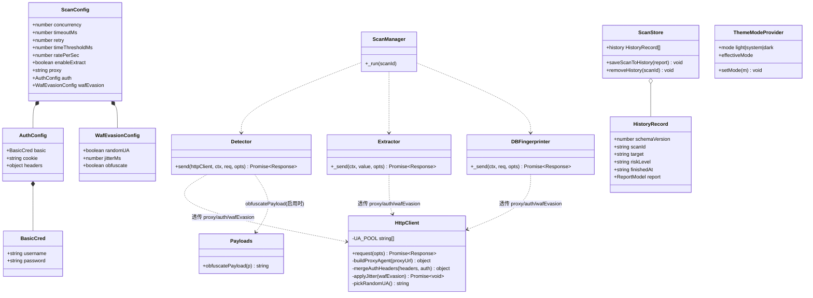
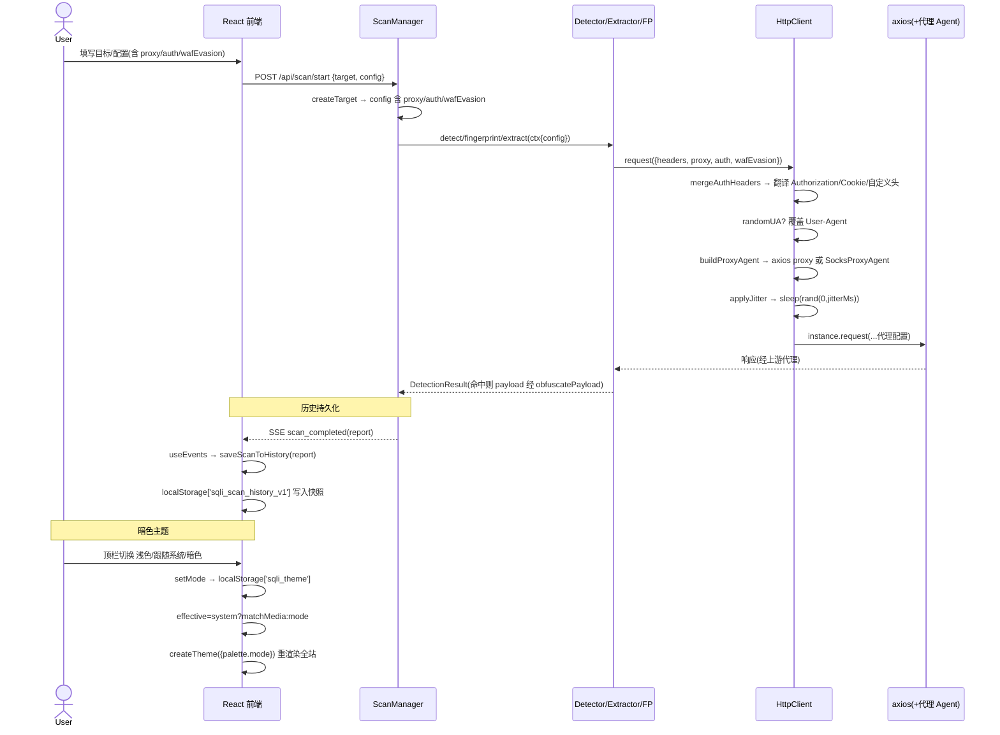

# SQL 注入检测工具「sqli-scanner」— P2 增量设计 + 文件级任务分解

> 作者：架构师 高见远（Gao）
> 版本：P2 增量（基于 v1.0.0 完整版 `docs/system_design.md`）
> 形态：Web 全栈（React + Node/Express 引擎）+ Tauri 桌面壳（一份代码双形态）
> 语言：简体中文
> 工程根目录：`sqli-scanner/`（相对 `C:\ProgramData\WorkBuddy\users\3a7d1c20\WorkBuddy\2026-07-27-04-04-56\`）
> 配套 PRD：`docs/prd_p2_incremental.md`

> ⚠️ 文件约定：本增量设计写入 `docs/system_design_p2.md`，并另存 `docs/class-diagram-p2.mermaid` / `docs/sequence-diagram-p2.mermaid`，**不覆盖** v1.0.0 的 `system_design.md` 与原始两张图。架构师判定：破坏性覆盖旧设计文档风险高于按 P2 后缀新增，故采用增量文件，便于后续合并。

---

## 1. 增量实现方案（五项接入点与双形态一致性）

P2 五项均属「外围增强」，不触碰检测算法/四类检测/指纹/拖库逻辑。核心设计原则：**所有出站请求经 `httpClient` 单一通道透传**；**前端仅改配置录入与本地存储/主题，业务逻辑零分支（Web/Tauri 共用同一份代码）**。

| 变更 | 接入旧模块 | 最小改动落地方式 | 双形态一致性 |
|------|------------|------------------|--------------|
| **F-14 代理** | `server/src/core/httpClient.js` + `ScanConfig.proxy`（已预留） | 在 `httpClient.request` 内按 `proxy` 字符串构造 axios 代理配置；HTTP 走 axios 原生 `proxy`，SOCKS5 走 `socks-proxy-agent`。`proxy` 经由 `ctx.config.proxy` 从 ScanManager→Detector/Extractor/FP→httpClient 透传。 | 代理纯服务端能力，前端只传字符串，无差异。 |
| **F-15 认证 + 自定义 Header** | `ScanConfig.auth`（已预留）+ `Target.headerParams`（已存在） | `httpClient` 新增 `mergeAuthHeaders(headers, auth)`：将 `auth.basic/cookie/headers` 翻译并合并进请求头；`auth` 经 `ctx.config.auth` 透传。自定义 Header 仍走 `Target.headerParams`（已由 `buildRequest`/`_build` 合入 `req.headers`）。 | 头合并全在服务端完成，前端零分支。 |
| **F-16 WAF 规避** | `httpClient`（随机 UA/ jitter）+ `payloads.js`（混淆） | 开关结构 `ScanConfig.wafEvasion={randomUA,jitterMs,obfuscate}`，随配置透传。`randomUA`/`jitter` 在 `httpClient.request` 内施加；`obfuscate` 在 `payloads.js` 新增 `obfuscatePayload(p)`，由各检测器/Extractor/FP 在 `fillPayload`/构造 value 后按需包裹。默认全关。 | 纯服务端行为，前端仅开关录入，无差异。 |
| **F-17 历史持久化** | `pages/HistoryPage` + `scanStore` + `useEvents` | `scan_completed` 事件触发 → `useEvents` 调 `saveScanToHistory(report)`（完整 `ReportModel` 快照）→ 写 `localStorage['sqli_scan_history_v1']`。HistoryPage 改读本地、点击回溯（直接用快照 `setReport`）、删除单条（软性过滤）。 | 统一用 `localStorage`（PRD④默认决策），Web/Tauri 业务逻辑一致、仅落盘通道后续可经 `tauriBridge` 升级为文件。 |
| **F-18 暗色主题** | `App.tsx` 顶层 `ThemeProvider` + 顶栏 | `App.tsx` 改用动态 `createTheme`，`mode∈{light,system,dark}` 存 `localStorage['sqli_theme']`；新增 `TopBar` 提供三态切换；`index.css` 删除 `body` 硬编码背景色，交由 MUI `CssBaseline` 按主题着色；Tailwind 仅布局类，无新增色值。 | 主题完全在前端 MUI 层，双形态共用同一主题代码。 |

**关键不变量（回归护栏）**：当 `proxy=null / auth=null / wafEvasion 全关` 时，`httpClient.request` 的代理配置为 `{proxy:false}`、不翻译任何头、不覆盖 `User-Agent`、不 `sleep`、不做混淆——与原 v1.0.0 行为完全一致。`auth` 改为「头翻译」而非 axios 原生 `auth`，但旧代码本就从未传入 `auth`，故无回归。

---

## 2. 文件级变更列表（相对 `sqli-scanner/`）

> 标注【修改】/【新增】+ 路径 + 具体改动（函数/字段级）。

### 服务端（引擎网络层 + 透传）

- 【修改】`server/src/config/defaults.js`
  - 新增字段 `wafEvasion: { randomUA: false, jitterMs: 0, obfuscate: false }`（保持 `proxy:null`、`auth:null` 预留位不变）。
- 【修改】`server/src/core/httpClient.js`
  - 顶层新增 `import { SocksProxyAgent } from 'socks-proxy-agent';`
  - 新增常量 `UA_POOL: string[]`（内置 8~12 条常见浏览器 UA）。
  - 新增 `pickRandomUA()`：从 `UA_POOL` 随机取一条。
  - 新增 `mergeAuthHeaders(headers, auth)`：将 `auth.basic→Authorization: Basic base64`、`auth.cookie→Cookie`（与已有 Cookie 合并）、`auth.headers→任意头`，合并进 `headers` 返回；`auth` 为空原样返回。
  - 新增 `buildProxyAgent(proxyUrl)`：空值→`{proxy:false}`；`http(s)://`→`{ proxy: { protocol, host, port } }`（axios 原生）；`socks5://`/`socks://`→`{ proxy:false, httpAgent: new SocksProxyAgent(url), httpsAgent: new SocksProxyAgent(url) }`。
  - 新增 `applyJitter(wafEvasion)`：`if(wafEvasion?.jitterMs>0) await sleep(rand(0,wafEvasion.jitterMs))`。
  - 改 `request(opts)`：入参增加 `proxy`、`auth`、`wafEvasion`；执行顺序：`headers=mergeAuthHeaders(opts.headers||{}, opts.auth)` → `if(wafEvasion?.randomUA) headers['User-Agent']=pickRandomUA()` → `proxyConf=buildProxyAgent(opts.proxy ?? defaults.proxy ?? false)` → 重试循环内 `bucket.acquire()` 后 `await applyJitter(wafEvasion)` → `instance.request({..., ...proxyConf})`。移除原 `auth: opts.auth ?? defaults.auth` 的 axios 原生写法。
- 【修改】`server/src/engine/payloads.js`
  - 导出新增 `obfuscatePayload(p)`：仅对字母做大小写随机化；在空白处分隔插入 `/**/`（如 `UNION SELECT` → `uNiOn/*xY*/SeLeCt`）；数字/引号/十六进制/字符串字面量不受影响。导出供检测器与 Extractor/FP 使用。
- 【修改】`server/src/engine/Detector.js`
  - 改 `send(httpClient, ctx, req, opts={})` 签名（原 `(httpClient, req, opts)`）；调用 `httpClient.request` 时额外透传 `proxy: ctx?.config?.proxy ?? false`、`auth: ctx?.config?.auth ?? null`、`wafEvasion: ctx?.config?.wafEvasion ?? null`。`buildRequest` 不变（`headerParams` 仍合入 `req.headers`）。
- 【修改】`server/src/engine/detectors/UnionDetector.js`
  - import 增加 `obfuscatePayload`；`fillPayload(...)` 结果按 `ctx.config?.wafEvasion?.obfuscate` 包裹 `obfuscatePayload`；把 `this.send(httpClient, req, ctx)` 调整为 `this.send(httpClient, ctx, req, ctx)`（第 25/32/47 行）。
- 【修改】`server/src/engine/detectors/ErrorDetector.js`
  - 同上：import 增加 `obfuscatePayload`；`payload=fillPayload(...)` 后包裹混淆；`this.send(httpClient, this.buildRequest(target,point,payload), ctx)` → `this.send(httpClient, ctx, this.buildRequest(target,point,payload), ctx)`（第 31 行）。
- 【修改】`server/src/engine/detectors/BooleanBlindDetector.js`
  - 同上：`truePayload`/`falsePayload` 后包裹混淆；两处 `this.send(httpClient, this.buildRequest(...), ctx)` → `this.send(httpClient, ctx, this.buildRequest(...), ctx)`（第 31/32 行）。
- 【修改】`server/src/engine/detectors/TimeBlindDetector.js`
  - import 增加 `obfuscatePayload`；`payload=fillPayload(...)` 后包裹混淆；`this.send(httpClient, this.buildRequest(target,point,payload), { timeoutMs })` → `this.send(httpClient, ctx, this.buildRequest(target,point,payload), { timeoutMs })`（第 35 行）。
- 【修改】`server/src/engine/Extractor.js`
  - import 增加 `obfuscatePayload`；`_send(ctx, value, opts)` 内对 `value` 做 `value = ctx.config?.wafEvasion?.obfuscate ? obfuscatePayload(value) : value`，再 `_build(ctx.target, ctx.point, value)`；`httpClient.request({...})` 增加 `proxy: ctx.config?.proxy ?? false`、`auth: ctx.config?.auth ?? null`、`wafEvasion: ctx.config?.wafEvasion ?? null`（第 132~140 行）。
- 【修改】`server/src/engine/DBFingerprinter.js`
  - import 增加 `obfuscatePayload`；`_send(httpClient, req, opts)` 改签名为 `_send(ctx, req, opts)`，内部 `value` 混淆（同 Extractor），`httpClient.request({...})` 增加 `proxy/auth/wafEvasion`（取自 `ctx.config`）；`fingerprint` 中 4 处 `this._send(httpClient, ...)` 改为 `this._send(ctx, ...)`（第 23/29/30/50 行）。
- 【修改】`server/src/engine/ScanManager.js`
  - `_run` 末尾（`s.status='completed'` 前）：若 `target.config.wafEvasion` 任一开关开启，写 `report.summary.wafEvasion = { randomUA, jitterMs, obfuscate }`，供报告标注「规避已启用」。ctxBase 已含 `config`，透传链路无需额外改动。

### 前端（配置录入 + 历史 + 主题）

- 【修改】`src/shared/types.ts`
  - 新增 `BasicCred { username:string; password:string }`、`AuthConfig { basic?:BasicCred; cookie?:string; headers?:Record<string,string> }`、`WafEvasionConfig { randomUA:boolean; jitterMs:number; obfuscate:boolean }`。
  - `ScanConfig.auth` 由 `object|null` 改为 `AuthConfig|null`；新增 `ScanConfig.wafEvasion: WafEvasionConfig`。
  - 新增 `HistoryRecord { schemaVersion:number; scanId:string; target:string; riskLevel:RiskLevel; finishedAt:string|null; report:ReportModel }`。
- 【修改】`src/shared/constants.ts`
  - `DEFAULT_CONFIG` 增加 `wafEvasion: { randomUA:false, jitterMs:0, obfuscate:false }`（`auth` 默认 `null` 不变）。
- 【修改】`src/components/ScanConfigPanel.tsx`
  - 新增录入区（均经 `onChange(patch)` 透传，嵌套对象整体替换）：
    - 代理：`proxy`（文本，占位 `http://127.0.0.1:8080` 或 `socks5://127.0.0.1:1080`）。
    - 认证：`auth.basic.username` / `auth.basic.password`（两个 TextField）、`auth.cookie`（文本）、`auth.headers`（键值文本，解析为 `Record<string,string>`）。旁注「凭证以明文保存于本地，请勿在公共设备使用」。
    - WAF 规避：`wafEvasion.randomUA`（Switch）、`wafEvasion.obfuscate`（Switch）、`wafEvasion.jitterMs`（数字，单位 ms）。
- 【修改】`src/components/TargetForm.tsx`
  - 现有 `headerParams` 即「全局自定义 Header」录入（F-15 自定义头走此路），在标签/占位文案注明即可，逻辑不变。
- 【修改】`src/pages/ScanPage.tsx`
  - 删除启动时的 `addHistory({ scanId:id, target:url.trim(), riskLevel:'Low' })` 调用（历史改由完成时写入）；移除未用的 `addHistory` 引用。
- 【修改】`src/store/scanStore.ts`
  - `history` 初始化改为从 `localStorage['sqli_scan_history_v1']` 读取（容错：解析失败回退 `[]`）。
  - 删除旧 `addHistory`，新增 `saveScanToHistory(report: ReportModel)`：构建 `HistoryRecord{schemaVersion:1, scanId, target:report.target.baseUrl, riskLevel:report.riskLevel, finishedAt:report.finishedAt, report}`，按 `scanId` 去重、置顶、`slice(0,100)`，写回 localStorage 并 `set`。
  - 新增 `removeHistory(scanId)`：过滤后写回 localStorage 并 `set`（软性删除）。
  - 新增工具 `loadHistory()` / `persistHistory(list)`。
- 【修改】`src/hooks/useEvents.ts`
  - `scan_completed` 分支改为调用 `saveScanToHistory(data.payload)`（完整报告快照持久化），移除旧的「内存 addHistory」语义。
- 【修改】`src/pages/HistoryPage.tsx`
  - 列表项改为读 `history`（每条含 `report` 快照）；点击 → `setReport(record.report)` + `navigate('/report/'+scanId)`（无需再请求服务端，支持扫描结束后回溯）。
  - 每条右侧新增「删除」按钮 → `removeHistory(scanId)`。
  - 兼容旧结构：展示用 `record.report?.target?.baseUrl ?? record.target`。
- 【修改】`src/App.tsx`
  - 用动态 `createTheme` 替换静态 `theme`：新增 `AppThemeProvider`（含 `mode` 状态 `'light'|'system'|'dark'`，从 `localStorage['sqli_theme']` 读取、写入；`system` 用 `matchMedia('(prefers-color-scheme: dark)')` 计算 `effective`），导出 `ThemeModeContext` 与 `useThemeMode()`。
  - 结构：`<AppThemeProvider><CssBaseline/><TopBar/><RouterProvider router={router}/></AppThemeProvider>`。
- 【新增】`src/components/TopBar.tsx`
  - MUI `AppBar`+`Toolbar`：应用标题、「新建扫描」「历史」导航链接、主题切换 `ToggleButtonGroup`（浅色/跟随系统/暗色，消费 `useThemeMode`）。
- 【修改】`src/index.css`
  - 删除 `body { background-color:#f5f7fa; }` 硬编码（改由 MUI `CssBaseline` 按主题设置 body 背景）；保留等宽字体等样式。
- 【修改】`tailwind.config.js`
  - 核查无硬编码色值；`risk` 语义色保留（双主题可用）。本任务无新增依赖/字段。

---

## 3. 新增依赖

### 服务端（`server/package.json` + `server/package-lock.json`）
```
- socks-proxy-agent@^8.0.2   # 仅 SOCKS5 代理需要；HTTP 代理用 axios 原生 proxy 选项，无需额外包
```
> 不引入 `http-proxy-agent` / `https-proxy-agent`：HTTP 代理由 axios 原生 `proxy` 选项处理，避免重复。

### 前端（`src`）
```
无   # MUI createTheme/useMediaQuery、Tailwind、localStorage 均原生具备
```

### 构建/工具 / Rust（Tauri）
```
无
```

---

## 4. 关键设计细节（可落地方案）

### 4.1 代理 `buildProxyAgent(proxyUrl)`
```js
// server/src/core/httpClient.js
import { SocksProxyAgent } from 'socks-proxy-agent';
import { URL } from 'url';

function buildProxyAgent(proxyUrl) {
  if (!proxyUrl) return { proxy: false };
  if (/^socks5?:\/\//i.test(proxyUrl)) {
    const agent = new SocksProxyAgent(proxyUrl);
    return { proxy: false, httpAgent: agent, httpsAgent: agent };
  }
  // http(s):// 走 axios 原生 proxy
  const u = new URL(proxyUrl);
  return {
    proxy: {
      protocol: u.protocol.replace(':', ''), // 'http'
      host: u.hostname,
      port: Number(u.port),
    },
  };
}
```
调用处（`request` 内）：`const proxyConf = buildProxyAgent(opts.proxy ?? defaults.proxy ?? false);` 然后把 `...proxyConf` 展开进 `instance.request`。无代理时返回 `{proxy:false}`，与原行为一致。

### 4.2 认证 `ScanConfig.auth` 与头合并
```ts
// 建议数据结构（types.ts）
interface BasicCred { username: string; password: string; }
interface AuthConfig {
  basic?: BasicCred;          // Basic Auth
  cookie?: string;            // 自定义 Cookie 字符串（全局随每次请求）
  headers?: Record<string,string>; // 自定义 Header 键值对
}
```
```js
// httpClient.js —— 翻译并合并（不破坏已有 Cookie/Header）
function mergeAuthHeaders(headers, auth) {
  const h = { ...(headers || {}) };
  if (!auth) return h;
  if (auth.basic && auth.basic.username != null) {
    h['Authorization'] = 'Basic ' +
      Buffer.from(`${auth.basic.username}:${auth.basic.password ?? ''}`).toString('base64');
  }
  if (auth.cookie) {
    h['Cookie'] = h['Cookie'] ? `${h['Cookie'].replace(/;?\s*$/, '')}; ${auth.cookie}` : auth.cookie;
  }
  if (auth.headers) Object.assign(h, auth.headers);
  return h;
}
```
- `Target.headerParams`（用户在 TargetForm 录入的全局自定义头）已由 `buildRequest`/`_build` 合入 `req.headers`，再经 `mergeAuthHeaders` 叠加 `auth` 相关头，最终随**每个**出站请求发送（满足 §3.1「与 auth 合并发送」）。
- 旧代码从未真正传入 `auth`，现改为头翻译无回归。

### 4.3 WAF 规避 `ScanConfig.wafEvasion`
```ts
interface WafEvasionConfig { randomUA: boolean; jitterMs: number; obfuscate: boolean; }
```
- **randomUA**：`httpClient.request` 内 `if (opts.wafEvasion?.randomUA) headers['User-Agent'] = pickRandomUA();`（`UA_POOL` 内置常见 UA；关闭时不动 UA，保留 axios 默认）。
- **jitter**：每次请求前 `await applyJitter(opts.wafEvasion)`（`sleep(rand(0, jitterMs))`）；`jitterMs=0` 时不 sleep。
- **obfuscate**：`payloads.js` 提供
  ```js
  export function obfuscatePayload(p) {
    let out = p.split('').map((c) => /[a-zA-Z]/.test(c)
      ? (Math.random() < 0.5 ? c.toLowerCase() : c.toUpperCase())
      : c).join('');
    out = out.replace(/ /g, (sp) => `/*${Math.random().toString(36).slice(2, 7)}*/${sp}`);
    return out;
  }
  ```
  检测器/Extractor/FP 在 `fillPayload`/构造 `value` 后按需包裹：`const p = ctx.config?.wafEvasion?.obfuscate ? obfuscatePayload(filled) : filled;`。仅随机化字母、仅在空白插 `/**/`，数字/引号/十六进制安全。

### 4.4 历史持久化
- **localStorage key**：`sqli_scan_history_v1`（schemaVersion=1，便于后续升级）。
- **存储结构**：JSON 数组，每项 `HistoryRecord { schemaVersion, scanId, target, riskLevel, finishedAt, report:ReportModel }`。
- **写入时机**：`scan_completed` 事件 → `useEvents` → `saveScanToHistory(report)`，存完整 `report` 快照（支持事后离线回溯）。
- **读取/回溯/删除**：`HistoryPage` 读 `history`；点击 → `setReport(record.report)` + 跳转（无需服务端）；「删除」→ `removeHistory(scanId)`（软性：仅从数组过滤，写回 localStorage）。
- **兼容旧结构**：加载时对每条做容错（缺 `report` 时用 `target`/`scanId` 占位展示，不崩溃）。

### 4.5 暗色主题
- `App.tsx`：`mode ∈ {'light','system','dark'}`，存 `localStorage['sqli_theme']`（默认 `'light'`，支持「跟随系统」读 `prefers-color-scheme`）；`createTheme({ palette:{ mode: effective, primary:{main:'#1976d2'}, secondary:{main:'#9c27b0'} }})`；导出 `useThemeMode()` 供 `TopBar` 切换。
- `TopBar.tsx`（新增）：`AppBar` 顶部栏，含标题、导航、主题 `ToggleButtonGroup` 三态。
- `index.css`：删除 `body{background-color:#f5f7fa}` 硬编码，交由 MUI `CssBaseline` 按主题着色；Tailwind 维持布局类、不使用硬编码色值。

---

## 5. 任务列表（有序、含依赖，工程师直接执行清单）

> 按 PRD 建议分组为 T-P2-1 ~ T-P2-6。注：角色默认约束「任务≤5」在此被团队负责人显式要求的 6 分组覆盖（增量改动按网络层/透传/前端录入/历史/主题/回归切分更清晰，且每任务≥3 文件）。

### T-P2-1 引擎网络层（httpClient 代理/认证/随机UA/jitter + payloads 混淆 + defaults）
- **目录/文件**：`server/src/config/defaults.js`【修改】、`server/src/core/httpClient.js`【修改】、`server/src/engine/payloads.js`【修改】
- **做什么**：
  - `defaults.js`：加 `wafEvasion:{randomUA:false,jitterMs:0,obfuscate:false}`。
  - `httpClient.js`：加 `UA_POOL`/`pickRandomUA`/`mergeAuthHeaders`/`buildProxyAgent`/`applyJitter`；`request(opts)` 支持 `proxy/auth/wafEvasion` 透传与无配置时行为不变。
  - `payloads.js`：导出 `obfuscatePayload(p)`。
  - `server/package.json`：加 `socks-proxy-agent@^8.0.2`。
- **依赖**：无（基础设施）。
- **优先级**：P0

### T-P2-2 透传接入（ScanManager→Detector/Extractor/FP 把 proxy/auth/wafEvasion 注入 httpClient）
- **目录/文件**：`server/src/engine/Detector.js`【修改】、`server/src/engine/detectors/UnionDetector.js`【修改】、`server/src/engine/detectors/ErrorDetector.js`【修改】、`server/src/engine/detectors/BooleanBlindDetector.js`【修改】、`server/src/engine/detectors/TimeBlindDetector.js`【修改】、`server/src/engine/Extractor.js`【修改】、`server/src/engine/DBFingerprinter.js`【修改】、`server/src/engine/ScanManager.js`【修改】
- **做什么**：
  - `Detector.send` 改签名为 `(httpClient, ctx, req, opts)` 并向 `httpClient.request` 透传 `proxy/auth/wafEvasion`。
  - 四检测器：`send` 调用顺序调整 + `fillPayload` 后按需 `obfuscatePayload`。
  - `Extractor._send` / `DBFingerprinter._send`：混淆 value + `httpClient.request` 透传三参数；FP 调用点 `_send(ctx, ...)`。
  - `ScanManager._run`：规避开启时写 `report.summary.wafEvasion`。
- **依赖**：T-P2-1。
- **优先级**：P0

### T-P2-3 前端配置录入（类型 + 代理/认证/WAF 开关）
- **目录/文件**：`src/shared/types.ts`【修改】、`src/shared/constants.ts`【修改】、`src/components/ScanConfigPanel.tsx`【修改】、`src/components/TargetForm.tsx`【修改】、`src/pages/ScanPage.tsx`【修改】
- **做什么**：
  - `types.ts`：加 `BasicCred/AuthConfig/WafEvasionConfig/HistoryRecord`；`ScanConfig.auth`→`AuthConfig|null`、加 `wafEvasion`。
  - `constants.ts`：`DEFAULT_CONFIG` 加 `wafEvasion`。
  - `ScanConfigPanel.tsx`：加代理/认证（basic/cookie/headers）/WAF（randomUA/obfuscate/jitterMs）录入项，经 `onChange` 透传嵌套对象。
  - `TargetForm.tsx`：标注 `headerParams` 为全局自定义头。
  - `ScanPage.tsx`：删除启动时 `addHistory`（历史改完成时写入）。
- **依赖**：无（与 T-P2-1 平行，类型对齐即可）。
- **优先级**：P0

### T-P2-4 历史持久化（store + 事件写入 + 页面回溯/删除）
- **目录/文件**：`src/store/scanStore.ts`【修改】、`src/hooks/useEvents.ts`【修改】、`src/pages/HistoryPage.tsx`【修改】、`src/pages/ScanPage.tsx`【修改】
- **做什么**：
  - `scanStore.ts`：`history` 从 `localStorage['sqli_scan_history_v1']` 初始化；`saveScanToHistory(report)` / `removeHistory(scanId)`；去重/置顶/截断 100；容错兼容旧结构。
  - `useEvents.ts`：`scan_completed` 调 `saveScanToHistory(data.payload)`。
  - `HistoryPage.tsx`：读 `history`、点击 `setReport(record.report)`+跳转、每条「删除」按钮。
  - `ScanPage.tsx`：移除旧 `addHistory` 引用（与 T-P2-3 同一文件，合并修改）。
- **依赖**：T-P2-3（依赖 `HistoryRecord` 类型）。
- **优先级**：P0

### T-P2-5 暗色主题（顶层 ThemeProvider + 顶栏切换 + Tailwind 适配）
- **目录/文件**：`src/App.tsx`【修改】、`src/index.css`【修改】、`src/components/TopBar.tsx`【新增】、`tailwind.config.js`【修改】
- **做什么**：
  - `App.tsx`：动态 `createTheme` + `AppThemeProvider` + `useThemeMode`，`mode` 持久化 `localStorage['sqli_theme']`，`system` 用 `matchMedia`。
  - `TopBar.tsx`：新增 `AppBar`+三态主题切换。
  - `index.css`：删 `body` 硬编码背景色。
  - `tailwind.config.js`：核查无硬编码色值（仅核查，无新增）。
- **依赖**：无。
- **优先级**：P1

### T-P2-6 装配与回归自检（默认全关 + 行为不变 + 回归测试）
- **目录/文件**：`server/src/config/defaults.js`【修改/核对】、`server/src/engine/ScanManager.js`【修改/核对】、`server/tests/httpClient.p2.test.js`【新增】
- **做什么**：
  - 核对 `defaults.js`：`proxy:null / auth:null / wafEvasion 全关`。
  - 核对 `ScanManager`：规避关闭时 `report.summary.wafEvasion` 不写、ctx 透传链路完整。
  - 新增回归测试 `httpClient.p2.test.js`：① 无代理/无认证/无 WAF 时 `request` 不出 `proxy` agent、不覆盖 UA、不 sleep、不翻译头（行为同 v1.0.0）；② `buildProxyAgent('socks5://..')` 返回带 `SocksProxyAgent` 且 `proxy:false`；③ `mergeAuthHeaders` 正确生成 `Authorization`/`Cookie`；④ `obfuscatePayload` 不改变数字/引号且仍可解析。
  - 运行 `npm test`（前端 `vitest` + 服务端 `node --test`）确认全绿。
- **依赖**：T-P2-1、T-P2-2。
- **优先级**：P0

---

## 6. 回归注意点

1. **无代理/无认证/无 WAF 时 `httpClient` 行为必须完全不变**：`proxy=null`→`{proxy:false}`；`auth=null`→不翻译头；`wafEvasion` 全关→不覆盖 UA、不 sleep、不混淆。对照 v1.0.0 的 GET/POST/Cookie/Header 扫描与四类检测必须有等价结果（T-P2-6 回归测试覆盖）。
2. **默认 `wafEvasion` 全关**：`defaults.js` 与 `constants.ts` 的 `DEFAULT_CONFIG` 必须初值全 `false/0`，否则会改变既有请求形态与时序。
3. **历史读取兼容旧结构**：旧版历史为 `{scanId,target,riskLevel}`（无 `report`），`scanStore` 加载须容错，展示不崩溃、删除仍按 `scanId` 工作。
4. **双形态零分支**：代理/认证/WAF 全在服务端；历史/主题全在前端且用 `localStorage`，Web 与 Tauri 共用同一份代码；`tauriBridge` 仅在引擎启停/文件导出处差异化，本 P2 不触碰。
5. **混淆安全边界**：`obfuscatePayload` 仅随机化字母、仅在空白插 `/**/`，不得破坏数字、引号、十六进制字面量，避免把正常 SQL 关键字序列拆坏。
6. **代理凭证/历史明文**：按 PRD④/②默认决策，凭证与历史均明文存本地、不加密，UI 需明示风险文案。

---

## 7. 待明确事项（不确定点 + 默认处理）

| # | 不确定点 | 默认处理 |
|---|----------|----------|
| 1 | SOCKS5 是否首版必做 | 做（PRD④已决策）；仅新增 `socks-proxy-agent`，HTTP 用 axios 原生。 |
| 2 | 代理凭证是否持久化 | 随 `ScanConfig.proxy`/`auth` 整体持久化（明文，不加密）；UI 标注风险。 |
| 3 | 历史用 localStorage 还是文件 | 统一 `localStorage`（PRD④），Web/Tauri 业务逻辑一致；后续可经 `tauriBridge` 升级为文件。 |
| 4 | WAF 规避默认态 | 默认全关（PRD④）；开启后在 `report.summary.wafEvasion` 标注。 |
| 5 | 暗色默认态 | 默认浅色 + 支持「跟随系统」（PRD⑤），持久化 `localStorage['sqli_theme']`。 |
| 6 | 自定义 Header 走 `auth.headers` 还是 `Target.headerParams` | 两者并存：`Target.headerParams` 为「目标级自定义头」（TargetForm 录入）；`auth.headers` 为「认证面板里的额外自定义头」；最终在 `httpClient` 合并。前端可在 ScanConfigPanel 的认证区提供「额外自定义头」录入。 |
| 7 | 混淆是否作用于拖库（Extractor）查询 | 是——Extractor/FP 的 `value` 同样按 `obfuscate` 包裹，保证提取阶段也规避 WAF；若担心误伤，可仅对检测阶段开启（本设计默认全阶段一致开启）。 |
| 8 | 是否需要新增回归测试文件 | 是——T-P2-6 新增 `server/tests/httpClient.p2.test.js`，验证「无配置时行为不变」。 |
| 9 | 主题切换组件是否新增文件 | 是——新增 `src/components/TopBar.tsx`（原项目无顶栏，PRD 要求顶栏按钮）。 |
| 10 | 是否覆盖 v1.0.0 设计文档/图 | 否——本增量设计存 `docs/system_design_p2.md` + `*-p2.mermaid`，保留旧文档；后续再合并。 |

---

## 附录 A：P2 增量类图（Mermaid）

> 同 `docs/class-diagram-p2.mermaid`



## 附录 B：P2 关键时序（Mermaid）

> 同 `docs/sequence-diagram-p2.mermaid`（含：① 带网络上下文的扫描请求；② 历史持久化；③ 主题切换）


