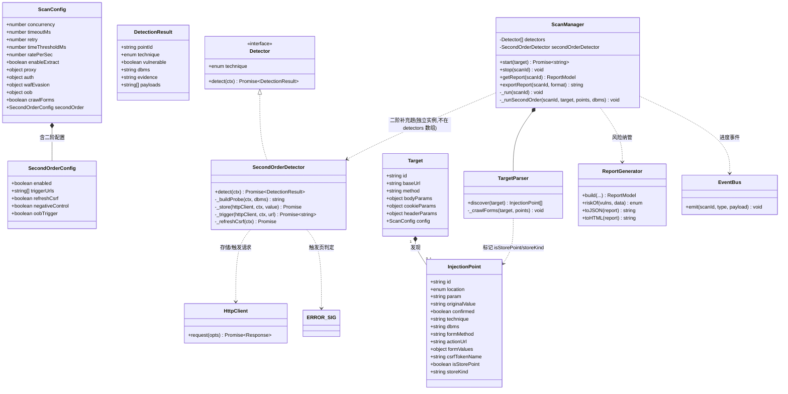

# 二阶注入（Second-order / Stored SQLi）检测 — 增量设计 + 任务分解

> 作者：架构师 高见远（Gao）
> 形态：在**现有注入检测引擎**上做增量（非从零写），引擎位于 `server/src/engine/`
> 语言：中文（注释/日志/报告文案沿用项目约定）
> 工程根：`sqli-scanner/`（相对 `C:\ProgramData\WorkBuddy\users\3a7d1c20\WorkBuddy\2026-07-27-04-04-56\`）
> 设计依据：已**亲读** `ScanManager.js / Detector.js / payloads.js / defaults.js / models.js / TargetParser.js / ReportGenerator.js / errors.js / injection.js / detectors/OobDetector.js / detectors/ErrorDetector.js / detectors/StackedDetector.js / engines/sqlmapBridge.js / api/scanRoutes.js / tests/*`

> ⚠️ 文件命名说明：项目对增量设计已有 `system_design_f19.md` / `system_design_p2.md` 的**后缀命名约定**。为不覆盖既有基础设计 `docs/system_design.md`，本次交付使用 `system_design_second_order.md` + `class-diagram-second-order.mermaid` + `sequence-diagram-second-order.mermaid`。如需合并进主文档请告知。

---

## 1. 增量设计总述（三段）

**如何融入现有流水线**：二阶注入本质是"先存储、后触发"的两阶段时序，与现有"单点单轮即时回显"模型根本不同，因此**不作为 `this.detectors` 注册表中的常规检测器参与一阶 per-point 循环**，而是作为 `ScanManager` 内的**独立补充趟（supplemental pass）**：在 `_run` 既有"发现→指纹→一阶检测→提取→聚合"之后，新增 `_runSecondOrder` 阶段。该阶段仅在 `config.secondOrder.enabled === true` 且 `triggerUrls` 非空且存在被标记的存储点时运行；命中结果复用既有的 `foundByPoint` → 聚合去重 → `ReportGenerator.riskOf` 通道，对一阶流水线零侵入。

**数据模型与编排**：`InjectionPoint` 扩展 `isStorePoint`/`storeKind` 两个字段——`TargetParser._crawlForms` 在发现 POST 表单点时启发式标记 `isStorePoint=true`（GET 表单点与非表单点保持 `false`）。配置侧新增 `config.secondOrder = { enabled, triggerUrls[], refreshCsrf, negativeControl, oobTrigger }`，`triggerUrls` 由用户/扫描输入提供候选触发页（可多个）。`ScanManager` 持有**独立实例** `this.secondOrderDetector = new SecondOrderDetector()`（不进 `this.detectors` 数组），对"每个存储点 × 每个 triggerUrl"调用其 `detect(ctx)`，其中 `ctx.triggerUrl` 由编排层逐次注入。

**判定方法与非破坏性边界**：复用 `ErrorDetector` 的 `ERROR_SIG` 报错特征正则作为触发页判定信号。存储阶段把"报错触发探针"POST 到存储点（真实写，opt-in）；触发阶段 GET 触发页，比较"基线（存储前读触发页）/实验（存探针后读）/阴性对照（存良性值后读）"三态，仅当"基线无报错 && 实验有报错 && 阴性无报错"判定为二阶注入。存储阶段是真实副作用，故**默认关闭**、`ScanManager` 在开启时打印明确告警日志、且全部测试用 mock `httpClient` 不真发。

---

## 2. 文件清单（相对 `sqli-scanner/`，区分【新增】/【修改】）

### 【新增】
| 路径 | 作用 |
|------|------|
| `server/src/engine/detectors/SecondOrderDetector.js` | 二阶检测器（策略模式，复用 `Detector` 基类 + `buildRequest` 表单点能力） |
| `server/tests/secondOrderDetector.test.js` | 检测器单测（mock httpClient 模拟"存→触发→回显"三态） |
| `server/tests/scanManager.secondOrder.test.js` | 编排层单测（opt-in 默认关闭、开启后门控触发、与一阶流水线共存、不写目标） |

### 【修改】
| 路径 | 改动点 |
|------|--------|
| `server/src/config/defaults.js` | 新增 `secondOrder: { enabled:false, triggerUrls:[], refreshCsrf:true, negativeControl:true, oobTrigger:false }` |
| `server/src/engine/models.js` | `createInjectionPoint` 扩展 `isStorePoint`、`storeKind`（非表单点保持 `false/null`，向后兼容） |
| `server/src/engine/TargetParser.js` | `_crawlForms` 对 POST 表单点置 `isStorePoint=true` 并按动作/字段启发式写 `storeKind` |
| `server/src/engine/payloads.js` | `TECHNIQUE_TYPES` 追加 `'second_order'`；`SUPPORTED` 各库追加 `second_order:true`（信息性同步）；新增 `SECOND_ORDER_PROBES`（跨库报错探针）与导出 `ERROR_SIG`（供复用） |
| `server/src/engine/ScanManager.js` | 持有独立 `SecondOrderDetector` 实例；`_run` 末尾加 `_runSecondOrder` 补充趟（门控、两阶段调度、合并入 `foundByPoint`、开启时告警日志） |
| `server/src/services/ReportGenerator.js` | `riskOf` 增加 `second_order → High` 分支 |
| `server/src/core/errors.js` | 末尾追加 `SECOND_ORDER_DISABLED: 6004`（防御性，不改既有码值） |
| `server/src/api/scanRoutes.js` | `sanitizeStart` 校验并收敛 `config.secondOrder`（enabled 布尔、triggerUrls 为 http(s) 数组） |
| `server/tests/targetParser.forms.test.js` | 追加"POST 表单点被标记 isStorePoint / storeKind"用例 |

### 明确**不修改**（非破坏性确认）
- `server/src/engines/sqlmapBridge.js`：**严禁破坏**。二阶增强只扩充原生引擎，不改变"原生引擎弱时委托真 sqlmap CLI"的通道；`SecondOrderDetector` 不进 `this.detectors`，与 bridge 完全正交。
- `server/src/engine/detectors/ErrorDetector.js`：可选改为 `import { ERROR_SIG } from '../payloads.js'` 以复用（非强制，本地副本可保留）。

---

## 3. 关键数据结构与接口契约

### 3.1 `InjectionPoint` 扩展（`models.js`）
在既有字段后追加两字段，**非表单点保持 `false/null`，向后兼容**：
```js
export function createInjectionPoint(location, param, originalValue, extra = {}) {
  return {
    // …既有字段…
    formMethod: extra.formMethod ?? null,
    actionUrl: extra.actionUrl ?? null,
    formValues: extra.formValues ?? null,
    csrfTokenName: extra.csrfTokenName ?? null,
    // —— 二阶注入新增 ——
    isStorePoint: extra.isStorePoint ?? false, // 是否为潜在"存储型参数点"（候选二阶存储端）
    storeKind: extra.storeKind ?? null,         // 启发式分类：'registration'|'profile'|'comment'|'unknown'|null
  };
}
```
`storeKind` 取值：`'registration'`（含 username/password/email 的注册类 POST 表单）、`'profile'`（含 name/bio/displayName/avatar 的资料修改类）、`'comment'`（含 comment/content/body/message 的评论/留言类）、`'unknown'`（其它 POST 表单）。判定用字段名正则在 `TargetParser._crawlForms` 中启发式给出，**仅作提示、不强制**；真正的判定在 `SecondOrderDetector`。

### 3.2 `SecondOrderConfig`（`defaults.js` schema）
```js
secondOrder: {
  enabled: false,        // 总开关（默认关；开启=对目标发起真实写请求，仅已授权目标显式开启）
  triggerUrls: [],       // 候选触发页 URL 列表（http/https），可多个；为空则不跑
  refreshCsrf: true,     // 存储前是否 GET actionUrl 重抓 CSRF token（应对单次 token 失效）
  negativeControl: true, // 是否做"存良性值→读触发页"阴性对照（多一次写，提高判定置信）
  oobTrigger: false,     // 扩展点：触发判定是否借用 OOB（见 §8）
}
```
门控契约（编排层唯一硬门）：`secondOrder.enabled === true && Array.isArray(triggerUrls) && triggerUrls.length > 0 && 存在 isStorePoint 点`。`config.techniques` 是否含 `'second_order'` 仅作"用户意图"记录（`sanitizeStart` 已因 `TECHNIQUE_TYPES` 包含而放行），**不独立触发**二阶趟——避免与一阶 per-point 循环耦合。

### 3.3 `SecondOrderDetector.detect(ctx)` 行为契约
```js
/**
 * @param {object} ctx
 *   { httpClient, target, point, dbms, config,
 *     triggerUrl: string }   // ← 由 ScanManager._runSecondOrder 逐次注入
 * @returns {Promise<DetectionResult>}
 *   technique 固定 'second_order'；命中时 evidence 描述"基线/实验/阴性"三态结论
 */
async detect(ctx) {
  const { httpClient, target, point, dbms, config, triggerUrl } = ctx;
  const result = createDetectionResult(point.id, 'second_order');
  if (!triggerUrl) return result;                       // 无触发页 → 直接未命中
  const so = (config && config.secondOrder) || {};
  if (!so.enabled) throw new AppError(ErrorCode.SECOND_ORDER_DISABLED, '二阶检测未启用');

  // 1) 基线：只读触发页，记录是否本就含报错特征（不写）
  const baselineBody = await this._trigger(httpClient, ctx, triggerUrl);
  const baselineErr = ERROR_SIG.test(baselineBody);

  // 2) 存储阶段（真实写）：构造报错探针 → 可选刷新 CSRF → POST 表单点
  const probe = this._buildProbe(ctx, dbms);            // 复用 obfuscateValue(ctx, probe)
  if (so.refreshCsrf) await this._refreshCsrf(ctx);     // GET actionUrl 重抓 token 覆盖 formValues
  await this._store(httpClient, ctx, probe);            // buildRequest(point, probe) → send

  // 3) 触发阶段：读触发页，看是否回显报错
  const expBody = await this._trigger(httpClient, ctx, triggerUrl);
  const expErr = ERROR_SIG.test(expBody);

  // 4) 阴性对照（可选）：存良性值 → 读触发页应无报错
  let negErr = false;
  if (so.negativeControl) {
    await this._store(httpClient, ctx, point.originalValue || 'benign');
    const negBody = await this._trigger(httpClient, ctx, triggerUrl);
    negErr = ERROR_SIG.test(negBody);
  }

  // 5) 判定
  if (!baselineErr && expErr && !negErr) {
    result.vulnerable = true;
    result.dbms = dbms || null;
    result.evidence =
      `二阶注入确认：存储探针后在触发页 ${triggerUrl} 回显数据库报错（基线无、实验有、阴性无），` +
      `存储点 ${point.param}@${point.actionUrl} 的数据被读出后重新拼入查询触发注入`;
    result.payloads = [probe];
    point.confirmed = true;
    point.technique = 'second_order';
    point.dbms = dbms || point.dbms;
  }
  return result;
}
```
辅助私有方法：
- `_buildProbe(ctx, dbms)`：已知 `dbms` 优先取 `PAYLOADS[dbms].error`（复用现有一阶报错模板），否则取 `SECOND_ORDER_PROBES`（跨库通用探针）；经 `this.obfuscateValue(ctx, filled)` 走 tamper 链。
- `_store(httpClient, ctx, value)`：`req = this.buildRequest(target, point, value)`（表单点已自动并入 `formValues` 含 CSRF），`await this.send(httpClient, ctx, req)`。
- `_trigger(httpClient, ctx, url)`：`await this.send(httpClient, ctx, { method:'GET', url, params:{}, data:{}, headers: target.headerParams||{} })` 返回 `String(res?.data ?? '')`。
- `_refreshCsrf(ctx)`：`GET point.actionUrl` 取 HTML → 复用 `TargetParser._parseForms` 思路解析出 `csrfTokenName` 对应新值 → 覆盖 `point.formValues[csrfTokenName]`；解析失败则保留原 token（best-effort）。

### 3.4 `DetectionResult`（复用，形状不变）
直接复用 `createDetectionResult(point.id, 'second_order')`，字段 `{ pointId, technique:'second_order', vulnerable, dbms, evidence, payloads }`，与一阶检测器完全一致 → 可直接进入既有 `foundByPoint` 聚合。

### 3.5 `payloads.js` 新增内容
```js
// 技术枚举同步（既有一阶循环门控 + scanRoutes 校验）
export const TECHNIQUE_TYPES = ['union','error','boolean','time','stacked','oob','second_order'];

// 跨库通用"存储探针"（未知 dbms 时回退；已知 dbms 用 PAYLOADS[dbms].error）
export const SECOND_ORDER_PROBES = [
  "'",
  "' AND '1'='1",
  "') OR ('1'='1",
  "';-- -",
  "' AND (SELECT 1 FROM(SELECT COUNT(*),CONCAT((SELECT version()),0x7e,FLOOR(RAND(0)*2))x FROM information_schema.tables GROUP BY x)a)-- -",
];

// 报错特征正则（从 ErrorDetector 提升为共享，供二阶触发页判定复用）
export const ERROR_SIG =
  /(SQL syntax|mysql_fetch|ORA-\d{5}|Microsoft SQL Server|PostgreSQL.*ERROR|SQLite3|syntax error|Unclosed quotation|extractvalue|updatexml|conversion failed|unknown column|Division by zero)/i;

// SUPPORTED 信息性同步（二阶触发判定 DBMS 无关，置 true 仅用于 UI/校验一致性）
SUPPORTED.MySQL.second_order = true;       // 各库同理
```
> 注：`ErrorDetector.js` 可改为 `import { ERROR_SIG } from '../payloads.js'`（去重），非强制。

### 3.6 `errors.js` 追加（末尾，不改既有码值）
```js
SECOND_ORDER_DISABLED: 6004, // 二阶检测器被调用但 config.secondOrder.enabled 未开（防御性）
```

---

## 4. 调用流程（Mermaid）

### 4.1 类图（另存 `class-diagram-second-order.mermaid`）


### 4.2 时序图（另存 `sequence-diagram-second-order.mermaid`）

```mermaid
sequenceDiagram
    participant TP as TargetParser
    participant SM as ScanManager
    participant BUS as EventBus
    participant SOD as SecondOrderDetector
    participant HC as HttpClient
    participant Store as 存储点(表单POST)
    participant Trig as 触发页(triggerUrl)
    participant RG as ReportGenerator

    Note over TP: crawlForms 开启时发现表单点
    TP->>TP: _crawlForms 解析 <form>
    TP->>TP: POST 表单点置 isStorePoint=true<br/>storeKind 启发式标记
    TP-->>SM: InjectionPoint[](含 isStorePoint)

    Note over SM: 一阶流水线(既有)完成 → 进入二阶补充趟
    SM->>SM: _runSecondOrder(scanId, target, points, dbms)
    alt secondOrder.enabled && triggerUrls>0 && 存在 store 点
        loop 每个 isStorePoint 表单点
            loop 每个 config.secondOrder.triggerUrls
                Note over SOD: ① 基线(只读触发页,不写)
                SOD->>HC: GET triggerUrl
                HC->>Trig: 请求触发页
                Trig-->>HC: 响应
                HC-->>SOD: baselineBody(记录 baselineErr)

                Note over SOD: ② 存储阶段(真实写,opt-in)
                SOD->>SOD: _buildProbe(ctx, dbms) 经 obfuscateValue
                opt refreshCsrf
                    SOD->>HC: GET actionUrl 重抓 CSRF
                    HC-->>SOD: 新 token
                end
                SOD->>HC: POST 存储点(探针值)
                HC->>Store: 提交表单(真实写)
                Store-->>HC: 存储成功
                HC-->>SOD: 存储确认

                Note over SOD: ③ 触发阶段
                SOD->>HC: GET triggerUrl
                HC->>Trig: 读取并回显存储值
                Trig-->>HC: 含报错特征?
                HC-->>SOD: expBody(记录 expErr)

                Note over SOD: ④ 阴性对照(可选)
                SOD->>HC: POST 存储点(良性值)
                HC->>Store: 覆盖为良性值
                SOD->>HC: GET triggerUrl
                Trig-->>SOD: negBody(记录 negErr)

                SOD->>SOD: 判定 !baselineErr && expErr && !negErr
                alt 命中二阶注入
                    SOD-->>SM: DetectionResult{vulnerable:true, technique:'second_order'}
                    SM->>BUS: emit(detection_found)
                    BUS-->>UI: SSE detection_found
                else 未命中
                    SOD-->>SM: DetectionResult{vulnerable:false}
                end
            end
        end
        SM->>SM: 合并入 foundByPoint → 既有聚合/去重
        SM->>RG: riskOf(含 second_order) → High
    else 未开启/无候选触发页
        SM->>SM: 跳过二阶趟(对目标零写)
    end
```


---

## 5. 有序任务清单（按依赖与实现顺序，标注依赖）

> 优先级：P0=核心必做；P1=重要；P2=打磨/测试。可并行项已注明。

| Task | 名称 | 源文件 | 依赖 | 优先级 |
|------|------|--------|------|--------|
| **T1** | 配置与模型扩展 | `defaults.js`、`models.js` | 无 | P0 |
| **T2** | TargetParser 存储点标记 | `TargetParser.js`、`tests/targetParser.forms.test.js` | T1 | P0 |
| **T5** | payloads / errors 同步 | `payloads.js`、`errors.js` | 无（可与 T1 并行） | P0 |
| **T3** | SecondOrderDetector 实现 | `detectors/SecondOrderDetector.js`、`tests/secondOrderDetector.test.js` | T1、T5 | P0 |
| **T4** | ScanManager 编排（注册+两阶段调度+门控+告警） | `ScanManager.js`、`scanRoutes.js`、`tests/scanManager.secondOrder.test.js` | T1、T2、T3、T5 | P0 |
| **T6** | ReportGenerator 风险纳管 | `ReportGenerator.js` | T1、T5 | P1 |
| **T7** | 测试补齐（node:test 行为/集成/非破坏性） | 上述各 test 文件 | T1–T6 | P1 |

并行建议：
- `T1` 与 `T5` 互不依赖，可同时开工（均为"扩展常量/字段"基础件）。
- `T2`（依赖 T1 的 `isStorePoint` 字段）、`T3`（依赖 T1+T5）、`T6`（依赖 T1+T5）可在 T1/T5 落地后并行。
- `T4` 是整合点，必须等 T1/T2/T3/T5 完成。
- `T7` 最后统一补齐并回归。

实现顺序推荐：`T1 → T5 → (T2 ∥ T3 ∥ T6) → T4 → T7`。

---

## 6. 依赖包列表

**预计无新增第三方依赖。**
- `nanoid`：已为项目依赖（`OobDetector`/`models` 已用），`SecondOrderDetector` 不新增使用。
- `node:test` + `node:assert/strict`：Node 内置，无需安装——**server 层测试沿用此框架**（同 `targetParser.forms.test.js`/`oobDetector.test.js`）。
- `axios`：`HttpClient` 已是项目依赖，二阶出站统一经其透传 proxy/auth/wafEvasion，不新增。
- 若实现 `_refreshCsrf` 想复用 `TargetParser._parseForms`，直接 `import` 该方法即可（同进程），无需新包。

> 注：`package.json` 的 `test` 脚本现指向 `vitest run`，而 `vitest.config.ts` 的 `include` 仅覆盖 `src/tests/**`（前端 React 单测）。server 层 `*.test.js` 均用 `node:test`，需以 `node --test server/tests/` 运行（或新增 `test:server` 脚本）。此为既有现状，二阶测试沿用 `node --test` 即可，详见 §7。

---

## 7. 共享约定（跨文件）

1. **技术名单一处真相**：`payloads.TECHNIQUE_TYPES` 为技术枚举唯一来源；`scanRoutes.sanitizeStart` 已据此校验 `techniques`，新增 `'second_order'` 后用户传参自动放行。
2. **出站唯一经 HttpClient**：存储/触发请求一律经 `Detector.send`→`ctx.httpClient.request`（或 `injection.sendInjection`），统一透传 `proxy/auth/wafEvasion/timeout/retry`，**禁止**任何检测器直接 `fetch`/`axios` 裸调。
3. **错误码追加不改动既有**：`errors.ErrorCode` 仅在**末尾**追加（本次 `SECOND_ORDER_DISABLED: 6004`），既有码值（含 `OOB_*`/`TAMPER_*`）保持不变；`AppError` 用法不变。
4. **检测器契约**：`SecondOrderDetector extends Detector`，`detect(ctx)` 返回 `createDetectionResult` 形状，`ctx` 约定 `{ httpClient, target, point, dbms, config, triggerUrl }`；其它检测器忽略 `triggerUrl`。
5. **混淆/tamper 复用**：存储探针经 `this.obfuscateValue(ctx, value)`（= `obfuscateWithConfig`），与 `ErrorDetector` 一致，保证 WAF 规避可用。
6. **向后兼容**：`isStorePoint`/`storeKind` 非表单点默认 `false/null`；`secondOrder` 配置默认 `enabled:false`——未开启时 `_run` 行为与现在完全一致（一阶流水线零改动）。
7. **测试框架分层**：
   - server 引擎：用 `node --test` + `node:assert/strict`（mock `httpClient.request` 验证行为），如 `node --test server/tests/secondOrderDetector.test.js`。
   - 前端：`vitest run`（仅 `src/tests/**`），本次不涉及。
   - 二阶测试**全部 mock**，绝不真发请求；用"mock 维护已存值状态、触发页按已存值是否含探针回显报错"模拟目标。
8. **日志/告警**：开启二阶检测时 `ScanManager._runSecondOrder` 首行 `logger.warn('二阶检测已开启：将对目标发起真实写请求（POST 注册/评论/资料），仅在你确认已授权目标时执行')`。

---

## 8. 待明确事项 / 风险

1. **触发点来源可靠性**：`triggerUrls` 由用户提供，准不准直接决定召回率。缓解：文档/UI 明确"触发页 = 会读取并回显该存储字段的页面"（如个人资料页、评论列表页）；门控要求非空且为 http(s)。
2. **存储阶段副作用**：每次（存储点×triggerUrl）最多 2 次真实写（探针 + 阴性对照），会在目标留下测试账户/垃圾评论。缓解：`enabled` 默认关 + 告警日志 + 可选 `negativeControl:false` 减少一次写；测试全 mock。
3. **CSRF token 重放失效**：爬取时捕获的 token 可能单次有效。`_refreshCsrf` 在存储前 GET `actionUrl` 重抓（best-effort）；若 `actionUrl` 不渲染表单或 token 绑会话，仍可能失败——此时存储请求报错，检测器按"存储失败→跳过该点"处理，不误报。列为中风险。
4. **与一阶流水线共存**：二阶趟在 `_run` 末尾、独立实例、独立 `foundByPoint` 合并，不与 per-point 循环/`break-on-first-hit`/提取互相干扰；二阶命中**不做拖库**（同 oob 仅确认），避免额外副作用。
5. **OOB 与二阶的关系（扩展点）**：`oobTrigger:false` 默认关。思路——存储阶段改存 OOB 探针（`OOB_PAYLOADS[dbms]`），触发页回显不靠报错而靠 `oobReceiver.waitForToken` 确认；需 `config.oob.enabled` 且 `oobReceiver` 已启动（复用现有 OOB 接收端）。本期不实现，仅预留开关与接口位。
6. **风险定级**：二阶 error-echo 确认 → 设 `High`（与 `error` 同级，因其可通过触发页进一步拖取数据）。若团队认为应等同盲注 `Medium`，改 `ReportGenerator.riskOf` 一处即可。
7. **前端类型同步（超出引擎范围，需后续跟进）**：`payloads.js` 注释提到与前端 `src/shared/types.ts` 的 `TechniqueType` 严格对应（本次 `Grep` 未在 `src/**` 命中该枚举，疑似前端类型尚未落地或命名不同）。要让 UI 暴露"二阶"开关，需前端 `TechniqueType` 追加 `'second_order'` 并在 `scanStore`/配置面板支持 `secondOrder` 配置项——列为**前端跟随任务**，不在本次 server 交付内。
8. **DBMS 无关性**：触发判定基于 `ERROR_SIG` 报错特征，对未知 DBMS 也能工作（用 `SECOND_ORDER_PROBES`）；已知 `dbms` 时优先用该库 `error` 模板提高命中率。

---

## 9. 与 sqlmap 桥的关系（非破坏性确认）

`server/src/engines/sqlmapBridge.js` 是**独立类** `SqlmapBridge`，与 `ScanManager` 的检测器流水线正交：原生引擎弱时由 `sqlmapRoutes` 委托真 sqlmap CLI（含 `--tamper` 透传）。本次方案：
- `SecondOrderDetector` **不注册**进 `ScanManager.detectors`，不改动任何一阶检测器；
- 不触碰 `sqlmapBridge.js` / `sqlmapRoutes.js`；
- 原生引擎自给能力增强，**不取代** bridge 通道。
满足"严禁破坏"约束。
