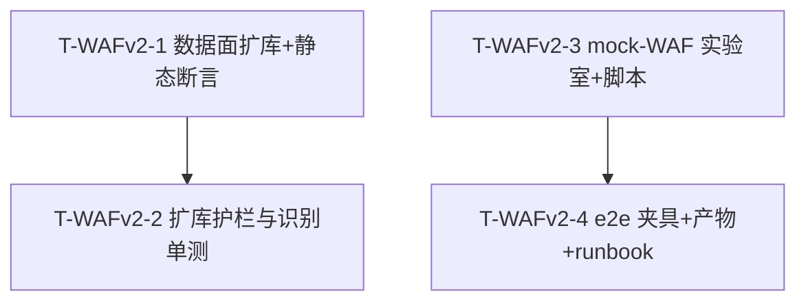

# SQL 注入检测工具「sqli-scanner」— WAF-v2 增量设计 + 任务分解（指纹库 7→~30 + 真机/e2e 验证）

> 作者：架构师 高见远（Bob / Gao）
> 版本：WAF-v2 增量（基于 F-20 已交付：后端 277 / 前端 48 测试 PASS）
> 语言：简体中文
> 配套 PRD：`docs/prd_wafv2.md`；基线设计：`docs/system_design_f20.md`、`docs/class-diagram-f20.mermaid`、`docs/sequence-diagram-f20.mermaid`
> 文件约定：本增量设计写入 `docs/system_design_wafv2.md`，并另存 `docs/sequence-diagram-wafv2.mermaid`（e2e 夹具↔扫描器↔lab 新交互）、`docs/class-diagram-wafv2.mermaid`（新增 e2e/lab 子系统模块）。不覆盖 F-20 文档与图。

---

## 0. 增量总览与核心边界（铁律，务必守住）

WAF-v2 是 F-20 之上的**严格数据面 + 验证面增量**。三条铁律（来自主理人 + PRD §1/§8）：

1. **不重写** WAF 识别引擎（`WafIdentifier`）、**不改写** `recommend()` 契约、**不改写** 前端 `WafTamperPanel`。
2. 本期仅做两件事：**#2 扩库**（规则/映射数据增量，带启动期静态断言防呆）+ **#1 验证面**（独立 mock-WAF 实验室 + e2e 关/开对比夹具 + 真实云 WAF runbook）。
3. **不新增 tamper 插件**（沿用现有 62 注册名，呼应 F-20 待确认①）。

> **边界结论**：`WafIdentifier.js` / `wafRecommend.js` 的**逻辑与导出签名不变**；本期只向 `WAF_RULES` / `WAF_RECOMMEND_MAP` 两个**数据对象**增键，并在 `wafRecommend.js` 加载期挂一个**静态断言**（校验推荐名 ∈ `tamperRegistry.list()`）。前端零改动即可消费约 30 vendor 的建议流。

---

## 1. 现状核查（设计前已读代码，如实记录）

| # | 文件 | 核查结论 |
|---|------|----------|
| 1 | `server/src/core/waf/wafRules.js` | 现有 `WAF_RULES` 仅 **7 类**（Cloudflare/ModSecurity/AWS_WAF/Aliyun_WAF/Baidu_Yunjiasu/SafeDog/Tencent_WAF）；matcher 结构统一为 `{type:'header'|'status'|'body', key?, test?}`，大小写不敏感（`WafIdentifier.getHeader` 已做 lower 归一）。 |
| 2 | `server/src/core/waf/wafRecommend.js` | 现有 `WAF_RECOMMEND_MAP` 7 项，值均为已注册名；`recommend(vendors)` 返回 `{vendor,plugins}[]`，仅保留命中映射且 plugins 非空。**导出签名不变**（铁律）。 |
| 3 | `server/src/core/waf/WafIdentifier.js` | `identify(response)` 纯函数遍历 `rules`，按 `hits` 计 `confidence = min(0.99, 0.8+(hits-1)*0.1)`，多命中升级；返回按置信度降序数组。**扩库 23 个新 vendor 后此逻辑无需改**（已支持多 vendor 数组返回）。 |
| 4 | `server/src/core/tamper/applyTampers.js` | 62 插件注册名已确认齐全；PRD 附录 A 推荐名（space2comment/randomcase/charencode/modsecurityversioned/versionedkeywords/securesphere/space2plus/percentage/equaltolike/randomcomments）**全部在册**，无未注册名。 |
| 5 | `server/src/engine/ScanManager.js` | `start(input)` → `createTarget(input)` → 异步 `_run`；`getReport(id)` 可轮询；可直接 `import` 驱动（无需起生产 HTTP server），适合 e2e 夹具。 |
| 6 | `server/tests/waf.f20.test.js` | **⚠️ 陷阱**：L78 `assert.equal(Object.keys(WAF_RULES).length, 7)` —— 扩库后必失败，须改为 `>= 28`（或常量）。已纳入 T-WAFv2-2 修复。 |
| 7 | 根 `package.json` | 测试用 `vitest`（`test: vitest run`）；但 `server/tests/*` 实际用 `node:test`（F-20 后端单测）。**e2e 不污染二者**：独立 Node 脚本 `npm run waf-e2e`。 |

---

## 2. 设计目标（对齐 PRD §2）

| # | 目标 | 落地口径 |
|---|------|----------|
| G1 | 指纹覆盖 7→~30 | `WAF_RULES` 扩至约 30 vendor（允许 28–32），`identify` 零误报、命中准确（单测覆盖）。 |
| G2 | 推荐精准且合法 | 扩库后 `recommend()` 对所有 vendor 返回的 plugins 名**全部 ∈ `tamperRegistry`**；启动期静态断言兜底。 |
| G3 | 可验证的绕过效果 | 本地 mock-WAF 实验室一键启；e2e 产出"开 tamper 检出率 > 关 tamper"可复现数据（JSON+MD）；真实云 WAF runbook 可执行（沙箱不出数据）。 |

---

## 3. 数据面设计：扩库 + 启动期静态断言

### 3.1 `WAF_RULES` 扩库写法（保留 7 + 新增 23 = 30）

沿用现有 matcher 结构；新增 vendor 取 PRD 附录 A 基线（可特征化原则下微调 ±2）。置信度基准：强特征头=0.9、body/status=0.7、多命中升级（由 `WafIdentifier` 既有公式自动计算，无需改引擎）。

```js
// server/src/core/waf/wafRules.js（扩库后结构示意，仅展示新增部分写法）
export const WAF_RULES = {
  // —— 7 个保留项保持不变（Cloudflare/ModSecurity/AWS_WAF/Aliyun_WAF/Baidu_Yunjiasu/SafeDog/Tencent_WAF）——
  // —— 新增 23 项（代表性写法，完整正则由工程师按 sqlmap identywaf / wafw00f 实现）——
  Barracuda:        { name: 'Barracuda',        matchers: [ { type:'header', key:'server', test:/barracuda/i }, { type:'header', key:'x-barracuda-' } ] },
  F5_BIG_IP:        { name: 'F5 BIG-IP',        matchers: [ { type:'header', key:'set-cookie', test:/bigipserver/i }, { type:'server', test:/big[- ]?ip/i } ] },
  FortiWeb:         { name: 'FortiWeb',         matchers: [ { type:'header', key:'server', test:/fortiweb/i } ] },
  Imperva_Incapsula:{ name: 'Imperva/Incapsula',matchers: [ { type:'header', key:'x-iinfo' }, { type:'body', test:/incapsula/i } ] },
  Akamai_Kona:      { name: 'Akamai Kona',      matchers: [ { type:'header', key:'server', test:/akamai/i }, { type:'header', key:/^x-akamai/i } ] },
  DenyAll:          { name: 'DenyAll',          matchers: [ { type:'cookie', test:/denyall_/i }, { type:'body', test:/denyall/i } ] },
  Wordfence:        { name: 'Wordfence',        matchers: [ { type:'body', test:/wordfence/i }, { type:'server', test:/wordfence/i } ] },
  Sucuri:           { name: 'Sucuri',           matchers: [ { type:'header', key:'x-sucuri-id' }, { type:'server', test:/sucuri/i } ] },
  Citrix_NetScaler: { name: 'Citrix NetScaler', matchers: [ { type:'cookie', test:/^nsc_/i }, { type:'header', key:'via', test:/ns-cache/i } ] },
  Cisco_ACE:        { name: 'Cisco ACE',        matchers: [ { type:'server', test:/ace/i } ] },
  Radware_AppWall:  { name: 'Radware AppWall',  matchers: [ { type:'header', key:/^x-rdw-/i }, { type:'server', test:/radware/i } ] },
  Sophos_UTM:       { name: 'Sophos UTM',       matchers: [ { type:'server', test:/sophos/i }, { type:'body', test:/sophos/i } ] },
  Qihoo_360:        { name: 'Qihoo 360',        matchers: [ { type:'body', test:/360webscan|qihoo/i } ] },
  NAXSI:            { name: 'NAXSI',            matchers: [ { type:'body', test:/blocked by naxsi/i } ] },
  DotDefender:      { name: 'DotDefender',      matchers: [ { type:'header', key:'x-dotdefender' }, { type:'server', test:/dotdefender/i } ] },
  BinarySec:        { name: 'BinarySec',        matchers: [ { type:'server', test:/binarysec/i } ] },
  BlockDoS:         { name: 'BlockDoS',         matchers: [ { type:'header', test:/blockdos/i }, { type:'body', test:/blockdos/i } ] },
  Bluedon:          { name: 'Bluedon',          matchers: [ { type:'server', test:/bluedon/i }, { type:'body', test:/bluedon/i } ] },
  Chuangyu:         { name: 'Chuangyu/Yunaq',   matchers: [ { type:'body', test:/chuangyu|yunaq/i } ] },
  Eisoo:            { name: 'Eisoo',            matchers: [ { type:'server', test:/eisoo|esafe/i } ] },
  Janusec:          { name: 'Janusec',          matchers: [ { type:'header', key:'x-janusec' }, { type:'body', test:/janusec/i } ] },
  KnownSec_KSWAF:   { name: 'KnownSec KS-WAF',  matchers: [ { type:'server', test:/ks-waf/i }, { type:'body', test:/knownsec/i } ] },
  Safe3:            { name: 'Safe3 WAF',        matchers: [ { type:'body', test:/safe3 web application firewall/i } ] },
};
// 注：matcher 的 'cookie' type 需在 WafIdentifier 中支持（当前支持 header/body/status）；
// 若沿用 header 解析 set-cookie 也可，不强制新增 type。工程师落地时确认 WafIdentifier 是否需最小扩展读取 cookie —— 见 §8 风险 R4。
```

> 完整 30 项（key + 代表性 matcher + 推荐组合）汇总表见 §3.3；最终正则由工程师按权威签名实现，须"可特征化"。

### 3.2 `WAF_RECOMMEND_MAP` 扩库写法（与推荐名合法性断言）

通用预设为 `TAMPER_INTENSITY_PRESETS.medium = [space2comment, randomcase, charencode]`；少数重点 WAF 定制。

```js
// server/src/core/waf/wafRecommend.js（扩库后，仅增键，recommend() 函数体不动）
export const WAF_RECOMMEND_MAP = {
  // 7 保留项不变 …
  Cloudflare:     ['space2comment', 'randomcase', 'charencode'],
  ModSecurity:    ['modsecurityversioned', 'versionedkeywords', 'space2comment'],
  AWS_WAF:        ['charencode', 'randomcase', 'space2comment'],
  Aliyun_WAF:     ['space2comment', 'randomcase', 'charencode'],
  Baidu_Yunjiasu: ['space2comment', 'randomcomments', 'randomcase'],
  SafeDog:        ['charencode', 'space2comment', 'equaltolike'],
  Tencent_WAF:    ['space2comment', 'randomcase', 'charencode'],
  // 23 新增项（通用预设 + 重点定制）
  Barracuda:        ['space2comment', 'randomcase', 'charencode'],
  F5_BIG_IP:        ['space2comment', 'randomcase', 'space2plus'],
  FortiWeb:         ['space2comment', 'randomcase', 'percentage'],
  Imperva_Incapsula:['securesphere', 'space2comment', 'randomcase'],
  Akamai_Kona:      ['space2comment', 'randomcase', 'charencode'],
  DenyAll:          ['space2comment', 'randomcase', 'charencode'],
  Wordfence:        ['space2comment', 'randomcase', 'charencode'],
  Sucuri:           ['space2comment', 'randomcase', 'charencode'],
  Citrix_NetScaler: ['space2comment', 'randomcase', 'space2plus'],
  Cisco_ACE:        ['space2comment', 'randomcase', 'charencode'],
  Radware_AppWall:  ['space2comment', 'randomcase', 'percentage'],
  Sophos_UTM:       ['space2comment', 'randomcase', 'charencode'],
  Qihoo_360:        ['space2comment', 'randomcase', 'charencode'],
  NAXSI:            ['space2comment', 'randomcase', 'charencode'],
  DotDefender:      ['space2comment', 'randomcase', 'charencode'],
  BinarySec:        ['space2comment', 'randomcase', 'charencode'],
  BlockDoS:         ['space2comment', 'randomcase', 'charencode'],
  Bluedon:          ['space2comment', 'randomcase', 'charencode'],
  Chuangyu:         ['space2comment', 'randomcase', 'charencode'],
  Eisoo:            ['space2comment', 'randomcase', 'charencode'],
  Janusec:          ['space2comment', 'randomcase', 'charencode'],
  KnownSec_KSWAF:   ['space2comment', 'randomcase', 'charencode'],
  Safe3:            ['space2comment', 'randomcase', 'charencode'],
};
// recommend(vendors) 函数体保持原样（铁律：不改契约）。
```

### 3.3 启动期静态断言（防呆：推荐名 ∈ tamperRegistry）

**拍板位置**：独立模块 `server/src/core/waf/assertTamperNames.js`（导出纯函数 `assertRecommendNames(registry?)`），并在 `wafRecommend.js` **模块加载期** `import` 并执行（fail-fast）。这样只要服务器/测试加载 `wafRecommend`，非法名立即抛错，杜绝"推荐了不存在的插件"。

```js
// server/src/core/waf/assertTamperNames.js（新增）
import { tamperRegistry } from '../tamper/index.js';
import { WAF_RECOMMEND_MAP } from './wafRecommend.js';

/**
 * 遍历 WAF_RECOMMEND_MAP 全部值，断言每个插件名都在 tamperRegistry 已注册清单中。
 * @param {Set<string>|string[]} [registered] 已注册名集合（默认从 tamperRegistry.list() 取）
 * @throws {Error} 一旦发现未注册名
 */
export function assertRecommendNames(registered) {
  const names = registered
    ? new Set(Array.from(registered))
    : new Set(tamperRegistry.list().map((t) => t.name));
  const bad = [];
  for (const [vendor, plugins] of Object.entries(WAF_RECOMMEND_MAP)) {
    for (const p of plugins || []) {
      if (!names.has(p)) bad.push(`vendor="${vendor}" -> "${p}"`);
    }
  }
  if (bad.length) {
    throw new Error(`[WAF_RECOMMEND_MAP] 引用未注册 tamper 插件: ${bad.join('; ')}`);
  }
  return true;
}
```

```js
// server/src/core/waf/wafRecommend.js（在文件末尾追加，模块加载期执行）
import { assertRecommendNames } from './assertTamperNames.js';
// 启动期静态断言：服务启动/测试加载即校验，fail-fast 防误写未注册名。
assertRecommendNames();
```

> 用途：① 运行期兜底（即便 `TamperRegistry.resolve` 会跳过未知名，也提前暴露数据错误）；② 单测 `waf_rules_v2.test.js` 显式调用 `assertRecommendNames()` 固化契约。

---

## 4. 验证面设计：mock-WAF 实验室 + e2e 夹具 + runbook

### 4.1 本地 mock-WAF 实验室（P0-4）

独立 Express 应用，**不复用生产 `server/`**，避免污染与权限问题。默认端口 **8099**（env `WAF_LAB_PORT` 可配）。

```js
// e2e/waf-lab/waf-signatures.js（新增）—— CRS 类"简化但具代表性"签名集（导出供 lab + 单测复用）
// 关键设计：用"空格锚定"正则（\s+），使 space2comment（空格→/**/）能绕过，从而演示 tamper 绕过差异。
export const WAF_SIGNATURES = [
  { id: 'union_select', re: /union\s+select/i },
  { id: 'or_eq',        re: /or\s+\d+\s*=\s*\d+/i },
  { id: 'comment_dash', re: /--|#/ },
  { id: 'hex_encode',   re: /0x[0-9a-f]+/i },
  { id: 'sleep',        re: /sleep\s*\(/i },
  { id: 'inline_cmt',   re: /\/\*.*\*\// },
  { id: 'quote_anom',   re: /'[^']*'[^']*'/ }, // 单引号配对异常（简化判定）
];

// e2e/waf-lab/lab-server.js（新增）—— createLabApp() 工厂 + 直接运行入口
import express from 'express';
import { WAF_SIGNATURES } from './waf-signatures.js';

export function createLabApp() {
  const app = express();
  const stats = { total: 0, blocked: 0, passed: 0 };
  // 中间件：对 query/body 命中任一 SQLi 签名即 403（复刻 ModSecurity CRS 类拦截）
  app.use((req, res, next) => {
    const probe = JSON.stringify(req.query) + JSON.stringify(req.body || '');
    stats.total += 1;
    const hit = WAF_SIGNATURES.some((s) => s.re.test(probe));
    if (hit) { stats.blocked += 1; return res.status(403).send('<h1>403 Forbidden</h1>'); }
    stats.passed += 1; next();
  });
  // 良性基线页（供指纹/基线抓取）
  app.get('/benign', (_q, r) => r.send('<html><body>ok</body></html>'));
  // sqli-labs 风格注入点：按 id 不安全拼接，可触发 union/error/boolean 检测
  app.get('/vuln', (req, r) => {
    const id = String(req.query.id ?? '1');
    // 简化"漏洞"：id 含单引号 → 返回 DB 错误（error 检测）；否则返回"结果行"
    if (id.includes("'")) return r.send('SQL syntax error near ...');
    if (/and\s+1=1/i.test(id)) return r.send(id.includes('1=2') ? 'no row' : 'row:1');
    return r.send(`row:${id}`);
  });
  app.get('/__stats', (_q, r) => r.json(stats));
  app.post('/__reset', (_q, r) => { stats.total=stats.blocked=stats.passed=0; r.json({ok:true}); });
  app._stats = stats;
  return app;
}

// 直接运行：node e2e/waf-lab/lab-server.js（npm run waf-lab）
if (import.meta.url === `file://${process.argv[1]}`) {
  const port = Number(process.env.WAF_LAB_PORT) || 8099;
  createLabApp().listen(port, () => console.log(`[waf-lab] http://localhost:${port} (block SQLi signatures → 403)`));
}
```

> 实验室"简化但具代表性"：核心 SQLi 关键字/正则黑名单（空格锚定），足以验证 `space2comment` 类 tamper 绕过差异；不强制对齐完整 CRS（控体积，见 §8 风险 R2）。`/vuln` 对 union/error/boolean 可检出，time 因 `SLEEP` 被自身拦截，不在 e2e 对比口径内（见 §4.2）。

### 4.2 e2e 对比夹具（P0-5 / P1-3 产物化）

独立 Node 脚本，**不进 vitest / node:test 单测套件**，由 `npm run waf-e2e` 调起；同进程起 lab + 直接 `import ScanManager` 驱动两次扫描（config A 关 / config B 开推荐组合），算指标并写 JSON+MD。

```js
// e2e/waf-lab/metrics.js（新增）—— 纯函数算指标，便于单测
export function computeMetrics({ totalPoints, detectedA, detectedB, blockedReqA, blockedReqB, totalReqA, totalReqB }) {
  const rate = (n, d) => (d ? +(n / d * 100).toFixed(1) : 0);
  return {
    totalPoints,
    detectedA, detectedB,
    detectRateA: rate(detectedA, totalPoints),
    detectRateB: rate(detectedB, totalPoints),
    blockedReqA, blockedReqB,
    blockRateA: rate(blockedReqA, totalReqA),
    blockRateB: rate(blockedReqB, totalReqB),
  };
}

// e2e/waf-lab/compare.e2e.js（新增）—— 独立运行入口（npm run waf-e2e）
// 流程：起 lab(8099) → 重置 stats → 跑 configA(tamper 关) → 读 stats/diff → 跑 configB(tamper 开=medium 预设) → 读 stats/diff
//       → computeMetrics → 写 e2e/waf-lab/results/compare.json + compare.md
// 指标口径：检出率 = 确认 vulnerable 点数 / 总注入点数；拦截率(请求级) = 403 数 / 总请求数
// 实验设计：lab 用"空格锚定"正则，space2comment 把 UNION SELECT→UNION/**/SELECT 绕过 → configB 检出率 > configA
// config B 推荐组合 = TAMPER_INTENSITY_PRESETS.medium（['space2comment','randomcase','charencode']）
// 注：lab 为"通用 SQLi 拦截器"非具体 WAF 厂商模拟，故 e2e 直接用 medium 预设演示机制，不经 identify→recommend
```

### 4.3 真实云 WAF runbook（P0-6）

`docs/waf_runbook.md` 大纲（用户本机执行，沙箱不出数据）：
1. 前置：自有域名 + Cloudflare/AWS WAF 已开启；一台有注入点的授权靶机；本工具 `npm run dev`。
2. 在 WAF 后挂靶机，确认"裸请求即被 403"。
3. 用本工具对靶机扫描（tamper 关）→ 观察 `waf_detected` 事件与建议（`GET /api/tampers` 已暴露清单，`WafTamperPanel` 建议流消费任意 vendor）。
4. 一键应用推荐组合 + 显式开启 `enabled` → 复扫。
5. 对比两次报告 `summary.wafEvasion.tamper` 与检出率。
6. 合规提示（仅授权目标）。

---

## 5. 任务分解（T-WAFv2-1 ~ T-WAFv2-4，每任务 ≥3 文件，总任务 ≤5，注明依赖与 P0/P1）

> 约束：纯数据面（T1/T2）与验证面（T3/T4）解耦；T1 ∥ T3 可并行；T2 依赖 T1（测试扩库）；T4 依赖 T3（实验室）。**无新增 npm 依赖**。

### T-WAFv2-1 数据面：WAF_RULES/WAF_RECOMMEND_MAP 扩库 + 启动期静态断言（P0-1, P0-2）
- **目录/文件**：
  - `server/src/core/waf/wafRules.js`【修改】— `WAF_RULES` 扩至约 30 vendor（保留 7 + 新增 23，按 §3.1/附录 A；允许 28–32）。
  - `server/src/core/waf/wafRecommend.js`【修改】— `WAF_RECOMMEND_MAP` 扩至约 30（§3.2）；文件末尾 `import` 并执行 `assertRecommendNames()`（模块加载期 fail-fast）。**不改 `recommend()` 函数体**。
  - `server/src/core/waf/assertTamperNames.js`【新增】— 导出 `assertRecommendNames(registry?)`，遍历 `WAF_RECOMMEND_MAP` 校验每个名 ∈ `tamperRegistry.list()`，否则 throw。
- **做什么**：把规则/映射从 7 扩到约 30（仅数据增量），并加启动期静态断言防误写未注册名。
- **依赖**：无（本特性数据基础）。
- **优先级**：P0
- **验收点**：① `Object.keys(WAF_RULES).length` 介于 28–32；② 全部 30 vendor 的推荐名均为已注册插件（静态断言通过，服务/测试加载不抛错）；③ 原 7 vendor 行为不变（不删键、不改 matcher 语义）；④ 导入 `wafRecommend` 即触发断言（fail-fast 生效）。

### T-WAFv2-2 扩库护栏与识别单测（P0-3, P1-2 多命中用例）
- **目录/文件**：
  - `server/tests/waf_rules_v2.test.js`【新增】— ① 遍历 `WAF_RECOMMEND_MAP` 调 `assertRecommendNames()`（推荐名合法性）；② `Object.keys(WAF_RULES).length >= 28`（数量护栏）；③ 抽样新增 vendor（如 `Imperva_Incapsula`/`F5_BIG_IP`）对带特征响应准确识别；④ 无特征响应返回 `[]`（零误报）；⑤ 多 WAF 串联样本返回多个候选（P1-2 多命中用例）。
  - `server/tests/waf_recommend_v2.test.js`【新增】— 扩库后 `recommend([...])` 对新增 vendor 返回 `{vendor,plugins}` 且 plugins 全为已注册名；过滤无映射 vendor。
  - `server/tests/waf.f20.test.js`【修改】— **修复陷阱**：L78 `assert.equal(Object.keys(WAF_RULES).length, 7)` → `assert.ok(Object.keys(WAF_RULES).length >= 28)`（否则扩库后整套后端单测红）。其余 F-20 用例保留。
- **做什么**：以单测固化"扩库后识别准确 + 零误报 + 推荐合法 + 数量护栏"。
- **依赖**：T-WAFv2-1（扩库数据 + 断言函数）。
- **优先级**：P0（护栏）/ P1（多命中用例）
- **验收点**：① 全量 WAF 单测 PASS；② 零误报用例存在且通过；③ 推荐名合法性断言通过；④ `waf.f20.test.js` 不再因数量断言失败。

### T-WAFv2-3 mock-WAF 实验室 + 启动脚本（P0-4）
- **目录/文件**：
  - `e2e/waf-lab/waf-signatures.js`【新增】— `WAF_SIGNATURES`（CRS 类简化签名集，空格锚定，导出复用）。
  - `e2e/waf-lab/lab-server.js`【新增】— `createLabApp()` 工厂 + 直接运行入口（默认端口 8099，env `WAF_LAB_PORT`）+ `/vuln`(sqli-labs) + `/benign` + `/__stats` + `/__reset`。
  - `package.json`【修改】— 加 `"waf-lab": "node e2e/waf-lab/lab-server.js"` 与 `"waf-e2e": "node e2e/waf-lab/compare.e2e.js"` 两个 script（根脚本，复用既有 Express，无新依赖）。
- **做什么**：建独立、可一键起的本地 mock-WAF 实验室，供 e2e 与人工复现。
- **依赖**：无（独立于生产 server）。
- **优先级**：P0
- **验收点**：① `npm run waf-lab` 起 8099；② 含 SQLi 特征请求稳定 403；③ 良性 `/benign` 与 `/vuln?id=1` 放行且 `/vuln` 可在扫描器下产出检测结果。

### T-WAFv2-4 e2e 对比夹具 + 产物 + 真实云 WAF runbook（P0-5, P0-6, P1-3）
- **目录/文件**：
  - `e2e/waf-lab/metrics.js`【新增】— `computeMetrics(...)` 纯函数（检出率/拦截率口径）。
  - `e2e/waf-lab/compare.e2e.js`【新增】— 独立脚本：同进程起 lab → 跑 configA(关)/configB(开=medium 预设) 两次扫描（直接 `import ScanManager`）→ 读 lab stats + 报告 → 写 `e2e/waf-lab/results/compare.json` + `compare.md`（关 vs 开对照表，PRD §6.2 口径）。
  - `docs/waf_runbook.md`【新增】— 真实云 WAF（Cloudflare/AWS WAF + 靶机）本机闭环 runbook（§4.3 大纲）。
- **做什么**：产出"开 tamper 检出率 > 关 tamper"可复现数据（JSON+MD 产物化，CI 可 diff），并交付真实云 WAF 执行文档。
- **依赖**：T-WAFv2-3（实验室）；T-WAFv2-1（仅间接：依赖 F-20 的 `TAMPER_INTENSITY_PRESETS.medium` 作为 configB 组合，不依赖本期扩库）。
- **优先级**：P0（e2e/runbook）/ P1（产物化）
- **验收点**：① 跑出"开 > 关"检出率差异（lab 用 space2comment 可绕过）；② `compare.json`/`compare.md` 稳定可复现（固定靶机样本）；③ runbook 步骤自洽、命令准确；④ 脚本独立运行不污染 vitest / node:test 单测套件。

---

## 6. 依赖包列表

**无新增 npm 依赖。** 实验室复用既有 `express`（已在依赖内）；`vitest` 为前端单测、后端单测用 Node 内置 `node:test`；e2e 为独立 Node 脚本（ESM，`type:module` 已设）。`package.json` 仅新增 2 个 script，不动 `dependencies`/`devDependencies`。

---

## 7. 共享知识（跨文件约定）

1. **推荐名唯一真相源**：`WAF_RECOMMEND_MAP` 的值**只能**是 `tamperRegistry.list()` 中的已注册名；任何改动必须经 `assertRecommendNames()`（加载期 + 单测）校验。
2. **扩库只增键，不改逻辑**：`WAF_RULES`/`WAF_RECOMMEND_MAP` 为纯数据；`WafIdentifier.identify` / `wafRecommend.recommend` 的**函数体不变**（铁律）。新 vendor 仅追加 matchers；置信度由既有公式自动计算。
3. **matcher 写法一致**：沿用 `{type:'header'|'status'|'body', key?, test?}`，大小写不敏感；新增 `cookie` 类特征优先用 `header(set-cookie)` 表达，避免改 `WafIdentifier`（见 §8 R4）。
4. **实验室端口 8099**：默认 `WAF_LAB_PORT` 可配；e2e 与手动 `npm run waf-lab` 共用 `createLabApp()`。
5. **e2e 指标口径**：检出率 = 确认 vulnerable 点数 / 总注入点数；拦截率（请求级）= 403 数 / 总请求数；lab 用"空格锚定"正则，使 `space2comment` 可演示绕过。
6. **e2e 不污染单测**：`compare.e2e.js` 经 `npm run waf-e2e` 独立运行，不进 `vitest`/`node:test` 套件；产物落 `e2e/waf-lab/results/`。
7. **前端零改动**：`WafTamperPanel` 建议流按 `vendor` 字符串消费，`waf_detected` 事件对任意约 30 vendor 自动生效；不新增端点（§8 拍板⑧）。

---

## 8. 待确认拍板结论（逐条回应 PRD §9 的 8 项 + 额外风险）

### 8.1 PRD §9 八项拍板

| # | 问题 | 拍板结论 |
|---|------|----------|
| ① | 最终 vendor 清单与数量 | **采用附录 A 基线 30（7 保留 + 23 新增）；工程可在"可特征化"原则下微调 ±2（28–32）**。优先覆盖有响应头/状态码/body 特征的真实产品。 |
| ② | matcher 数据源 | **沿用 F-20「零额外发包」**：只用指纹 baseline 的 header/status/body；不引入主动探测。 |
| ③ | 推荐组合策略 | **通用预设(medium)为基线 + 重点 WAF 定制**（ModSecurity=`modsecurityversioned`、Imperva=`securesphere`、Citrix/F5=`space2plus`、FortiWeb/Radware=`percentage`、SafeDog=`equaltolike`）；所有名已注册。 |
| ④ | lab 形态 | **独立轻量服务**（`e2e/waf-lab/`，`npm run waf-lab` 起，端口 8099），不复用生产 server。 |
| ⑤ | 指标口径 | **采用 PRD 定义**：检出率 = 确认 vulnerable 点数 / 总点数；拦截率 = 返回 403 且未检出点占比（并补充请求级 blockRate）。固定靶机样本保证可复现。 |
| ⑥ | runbook | **本期产出 `docs/waf_runbook.md`**（用户本机执行，沙箱不出数据）。 |
| ⑦ | lab 签名强度 | **默认"简化但具代表性"**：核心 SQLi 关键字/正则黑名单（空格锚定），足以验证 tamper 绕过差异；不强制对齐完整 CRS。 |
| ⑧ | 是否新增端点暴露 30 vendor | **默认不新增端点**：前端按 `waf_detected` 事件消费识别结果即可；"WAF 知识库"展示页留 P2。 |

### 8.2 额外风险与 P1 处理（PRD 未覆盖 / 与铁律冲突）

- **R1（陷阱，必处理）**：`server/tests/waf.f20.test.js` L78 的 `===7` 数量断言在扩库后必红——已在 **T-WAFv2-2** 修复（改为 `>=28`）。
- **R2（实验室真实性，中）**：mock-WAF 是"简化 CRS"，与真实 WAF 规则有差距；e2e 差异数据仅证明"tamper 能提升检出"，不等于真实环境效果——runbook 负责真实闭环。实验室对 `time` 类（`SLEEP`）会因自身拦截无法演示绕过，故 e2e 对比口径限定 `techniques:['union','error','boolean']`。
- **R3（误报，中）**：约 30 vendor 的 matcher 若过宽可能误命中。护栏：弱特征给低置信度、单测必含"无特征→`[]`"零误报、多 matcher 才升强识别（沿用 `WafIdentifier` 既有公式）。
- **R4（cookie matcher，低）**：新增 vendor 含 `cookie` 类特征（如 F5/DenyAll）。当前 `WafIdentifier` 仅支持 `header/body/status`。**不改写引擎**的前提下，约定 cookie 特征优先用 `header(set-cookie, test:/.../i)` 表达（set-cookie 本就是响应头）；若确需独立 `cookie` type，则属引擎最小扩展，需在 T-WAFv2-1 内以"仅新增一个 type 分支、不改既有逻辑"方式落地，并单测覆盖——**默认不引入**，优先 header 表达。
- **R5（P1-1 置信度分层，冲突铁律→部分落地/部分 defer）**：PRD P1-1 要求"为不同 vendor 设基础权重（强头 0.9/body 0.7/弱 0.5）"并改 `WafIdentifier` 置信度模型——**这违反铁律"不重写 WafIdentifier"**，故**引擎置信度模型本期不改**。其"前端建议展示门槛（强识别才给一键应用）"部分**不依赖引擎改动**：直接用现有 `confidence` 数值（当前 0.8+ 即强识别）在 `WafTamperPanel` 设阈值即可，但**前端面板不改写（铁律）**，故该前端门槛本期也不落地。结论：P1-1 整体**递延**至后续允许引擎微调的增量。
- **R6（P1-2 多 WAF 串联，部分落地）**：`identify` 已返回数组，本期**仅补"多命中返回多候选"单测**（T-WAFv2-2）；"推荐合并（取并集去重）"需改 `recommend()` 输出语义，**违反契约铁律**，故合并策略**递延**。
- **R7（P1-4 针对性推荐标注，冲突铁律→递延）**：在 `recommend()` 输出加 `targeted` 或改 `WafTamperPanel` 渲染均**违反铁律**（不改契约/不改面板）。可加独立只读 `WAF_RECOMMEND_META` 映射表（不影响 `recommend()` 契约），但面板不消费即无意义，故本期**不落地**，留 P2 配套面板增强。
- **R8（P1-3 产物化，已落地）**：e2e 产出 `compare.json`+`compare.md`（T-WAFv2-4），CI 可 diff，已纳入。

---

## 9. 任务依赖图（Mermaid graph）



> 说明：T-WAFv2-1（数据）与 T-WAFv2-3（实验室）**可并行**；T-WAFv2-2 依赖 T-WAFv2-1（测试扩库数据）；T-WAFv2-4 依赖 T-WAFv2-3（实验室）。共 4 个任务，均 ≥3 文件，符合「≤5 任务」硬约束。**无新增依赖包**。P0 全覆盖（扩库/断言/单测/实验室/e2e/runbook）；P1 仅 P1-2 多命中单测、P1-3 产物化落地，P1-1/P1-4 因与铁律冲突递延（见 §8.2）。

---

## 10. 类图 / 时序图说明

- **复用 F-20 图**：`WafIdentifier` / `wafRecommend` / `WafTamperPanel` 的交互图**完全复用** `docs/class-diagram-f20.mermaid` 与 `docs/sequence-diagram-f20.mermaid`，本期无新增交互。
- **新增交互**：仅"e2e 夹具 ↔ ScanManager ↔ 实验室"存在新调用链（验证面），已补：
  - `docs/sequence-diagram-wafv2.mermaid` — e2e 对比夹具驱动流程（起 lab → configA 关扫描 → 读拦截 → configB 开扫描 → 读拦截 → 算指标 → 写产物）。
  - `docs/class-diagram-wafv2.mermaid` — 新增 e2e/lab 子系统模块（`createLabApp` / `WAF_SIGNATURES` / `compare.e2e` / `computeMetrics` / `assertRecommendNames`）及与既有 `ScanManager` / `tamperRegistry` 的关系。
- 若团队认为新增图价值有限，可仅保留本文档 §3–§4 的代码块作为设计依据，删除两个 mermaid 文件（不影响实现）。

---

> 本增量设计可直接落地：工程师按 T-WAFv2-1 ∥ T-WAFv2-3 → T-WAFv2-2 / T-WAFv2-4 顺序、在每任务内按文件清单实现即可。识别引擎、recommend 契约、前端面板**零改动**；本期纯属"规则/映射扩库（带启动期静态断言）+ 独立 mock-WAF 实验室 + e2e 关/开对比 + 真实云 WAF runbook"。双形态前端因零改动天然兼容。
